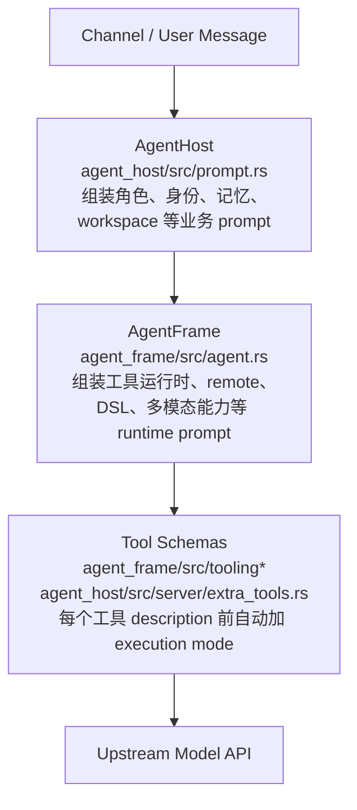

# ALL_PROMPTS.md

本文档整理当前代码中会暴露给模型的主要 prompt，包括各种 Agent 的 System Prompt、请求期 transient system notice、compaction prompt，以及所有工具的 tool prompt。

代码来源：

- AgentHost System Prompt: `agent_host/src/prompt.rs`
- AgentFrame System Prompt: `agent_frame/src/agent.rs`
- AgentFrame built-in tools: `agent_frame/src/tooling.rs`, `agent_frame/src/tooling/*.rs`
- AgentHost extra tools: `agent_host/src/server/extra_tools.rs`
- Session prompt component / transient notice: `agent_host/src/session.rs`, `agent_host/src/server.rs`
- Compaction prompt: `agent_frame/src/compaction.rs`

## 0. 本次检查结论

这份文档按“真实发送给模型”的路径重整，而不是只看静态 prompt 文本。当前真实上游请求会包含三类 prompt：

- system messages: AgentFrame runtime wrapper + AgentHost canonical prompt + skills metadata + 本轮 transient notices。
- tool schemas: 每个工具的 description 会自动加 `Execution mode: ...` 前缀，并带参数 schema。
- compaction request: 上下文压缩时单独发给模型的压缩 prompt，不是普通对话 prompt。

本次检查发现并修正/记录的点：

- 已按最新要求收敛 remote prompt：具体工具 description 不再逐个解释 remote 参数，`remote` 参数 schema 只保留最小描述；统一 remote 使用规则放在 AgentFrame system prompt 和 conversation remote workpaths system 段落中。
- 已在 `exec_start` 层拒绝手写 `ssh ...` 命令，要求模型使用 remote-capable tool 的 remote 功能。
- 已把 `file_download_start` 和 `image_start` 升级为 exec-style start：支持 `return_immediate`、`wait_timeout_seconds`、`on_timeout=continue|kill`，默认先等待完成以减少模型往返。
- `file_download_wait` 和 `image_wait` 也支持 `wait_timeout_seconds` / `on_timeout`，避免 wait 工具无限阻塞。
- 已把 runtime-id start 等待策略集中到 AgentFrame system prompt：`exec_start` / `dsl_start` / `file_download_start` / `image_start` 的工具 description 不再分别重复 `return_immediate` / `wait_timeout_seconds` / `on_timeout` 的使用策略，只保留参数 schema。
- 已精简 DSL、`user_tell`、`update_plan`、`shared_profile_upload` 等工具 description：跨工具或跨 agent 的行为策略保留在 system prompt，工具 description 只说明工具效果。
- 已修复 `workpath_add` Host 侧 host 校验过宽的问题：现在会拒绝 `host` / `<host>` / `<host>|local` 占位符、以 `-` 开头的值、空白、控制字符、shell metacharacters、路径分隔符，避免把明显非法的 SSH alias 持久化。
- 已修正 `workpath_add` 工具返回说明：remote workpath 会立即写入 conversation 设置，但当前这一轮 AgentFrame remote default-root map 不会热更新。当前轮如果立刻继续用 remote 工具，应传绝对路径或显式 `cwd=path`；下一轮或重建 prompt 后，省略 `cwd` 才会默认使用新 workpath。
- 已修正本文档中的 tool schema 摘要：外部 `web_search` 条件工具需要列入，download/image start/wait 参数需要同步最新 schema。
- 剩余较合理的重复主要是“功能文档/FEATURES 作为测试保护”和“工具 schema 参数名本身”，不再把同一行为策略在多个工具 description 中反复说明。

## 1. Prompt 分层总览



真实发送给模型的上游 system prompt 通常是：

1. AgentFrame runtime wrapper。
2. AgentHost canonical system prompt。
3. Skills metadata prompt。
4. 请求期 transient system notice, 如果本轮需要。
5. Tool schemas, 其中每个工具的 description 都会被自动加上 execution mode 前缀。

### 1.1 Remote / Workpath 真实交互逻辑

代码里的“Workpass”实际实现名是 `workpath_*`。它和 `remote` 参数的关系如下：

1. `workpath_add(host, path, description)` 是 AgentHost extra tool，只在 `MainForeground` / `MainBackground` 可用。
2. 调用成功后，conversation settings 立即持久化一条 remote workpath。每个 host 只保留一条，重复添加同 host 会替换旧 path 和 description。
3. `workpath_add` 会立即尝试通过 SSH 读取 `path/AGENTS.md`，并把读取结果放进工具返回值的 `agents_md` 字段。
4. 后续重建 AgentHost system prompt 时，会在 `Remote workpaths registered for this conversation:` 段落中列出 host/path/description，并重新加载 remote `AGENTS.md`。
5. AgentFrame 在每轮开始构建工具 registry 时，会把当时 conversation settings 中的 remote workpaths 转成 remote default-root map。
6. 因此，同一轮内刚刚 `workpath_add` 后，conversation 持久化已生效，但 AgentFrame 工具捕获的 default-root map 仍可能是旧快照。当前轮继续远端操作时：
   - `remote="<host>"` 仍会走 SSH。
   - 如果用相对路径且省略 `cwd`，默认 root 可能仍是旧 workpath 或 remote home。
   - 想立即使用新 path，应传绝对远端路径，或在支持 `cwd` 的工具上显式传 `cwd=path`。
   - 下一轮用户消息、prompt rebuild 或 compaction 后，省略 `cwd` 才会自然使用新 workpath。

Remote path resolution 的统一规则：

- local work: 省略 `remote`，或传 `remote=""` / `remote="local"`。
- remote work: 传真实 SSH alias，例如 `remote="wuwen-dev6"`；不要传字面量 `host`，也不要在 shell 中手写 `ssh <host> ...`。
- 支持 `cwd` 的工具：remote + 非空 `cwd` 时，`cwd` 控制远端工作目录；相对 `cwd` 会接在注册 workpath 后面，绝对 `cwd` / `~` / `~/...` 直接使用。
- 文件类工具的绝对 path 会以 `/` 为 root；相对 path 会以注册 workpath 为 root，没有注册时退回 remote home。

## 2. AgentHost System Prompt

AgentHost prompt 按 Agent 类型分成：

- `MainForeground`
- `MainBackground`
- `SubAgent`

三者共用大部分基础规则，只在角色职责、background delivery、subagent scope 等部分不同。

### 2.1 AgentHost Prompt 组装顺序

`build_agent_system_prompt(...)` 当前按下列顺序拼装：

1. Header:
   - `[AgentHost Main Foreground Agent]`
   - `[AgentHost Main Background Agent]`
   - `[AgentHost Sub-Agent]`
2. Role line:
   - `You are the Main Foreground Agent running inside AgentHost.`
   - `You are a Main Background Agent running inside AgentHost.`
   - `You are a Sub-Agent running inside AgentHost.`
3. 共享基础规则:
   - 当前 workspace root 是主要可写工作区。
   - 不确定时必须验证，不从记忆猜测。
   - 使用库、命令、路径、项目能力前先验证存在。
   - 默认工作流是探索相关代码和配置、理解本地约定、修根因、做 focused verification，再按需 lint/typecheck/check。
   - `AGENTS.md` 和类似文件是 scoped rules。
   - skills 可用时先看 metadata，再 load 具体 skill。
   - `./.skill_memory` 只有被 skill 明确要求时才读写。
   - `user_tell` 只用于中途进度或协调消息，不替代 final answer。
   - `update_plan` 用于非平凡、多步、模糊、长任务。
   - progress check 不是 stop signal。
   - `[Interrupted Follow-up]` 和 `[Queued User Updates]` 要先可见回应，再继续工作。
   - `USER.md` 和 `IDENTITY.md` 是 workspace 内的 profile copy。修改后要 `shared_profile_upload`，改了 `IDENTITY.md` 还要立即 reread。
   - repo 探索应使用 `glob` / `grep` / `ls` / `file_read`，不要用 `exec_start` 直接跑 `grep` / `find` / `cat` / `head` / `tail` / `ls`。
   - durable remote directory 使用 `workpath_add(host, path, description)`。
   - 无依赖的多个 exec 命令应同 batch 发出。
   - exec 命令应非交互化。
   - exec 返回 stdout/stderr 最多 1000 字符，大输出应看保存路径。
   - 全局软件包默认装到 `main_agent.global_install_root`。
   - 给用户发送文件或图片要在 final reply 中使用 `<attachment>relative/path</attachment>`。
   - 回复语言默认使用 `main_agent.language`。
4. Current model profile:
   - `Current model profile: {model_name} - {model.description}`
5. Available models catalog, 如果存在:
   - `Available models:`
   - `- {model_key}: {description}`
6. Agent kind specific rules, 见下文。
7. Identity:
   - 标题 `Identity:`
   - 内容来自 session prompt component 的 canonical snapshot, 或 workspace `IDENTITY.md` 渲染结果。
8. User meta:
   - 标题 `User meta:`
   - 内容来自 session prompt component 的 canonical snapshot, 或 workspace `USER.md` frontmatter。
9. Workspace summary:
   - 标题 `Current workspace summary:`
10. Runtime notes:
    - 标题 `Runtime notes:`
    - 内容来自 workspace root `AGENTS.md`。
11. Remote workpaths:
    - 内容来自 conversation settings 里的 `remote_workpaths`。
12. Memory mode:
    - `Memory mode: claude_code.`
    - 或 `Memory mode: layered.`
13. `PARTCLAW.md`, 仅 ClaudeCode memory mode 且文件非空时加入。

### 2.2 MainForeground 特有规则

MainForeground 是用户当前对话的主 Agent。它的特有规则包括：

- 它是 primary user-facing conversation。
- 用户问历史聊天、历史 session、之前发过什么、历史工作时，应先使用 workspace history tools。
- 小而有边界、但会消耗上下文的任务应尽早交给 subagent。
- open-ended search、多文件定位、fact gathering、side task 可以积极使用 subagent。
- subagent 和 background 的区别按 final user-facing result 的所有权决定：
  - 需要自己 review / integrate / selectively adopt 的内部支持工作用 subagent。
  - 允许稍后独立完成、独立汇报给用户、并进入 foreground context 的工作用 background。
- 不要把 background agent 当作当前 turn 的内部 helper。
- 如果已经启动 background 后又自己接管，要 cancel 或 suppress background，避免双重用户可见完成。
- subagent 模型要按模型描述选择，不要机械默认。

### 2.3 MainBackground 特有规则

MainBackground 用于异步、可独立汇报的工作。它的特有规则包括：

- 先规划任务拆分，尽量拆成少数较大的 delegated chunks。
- 按模型描述选择适合的 subagent model。
- 使用 subagent 承担 bounded side task，让 background 自己保留协调和整合上下文。
- 只要 delegated chunk 是 final answer 必需，就必须等所有 subagent 结果回来。
- 它的 final response 会自动投递到 owning foreground conversation，并插入 foreground context。
- reminder / cron / scheduled notification / send-this-message 类任务，主要用户可见消息应放在 final answer 中，不要用 `user_tell` 发送主消息，也不要额外说 `sent`，除非用户要回执。
- 如果任务应静默结束，调用 `terminate` 后停止。
- 让 subagent 写了大量内容时，要求 subagent 总结生成了什么、在哪里、下游要知道什么，避免后续重读大文件。
- 需要历史信息时用 workspace history tools。

### 2.4 SubAgent 特有规则

SubAgent 是 bounded delegated worker。它的特有规则包括：

- 只关注委派任务，不主动扩大 scope。
- 优化目标是快速完成和低上下文增长，不接管整个问题。
- 生成大量文件或内容后，final summary 要说明创建了什么、在哪里、下游 Agent 需要知道什么。
- 返回一个简洁 final summary，不要求 caller 与自己长对话。

### 2.5 Memory Mode Prompt

ClaudeCode memory mode：

- `Memory mode: claude_code.`
- `PARTCLAW.md` 是 workspace root 的 durable project memory。
- 只记录长期项目事实、约定、计划、handoff notes。
- 不记录 transient per-turn chatter。
- 确认了 build/test/lint/typecheck 命令、稳定代码风格、重要架构事实、handoff 关键决策时，应写入 `PARTCLAW.md`。

Layered memory mode：

- `Memory mode: layered.`

### 2.6 AgentHost 动态字段和 snapshot 语义

当前已经区分 canonical snapshot 和 notified latest 的字段：

- Identity: `session_state.prompt_components["identity"]`
- User meta: `session_state.prompt_components["user_meta"]`
- Skills metadata: `session_state.prompt_components["skills_metadata"]`

它们的语义：

- `system_prompt_value`: 当前应出现在 canonical system prompt 中的旧快照。
- `notified_value`: 已经通知给模型的最新值。
- 普通用户消息边界上，如果当前最新值和 `notified_value` 不一致，就插入一次系统通知，并同步更新 `notified_value`。
- compaction 之后，把 `notified_value` promote 成新的 `system_prompt_value`。
- assistant resume、background auto-resume、tool-progress loop 不推进通知状态。

以下字段按 snapshot-style 处理，不做普通 turn 通知：

- workspace summary
- remote workpaths
- runtime notes / `AGENTS.md`
- `PARTCLAW.md`

以下字段直接按最新内容组装，不做双值追踪：

- Host static intro
- foreground/background/subagent role rules
- memory mode
- current model profile
- available models catalog

## 3. AgentFrame System Prompt

AgentFrame wrapper 由 `compose_system_prompt(...)` 组装。它在 AgentHost prompt 外层，负责告诉模型 runtime/tool 层能力。

组装顺序：

1. `[AgentFrame Runtime]`
2. `You are running inside AgentFrame. Use tools when they materially help.`
3. Remote-capable tool guidance:
   - 当工具暴露 `remote` 参数且任务目标在 SSH host 上，必须把 `remote` 设置为真实 SSH alias。
   - 不要在 `exec_start` shell command 里手写 `ssh <host>`；手写 SSH 会被拒绝。
   - local work 省略 remote，或设置 `remote=""` / `remote="local"`。
   - remote cwd 非空时控制远端工作目录；否则使用 registered workpath；没有 workpath 时 fallback 到 remote home。
   - remote 规则集中在 system prompt 中，具体 tool description 不再重复解释 remote 参数。
4. Runtime-ID start tool guidance:
   - `exec_start` / `dsl_start` / `file_download_start` / `image_start` 会创建后台状态，也可以在同一次工具调用中等待短任务结束。
   - 短的有界任务优先使用默认 wait-until-complete。
   - 长任务才设置 `return_immediate=true`。
   - 需要显式超时语义时使用 `wait_timeout_seconds` 和 `on_timeout`。
   - 这类等待策略集中在 system prompt 中，start tool description 不再逐个重复。
5. DSL tool guidance:
   - `dsl_start` / `dsl_wait` / `dsl_kill` 只用于有限的多步编排。
   - DSL 在 restricted CPython worker 中运行。
   - 允许表达式、赋值、`if`、f-string、list/dict、slice、string methods、`type()`。
   - 可用 globals: `emit(text)`, `quit()`, `quit(value)`, `handle = LLM()`, `handle.system(text)`, `handle.config(key=value)`, `handle.fork()`, `await handle.gen(...)`, `await handle.json(...)`, `await handle.select(prompt, ["A", "B", "C"])`, `await tool({"name": "...", "args": {...}})`。
   - `tool(...)` 只能接受单个 dict request shape。
   - DSL LLM call 使用 `dsl_start` caller 同一个模型。
   - 不能使用 loops、comprehensions、generators、imports、functions、classes、lambdas、private `_` names/attributes、recursive DSL calls。
   - interrupting `dsl_start` / `dsl_wait` 只中断外层等待，DSL job 本身继续后台运行。
   - DSL 不能直接修改 canonical system prompt 或 Session prompt components。
6. 如果 provider native web search enabled:
   - 提示模型优先使用 provider built-in capability，而不是期待外部 `web_search` 工具。
7. 如果 provider native image generation enabled:
   - 提示模型使用 provider built-in image generation，而不是期待本地 image generation tool。
8. AgentHost system prompt, 即 `config.system_prompt`。
9. Skills metadata prompt。

## 4. 请求期 Transient System Notices

这些 notice 可能作为 system message 进入本轮请求，但不都持久化为 canonical system prompt。

### 4.1 Plan Reminder

AgentFrame 每 10 个 tool batch 注入一次：

```text
[System Reminder: use tool to update plan progress.]
```

如果上一个 tool batch 已经调用过 `update_plan`，本次不注入。

### 4.2 Interrupted / Queued User Updates

SessionActor 会把中断期间进入的用户消息标记为：

```text
[Interrupted Follow-up]
```

多条 queued update 会标记为：

```text
[Queued User Updates]
```

Host prompt 要求模型看到这些标记后，先给用户可见反馈，再继续实质性工具调用。

### 4.3 Compaction Wait Notice

如果用户消息到达时 session 正在压缩，用户会收到：

```text
正在压缩上下文，可能要等待压缩完毕后才能回复。
```

### 4.4 Time Notices

当需要提示距离上次用户消息已过较久：

```text
[System Tip: {hours:.1} hours since the last user message.]
```

每轮可插入当前日期：

```text
[System Date: YYYY-MM-DD HH:MM:SS +08:00]
```

### 4.5 Process Restart Notice

服务重启恢复后可能插入：

```text
[System Restarted: All previous long run execution tools and DSL jobs with IDs are all ended]
```

### 4.6 Profile / Skill Change Notice

用户消息 turn 边界上，如果 profile prompt component 或 skills metadata 发生变化，会插入一次系统通知。

Profile / prompt component 更新使用：

```text
[Runtime Prompt Updates]

Some durable profile context changed since the current canonical system prompt snapshot. Apply these updates for this user turn; they will be folded into the canonical system prompt after compaction.

Identity changed. Treat this refreshed identity as authoritative for this turn:
...

User meta changed. Treat this refreshed user metadata as authoritative for this turn:
...
```

Skill 更新使用：

```text
[Runtime Skill Updates]

The global skill registry changed since earlier in this session. Apply these updates before handling the user's new request.

The available skill metadata changed. Treat this refreshed metadata as authoritative for this turn:
...
```

如果已加载过的 skill 内容在本次 compaction 前变化，还会附上 refreshed `SKILL.md` content，要求当前 turn 立即使用新内容。

## 5. Compaction Prompt

Compaction prompt 在 `agent_frame/src/compaction.rs` 中生成。它不是普通 Agent prompt，而是上下文压缩专用请求。

当前策略要点：

- 将旧消息压缩成 continuation summary。
- 不能编造没有证据的信息。
- 不重复 system prompt、skills metadata、`USER.md`、`IDENTITY.md`、remote workpaths、`PARTCLAW.md` 这类可由 runtime 重建的内容。
- 忽略 transient runtime system messages。
- 保留最近高保真区域。
- 保留未完成任务、long-running exec id、DSL job id、download/image job id 等可继续操作的引用。
- 多模态内容在压缩请求中会被替换为 placeholder，而不是完整内联。

Structured memory mode 的 compaction 期望 JSON 字段：

- `old_summary`
- `new_summary`
- `keywords`
- `important_refs`
- `memory_hints`
- `next_step`

Plain mode 则生成详细但简洁的 continuation summary。

## 6. Tool Prompt 通用规则

每个 tool description 发送给 OpenAI Chat Completions / Responses API 前，都会自动添加 execution mode 前缀。

Immediate tool 前缀：

```text
Execution mode: immediate. This tool returns promptly and does not use a top-level timeout parameter.
```

Interruptible tool 前缀：

```text
Execution mode: interruptible. This tool may wait, but the runtime can interrupt it when a newer user message arrives or the turn hits its timeout observation boundary.
```

因此真实 tool prompt 是：

```text
{execution mode prefix} {tool-specific description}
```

兼容 alias：

- `read_file` -> `file_read`
- `write_file` -> `file_write`

工具错误会在全局工具层做瘦身，超长 `error` 字段保留头尾后截断，避免把大量错误输出灌进模型上下文。

Remote-capable tools 仍然在参数 schema 中暴露 `remote` 字段，但该字段的 description 只写 `Execution target.`。具体何时使用、如何填写、路径如何解析，都由 AgentFrame system prompt 统一说明。

## 7. AgentFrame Built-in Tools

这些工具由 AgentFrame 注册，所有 Agent 类型都可以按当前模型能力和配置获得其中一部分。

### 7.1 File / Search Tools

| Tool | Mode | Prompt 摘要 | 主要参数 |
| --- | --- | --- | --- |
| `file_read` | immediate | 读取 UTF-8 文本文件。支持 `file_path`、`offset`、`limit`。 | `file_path`, `offset`, `limit`, `remote` |
| `file_write` | immediate | 写入 UTF-8 文本文件。支持 overwrite/append。 | `file_path`, `content`, `mode`, `encoding`, `remote` |
| `glob` | immediate | 按 glob pattern 快速匹配路径，例如 `**/*.rs`。 | `pattern`, `path`, `remote` |
| `grep` | immediate | 按 regex 搜索文件内容并返回匹配文件路径。支持 include glob。 | `pattern`, `path`, `include`, `remote` |
| `ls` | immediate | 列出非隐藏文件和目录的递归树，跳过常见 cache/build 目录，大树截断到前 1000 项。 | `path`, `remote` |
| `edit` | immediate | 替换 UTF-8 文件中的 `old_text`。当 `replace_all=false` 时，`old_text` 必须唯一匹配；多处匹配会拒绝，要求更多上下文。 | `path`, `old_text`, `new_text`, `replace_all`, `create_if_missing`, `encoding`, `remote` |
| `apply_patch` | immediate | 使用 `git apply` 在 workspace 中应用 unified diff patch。 | `patch`, `strip`, `reverse`, `check`, `remote` |

### 7.2 Exec Tools

| Tool | Mode | Prompt 摘要 | 主要参数 |
| --- | --- | --- | --- |
| `exec_start` | interruptible | 启动 shell command 或 executable。输出给模型最多 `max_output_chars`，完整 stdout/stderr 保存到返回路径。runtime-id start 等待策略见 AgentFrame system prompt。 | `command`, `cwd`, `tty`, `include_stdout`, `start`, `limit`, `return_immediate`, `wait_timeout_seconds`, `on_timeout`, `max_output_chars`, `remote` |
| `exec_observe` | immediate | 观察已启动 exec process 的最新输出。remote host 从 `exec_id` 推断。 | `exec_id`, `start`, `limit`, `max_output_chars` |
| `exec_wait` | interruptible | 等待已启动 exec process。可先向 stdin 写 input。被用户中断或 timeout observation 时立即返回，process 继续运行。 | `exec_id`, `wait_timeout_seconds`, `input`, `include_stdout`, `start`, `limit`, `on_timeout`, `max_output_chars` |
| `exec_kill` | immediate | 立即停止已启动 exec process。remote host 从 `exec_id` 推断。 | `exec_id` |

`exec_start` 额外策略：

- 简单直接的 `cat` / `grep` / `find` / `head` / `tail` / `ls` 会被拒绝。
- 手写 `ssh ...` 会被拒绝。remote 场景的统一规则在 AgentFrame system prompt 中说明。

### 7.3 DSL Tools

| Tool | Mode | Prompt 摘要 | 主要参数 |
| --- | --- | --- | --- |
| `dsl_start` | interruptible | 启动 restricted CPython DSL job，用于有限多步编排。DSL 语法和 runtime-id start 等待策略见 AgentFrame system prompt。 | `code`, `label`, `return_immediate`, `wait_timeout_seconds`, `on_timeout`, `max_output_chars`, `max_runtime_seconds`, `max_llm_calls`, `max_tool_calls`, `max_emit_calls` |
| `dsl_wait` | interruptible | 等待或观察 DSL job。timeout 可继续或 kill。 | `dsl_id`, `wait_timeout_seconds`, `on_timeout`, `max_output_chars` |
| `dsl_kill` | immediate | 终止 DSL job。可选择是否杀掉 child exec/download/image jobs。 | `dsl_id`, `kill_children`, `max_output_chars` |

DSL 的完整行为集中在 AgentFrame system prompt 中；`dsl_start` description 和 `code` schema 只保留最小指引。

### 7.4 Download / Web Tools

| Tool | Mode | Prompt 摘要 | 主要参数 |
| --- | --- | --- | --- |
| `file_download_start` | interruptible | 启动 HTTP 下载到本地文件。runtime-id start 等待策略见 AgentFrame system prompt。 | `url`, `path`, `headers`, `overwrite`, `return_immediate`, `wait_timeout_seconds`, `on_timeout` |
| `file_download_progress` | immediate | 查询下载进度。 | `download_id` |
| `file_download_wait` | interruptible | 等待或观察已启动的下载。 | `download_id`, `wait_timeout_seconds`, `on_timeout` |
| `file_download_cancel` | immediate | 取消下载。 | `download_id` |
| `web_fetch` | interruptible | 获取网页或 HTTP resource 并返回可读文本。模型必须选择 `timeout_seconds`。被中断会取消 in-flight fetch。 | `url`, `timeout_seconds`, `max_chars`, `headers` |
| `web_search` | interruptible | 使用配置的 external search provider 搜索网页并返回 answer + citations。仅当当前 upstream 没开 native web search 且配置了 external web search 时注册。被中断会取消 in-flight search。 | `query`, `timeout_seconds`, `max_results`, `images` |

### 7.5 Multimodal Tools

多模态工具按当前模型能力和 helper 配置条件注册。

| Tool | Mode | 注册条件 | Prompt 摘要 | 主要参数 |
| --- | --- | --- | --- | --- |
| `image_load` | immediate | 当前模型支持 native image input 且没有 external image helper 替代 | 把本地图片载入下一次模型请求供当前模型直接看。一个 tool-call batch 最多 3 张。 | `path` |
| `image_start` | interruptible | 配置 external image helper | 启动图片检查任务。runtime-id start 等待策略见 AgentFrame system prompt。 | `path`, `question`, `return_immediate`, `wait_timeout_seconds`, `on_timeout` |
| `image_wait` | interruptible | 配置 external image helper | 等待或观察已启动的图片任务。 | `image_id`, `wait_timeout_seconds`, `on_timeout` |
| `image_cancel` | immediate | 配置 external image helper | 取消图片任务。 | `image_id` |
| `pdf_load` | immediate | 当前模型支持 native PDF input 且没有 PDF helper | 把本地 PDF 载入下一次模型请求。 | `path` |
| `pdf_query` | interruptible | 配置 PDF helper | 用 helper model 询问本地 PDF。可中断并立即取消。 | `path`, `question`, `images` |
| `audio_load` | immediate | 当前模型支持 native audio input 且没有 audio helper | 把本地 audio 载入下一次模型请求。 | `path` |
| `audio_transcribe` | interruptible | 配置 audio helper | 用 helper model 转写或检查本地音频。可中断并立即取消。 | `path`, `question`, `images` |
| `image_generate` | interruptible | 配置 image generation helper | 用 helper model 生成图片，返回 generated file path，并把图片附回上下文。可中断并取消。 | `prompt`, `images` |

### 7.6 Skills Tools

| Tool | Mode | 注册条件 | Prompt 摘要 | 主要参数 |
| --- | --- | --- | --- | --- |
| `skill_load` | immediate | 发现可用 skills | 按 skill name 加载 `SKILL.md` 指令。必须使用 metadata 中的精确 skill name。 | `skill_name` |
| `skill_create` | immediate | 配置 skill roots | 从当前 workspace 的 `.skills/<skill_name>/` 持久化 staged skill 到 runtime skills store，作为新 skill。会验证 `SKILL.md`。 | `skill_name` |
| `skill_update` | immediate | 配置 skill roots | 从 `.skills/<skill_name>/` 持久化 staged skill，更新已有 skill。会验证 `SKILL.md`。 | `skill_name` |

## 8. AgentHost Extra Tools

这些工具由 AgentHost 根据 Agent 类型和 memory mode 注入 AgentFrame。

### 8.1 Workspace / History / Remote Context

可用 Agent：

- `MainForeground`
- `MainBackground`

| Tool | Mode | Prompt 摘要 | 主要参数 |
| --- | --- | --- | --- |
| `workspaces_list` | immediate | 获取历史信息，包括早先聊天内容和对应 workspace。列出 workspace id/title/summary/state/timestamps，默认隐藏 archived。 | `query`, `include_archived` |
| `workspace_content_list` | immediate | 选定历史 workspace 后，高层级查看其中有哪些文件/目录，不读文件内容。 | `workspace_id`, `path`, `depth`, `limit` |
| `workspace_mount` | immediate | 把历史 workspace 作为 read-only mount 带入当前 workspace，返回相对 mount path。 | `workspace_id`, `mount_name` |
| `workspace_content_move` | immediate | 从旧 workspace 搬运选定内容到当前 workspace，可更新 source/target summary。 | `source_workspace_id`, `paths`, `target_dir`, `source_summary_update`, `target_summary_update` |
| `workpath_add` | immediate | 注册 conversation 级 remote SSH workpath。每个 host 只能有一个 workpath；重复添加会替换。成功后立即尝试读取 `path/AGENTS.md`。当前轮工具 default-root map 不热更新；立即继续操作时用绝对路径或显式 `cwd`。 | `host`, `path`, `description` |
| `workpath_modify` | immediate | 修改已有 remote workpath 的 description。 | `host`, `description` |
| `workpath_remove` | immediate | 按 host 移除 remote workpath。 | `host` |

### 8.2 Layered Memory Tools

仅当 `memory_system == layered` 时注册。

可用 Agent：

- `MainForeground`
- `MainBackground`

| Tool | Mode | Prompt 摘要 | 主要参数 |
| --- | --- | --- | --- |
| `memory_search` | immediate | 搜索当前 conversation memory layers。需要旧上下文时先用它，再看 rollout summary/snippet。 | `query`, `limit` |
| `rollout_search` | immediate | 搜索 rollout transcript 中的精确历史证据。已知 rollout 时优先传 `rollout_id`。 | `query`, `rollout_id`, `kinds`, `limit` |
| `rollout_read` | immediate | 读取某个 rollout event 附近的小片段。应在 `rollout_search` 后使用，不要打开整个 transcript。 | `rollout_id`, `anchor_event_id`, `mode`, `before`, `after` |

### 8.3 Profile / Progress / Subagents

可用 Agent：

- `MainForeground`
- `MainBackground`

| Tool | Mode | Prompt 摘要 | 主要参数 |
| --- | --- | --- | --- |
| `shared_profile_upload` | immediate | 把 workspace copy 的 `USER.md` 和 `IDENTITY.md` 上传回 shared profile files。何时调用和 reread 规则在 AgentHost system prompt 中说明。 | none |
| `user_tell` | immediate | 立即向当前用户 conversation 发送短进度或协调消息。何时使用、何时不用的策略在 AgentHost/background system prompt 中说明。 | `text` |
| `update_plan` | immediate | 替换展示给用户的当前任务计划。何时使用和 step 状态约束在 AgentHost system prompt 与参数 schema 中说明。 | `explanation`, `plan[]` |
| `subagent_start` | immediate | 启动 session-bound subagent 执行小的 delegated task。可指定 model。 | `description`, `model` |
| `subagent_kill` | immediate | 杀掉 running subagent 并清理状态。 | `agent_id` |
| `subagent_join` | interruptible | 等待 subagent 完成或失败。可设置 timeout；超时不杀 subagent。完成或失败后 join 会销毁 subagent。 | `agent_id`, `timeout_seconds` |

### 8.4 Foreground Only

| Tool | Mode | Prompt 摘要 | 主要参数 |
| --- | --- | --- | --- |
| `start_background_agent` | immediate | 启动 main background agent。最终用户可见回复会投递到当前 foreground conversation，并插入 main foreground context。 | `task`, `model` |

### 8.5 Background Only

| Tool | Mode | Prompt 摘要 | 主要参数 |
| --- | --- | --- | --- |
| `terminate` | immediate | 静默终止当前 main background agent。用于不需要用户可见回复、不插入 foreground context 的任务。 | none |

### 8.6 Cron / Background Status

可用 Agent：

- `MainForeground`
- `MainBackground`

| Tool | Mode | Prompt 摘要 | 主要参数 |
| --- | --- | --- | --- |
| `list_cron_tasks` | immediate | 列出 cron tasks，包括 enabled state 和 next_run_at。 | none |
| `get_cron_task` | immediate | 按 id 获取 cron task 详情。 | `id` |
| `create_cron_task` | immediate | 创建持久化 cron task，之后会启动 main background agent。时间字段全部用命名参数；host 会按任务 timezone 生成 seconds-first cron expression。默认 timezone 是 `Asia/Shanghai`。checker 可选，exit code 0 触发 LLM，非 0 跳过，checker error/timeout 仍触发 LLM。 | `name`, `description`, `cron_second`, `cron_minute`, `cron_hour`, `cron_day_of_month`, `cron_month`, `cron_day_of_week`, `cron_year`, `timezone`, `task`, `enabled`, `checker_command`, `checker_timeout_seconds`, `checker_cwd` |
| `update_cron_task` | immediate | 更新 cron task。修改时间时必须一起提供全部命名 cron 字段。可改 timezone、enabled、checker、model、task 等。 | `id`, `name`, `description`, `cron_*`, `timezone`, `task`, `model`, `enabled`, `checker_*`, `clear_checker` |
| `remove_cron_task` | immediate | 永久移除 cron task。 | `id` |
| `background_agents_list` | immediate | 列出 tracked background agents 的 status、model、token usage。 | none |
| `get_agent_stats` | immediate | 按 `agent_id` 获取 background agent 或 subagent 的详细状态和 token usage。 | `agent_id` |

## 9. Tool 可用性矩阵

| Tool group | MainForeground | MainBackground | SubAgent |
| --- | --- | --- | --- |
| AgentFrame file/search/exec/dsl/download/`web_fetch` | yes | yes | yes |
| AgentFrame external `web_search` | depends on upstream web-search config | depends on upstream web-search config | depends on upstream web-search config |
| AgentFrame multimodal | depends on model/helper config | depends on model/helper config | depends on model/helper config |
| AgentFrame skills | depends on skill config | depends on skill config | depends on skill config |
| Workspace/history/workpath tools | yes | yes | no |
| Layered memory tools | yes, only layered mode | yes, only layered mode | no |
| `shared_profile_upload` | yes | yes | no |
| `user_tell` | yes | yes | no |
| `update_plan` | yes | yes | no |
| `subagent_*` | yes | yes | no |
| `start_background_agent` | yes | no | no |
| `terminate` | no | yes | no |
| cron tools | yes | yes | no |
| background status tools | yes | yes | no |

## 10. Prompt 冗余审阅结果

本轮按“跨工具/跨 agent 策略放 system prompt，单个工具效果放 tool description”的原则做了收敛。Remote 规则已经从具体工具 description 中移出，集中在 AgentFrame system prompt 和 conversation remote workpaths system 段落；runtime-id start 的等待策略也集中到 AgentFrame system prompt。

| 主题 | 收敛后归属 | 当前状态 |
| --- | --- | --- |
| Remote 参数使用 / 禁止手写 SSH | AgentFrame system prompt + remote workpaths context | tool description 只保留 `remote` 参数和 `Execution target.` schema 描述 |
| Runtime-ID start 默认等待 / timeout 策略 | AgentFrame system prompt | start tool description 不再重复 `return_immediate` / `wait_timeout_seconds` / `on_timeout` 用法，schema 仍暴露参数 |
| DSL 语法/限制 | AgentFrame system prompt | `dsl_start` description 和 `code` schema 只指向 system prompt，避免大段语法双写 |
| `user_tell` 用途 | AgentHost / background system prompt | tool description 只说明立即发送短消息和 attachment tag 格式 |
| `update_plan` 用途和约束 | AgentHost system prompt + 参数 schema + runtime validation | tool description 只说明替换当前计划 |
| `image_load` 同批最多 3 张 | `image_load` tool description + runtime enforcement | AgentHost system prompt 不再重复 |
| `shared_profile_upload` 后 reread `IDENTITY.md` | AgentHost system prompt | tool description 只说明上传 workspace copies |
| Background final delivery / 不用 `user_tell` 发主结果 | Background system prompt | `user_tell` background description 不再重复主结果投递策略 |
| Cron named fields/timezone | Cron tool schema/description | 属于具体工具接口，保留在 cron tools；FEATURES 只作为测试保护文档 |

## 11. 当前维护注意事项

- 不要把 AgentFrame rendered `[AgentFrame Runtime]` prompt 持久化成 durable canonical system prompt；持久化时要归一化回 AgentHost canonical prompt。
- Host prompt 的动态 profile/skill 通知只能在用户消息边界推进。
- Snapshot-style 字段不要在普通 turn 里频繁通知模型，等待 compaction/rebuild 进入 system prompt。
- Tool prompt 的 token 体积来自两部分：execution mode 前缀和工具自己的 description/schema。新增工具时要同时检查 description 是否过长、成功路径 result 是否返回空字段。
- 新增 user-facing config 或 workdir schema 时，按 `AGENTS.md` 规则同步更新 config/workdir upgrade、`VERSION`、示例配置和测试。
