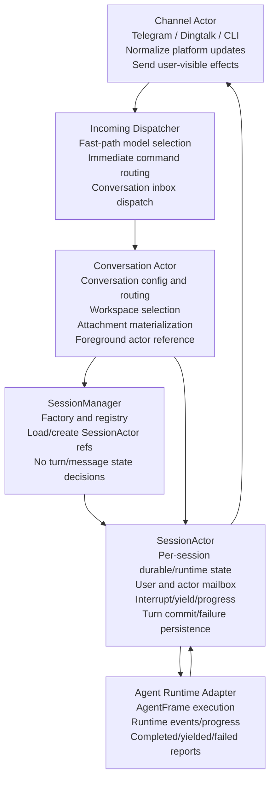

# FEATURES.md

This file records the project features that should be protected by tests.

When adding a new non-bugfix capability, decide whether it is a feature. If it is, add or update an entry here and add focused tests that protect the behavior from future regressions.

## Features

### Config Schema Invariants

- Latest AgentHost config files support a `models.<alias>.type = "brave-search"` helper model type for `tooling.web_search`, with Brave-specific default endpoint/path semantics that resolve to `https://api.search.brave.com` and `/res/v1/web/search`.
- Latest AgentHost config files support a `models.<alias>.type = "claude-code"` provider for Anthropic Messages compatible endpoints, with default endpoint/path semantics that resolve to `/v1/messages` style routing instead of OpenAI chat or responses routes.
- Latest AgentHost config files do not use `main_agent.model` as a global default-model knob; user-facing model selection remains conversation-owned state.
- Latest AgentHost config files do not use `main_agent.timeout_seconds` as a global subagent-timeout knob; subagent timeout policy is derived from the selected model/runtime flow instead of a second main-agent override field.
- Latest AgentHost config files do not allow inline model-level `external_web_search` blocks; external search routing must flow through normal model/tooling configuration instead of a second per-model search config shape.
- Latest AgentHost config files use `models.<alias>.web_search` instead of the legacy `web_search_model` key, require nested `main_agent.context_compaction` / `idle_compaction` fields instead of old flat compaction knobs, and only allow `sandbox.mode = "subprocess" | "bubblewrap"` in the latest schema.
- Legacy config spellings such as `web_search_model`, flat compaction fields, legacy `"zgent"` backend values, and `sandbox.mode = "disabled"` are accepted only through dedicated old-version loaders and upgrade flows, not by the latest config parser itself.
- Older configs may still load with those legacy fields present, but the latest config writer must not emit them again.
- Regression coverage should protect legacy-field ignore-on-load behavior and latest-template omission.

### Claude Messages Provider

- The `claude-code` model type uses Anthropic Messages compatible payloads with `x-api-key` authentication and a default `/messages` request path.
- Automatic Anthropic prompt caching is enabled for Claude-compatible `claude-code` models and is translated into an explicit block-level `cache_control` marker on the last cacheable request block so Claude-style prompt caching works on Anthropic Messages / NewAPI style gateways.
- Assistant tool use and tool result history are translated losslessly between internal `ChatMessage` state and Claude Messages `tool_use` / `tool_result` blocks, so tool-driven multi-round sessions keep working when a conversation runs on `claude-code`.
- Regression coverage should protect config upgrade defaults for `claude-code`, request payload cache markers, and tool roundtrips through the Claude Messages provider.

### Brave Search Web Search Helper

- A `brave-search` helper model can be selected through `tooling.web_search` as a dedicated external search provider without pretending to be an OpenAI chat-completions model.
- Brave-backed `web_search` calls use Brave Search's `GET /res/v1/web/search` transport with `x-subscription-token` authentication, clamp result count to the documented web-search limit, and return compacted snippets plus citation URLs for the agent to read.
- Brave-backed `web_search` rejects reference-image inputs instead of silently pretending multimodal search is supported.
- Regression coverage should protect Brave config defaults, request-shape translation, and response compaction into answer/citation output.

### Helper Image Generation Providers

- `image_generate` should delegate upstream-specific request construction to the shared LLM/provider layer instead of hardcoding one provider protocol inside `tool_worker`.
- OpenRouter chat-completions image helpers should request image output through `modalities: ["image"]` and read generated images from normalized assistant image payloads.
- OpenRouter responses image helpers should likewise support direct image generation through the Responses endpoint with image modalities, rather than assuming only OpenAI-style `image_generation` tool calls exist.
- Generated helper images should be normalized back into canonical PNG workdir files before re-entering synthetic multimodal context.
- Regression coverage should protect OpenRouter image-response parsing for both chat-completions and responses shapes, plus PNG canonicalization before persistence.

### Chat Message Fidelity

- Internal `ChatMessage` state can retain multiple tool calls on a single assistant message, structured array content, and optional reasoning payloads instead of flattening everything to plain text too early.
- Structured `ChatMessage.content` arrays may also carry multiple multimodal items plus internal rich blocks such as `tool_result` and `context`, so one durable message can preserve richer assistant/runtime state than any single upstream provider schema.
- Durable multimodal `ChatMessage` items are canonical workspace-relative path references rather than provider-specific inline base64 payloads; provider/base64 expansion happens only at the final upstream request-materialization boundary.
- User ingress, synthetic tool multimodal injections, and assistant/provider multimodal outputs all canonicalize into the same path-based internal message form before they are persisted into session or snapshot history.
- Provider adapters may still degrade or omit unsupported fields at the last upstream boundary, but internal persistence/transcript-friendly message state should keep rich assistant content whenever the source provider exposed it.
- When a provider cannot natively represent `tool_result` or `context` content blocks inline, adapters should degrade them only at request-build time by splitting tool-result blocks into provider-native tool outputs where possible and rendering context blocks into textual fallback blocks otherwise.
- OpenAI Responses output should preserve assistant content blocks plus reasoning blocks in internal `ChatMessage` form, while OpenAI chat-completions payloads must omit the internal-only `reasoning` field before sending upstream.
- Regression coverage should protect mixed assistant content + multi-tool-call parsing, path-based multimodal canonicalization/materialization, context/tool-result block degradation, and internal-only reasoning not leaking into incompatible upstream payloads.

### Runtime Recovery Notices

- Foreground startup-recovery notices should only arm for sessions that actually still have pending messages to recover, rather than every restored foreground session.
- User-facing recovery copy should describe this as a ClawParty service restart, not a generic system restart, so restart semantics stay accurate when only the host/service process was restarted.
- Regression coverage should protect the “pending messages only” arming rule.

### Cache Health Warnings

- Foreground sessions should emit a user-visible cache warning when prompt-cache reads look unhealthy: either 3 consecutive model calls with `cache_read_input_tokens == 0` and no gap longer than 5 minutes between those consecutive zero-read calls, or 2 zero-read model calls within the most recent 10 calls with no gap longer than 5 minutes between those zero-read calls and no compaction boundary in between.
- Cache warnings should deduplicate during a continuous failure streak and only reopen after a subsequent non-zero cache read changes the health state again.
- Regression coverage should protect the consecutive-zero trigger, the rolling-10-call trigger, the compaction-boundary reset, and the deduplication behavior.

### Attachment Prompt Preparation

- Current-turn attachment handling should stay split into an attachment-preparation phase and a message-assembly phase instead of mixing attachment capability checks, prompt-ready multimodal conversion, and final `ChatMessage` assembly in one function.
- Prompt-ready attachment derivation for images, PDFs, audio clips, and historical inline-image normalization should live behind reusable attachment-prep helpers rather than being duplicated across message-building and history-sanitization code paths.
- Newly materialized conversation attachments should normalize unsupported but transcodable image formats such as TIFF into canonical persisted PNG files at the channel/workdir boundary, so later prompt assembly can reuse stable stored artifacts instead of re-transcoding the same upload every turn.
- Conversation/user-message assembly should emit canonical path-based multimodal content items under the workspace root instead of baking model capability checks or inline base64 payloads into durable user messages.
- Existing workdirs should be upgraded by rewriting persisted `ChatMessage.content` inline images in unsupported formats into canonical supported inline image payloads when possible, or durable placeholder text when the old payload is no longer decodable.
- Existing workdirs should also be upgraded by rewriting persisted inline multimodal message payloads into canonical workspace-relative media paths under `media/legacy/`, so restored sessions and snapshots reuse the same durable message shape as new runtime writes.
- Regression coverage should protect path-based user attachment assembly, request-time multimodal materialization, attachment materialization normalization, tool/provider multimodal canonicalization, and historical multimodal upgrade behavior.

### Interruptible Conversations

- A foreground conversation can be interrupted by a newer user message while the current agent turn is still running.
- When the running turn yields, the interrupting user message is inserted as the next conversation input instead of being lost or auto-resumed past.
- Interrupted follow-up text is marked distinctly so runtime-change notices and normal user-prefix logic do not accidentally rewrite it as ordinary context.
- Regression coverage should include pending interrupt delivery to the next foreground control, interrupted follow-up coalescing, and slash/control messages not leaking into user context.

### Parallel Conversations

- Different conversations must be able to run foreground work concurrently; a long-running turn in one conversation must not block normal message dispatch for another conversation.
- Incoming dispatch and Conversation routing must not maintain long-running per-conversation queues; they may prepare and route messages, but durable ordering and waiting belong to the receiving SessionActor.
- Session actors own the per-session run claim, interrupt, yield, compaction-phase, and pending-interrupt state so independent sessions can progress concurrently.
- Server maintenance work such as idle context compaction must not run inline on the incoming-message dispatch loop in a way that globally pauses new conversation dispatch.
- Idle context compaction uses `idle_compaction.min_ratio` as the precompression token limit, so an idle session over that ratio can be compacted before it reaches the normal foreground threshold.
- Regression coverage should protect per-session interrupt scoping, non-leaking conversation queues/control messages, and idle compaction min-ratio precompression.

### Tool Execution Lifecycle

- Tools have only two execution modes:
  - immediate: the tool returns promptly and does not require turn-level waiting semantics.
  - interruptible: the tool may wait, but must return promptly when a newer user message interrupts the turn or timeout observation asks it to yield.
- Long-running stateful work should use an explicit lifecycle. Some families keep separate start/wait/kill tools, while shell execution now uses a session-oriented pair: `shell` and `shell_close`.
- `shell` owns persistent shell sessions. It can create a session and start the next command, wait for or observe the current command when called without `command`, or send stdin with `input`.
- `shell` creates new sessions only when `session_id` is omitted. Passing `session_id` means "reuse this existing session"; unknown ids must be rejected instead of creating caller-chosen session names.
- Auto-generated shell session ids use the short `sh_<YYYYMMDD>_<6-char>` format instead of UUIDs so they stay easier to quote in tool args, compaction summaries, and transcripts.
- `shell` treats `command=""` the same as omitting `command`.
- Shell results expose `running` and `interactive` on every response. `stdout`, `stderr`, `out_path`, and optional `exit_code` describe only the current process in that session and must not leak output from older commands.
- Full shell output is persisted under `out_path/stdout` and `out_path/stderr`, while the returned `stdout` and `stderr` keep the existing tail-window plus character-cap truncation behavior. Truncation flags and `needs_input` are omitted unless they are true.
- If a shell command finishes and its result has not yet been returned, starting another command in the same session discards that older unreturned result and immediately replaces it with the new current process.
- `shell_close` closes the session and stops any running current command.
- Shared runtime-id guidance belongs in the AgentFrame system prompt; individual tool descriptions should expose the tool effect and schema without restating the same lifecycle rules at length.
- Tool results should omit empty, null, or false diagnostic fields on ordinary success paths; absence means the normal/false case, while truncation, stderr, and errors remain explicit when present.
- Lifecycle tool status results should also omit redundant default-state noise such as `error: null`, `returncode: null`, `completed: false`, `cancelled: false`, `failed: false`, local `remote`, and empty stdout/stderr while preserving meaningful true states, errors, ids, paths, and actual exit codes.
- Tool errors are normalized at the global tool layer before they are returned to the model; oversized error strings are truncated with head/tail preservation rather than letting individual tools flood the assistant context.
- Direct shell read/search commands such as `cat`, `grep`, `find`, `head`, `tail`, and `ls` are rejected on the simple-command path. Agents should use the dedicated `file_read`, `grep`, `glob`, and `ls` tools; remote behavior is governed by the centralized remote policy.
- Timeout observation compaction is controlled by the main agent global setting and is not gated on a particular model provider or per-model prompt-cache TTL.
- Remote-capable tools should use their `remote` argument instead of shelling out to `ssh <host>` manually. The `remote` value must be an actual local SSH alias, normally one detected from `~/.ssh/config` and listed in the system prompt, or a registered remote workpath host; agents must not invent host labels.
- `shell` rejects manual `ssh ...` command strings so models use remote-capable tools rather than bypassing the remote policy.
- When a conversation is in `/remote` execution mode, AgentFrame filesystem/patch/shell tool schemas must stop exposing per-tool `remote` arguments entirely; the bound execution root becomes the only filesystem target for those tools.
- Download/image-style background jobs follow start + wait/progress + cancel where applicable, and their wait tools support explicit wait timeouts without cancelling on normal interruption.
- Regression coverage should protect tool execution mode annotations, shell session lifecycle semantics, centralized remote guidance, manual SSH rejection, and the start/wait/terminate schemas for long-running tool families.

### Conversation Local Mounts

- Users can send `/mount <folder>` to add an existing local directory to the current conversation's durable local mount list.
- In bubblewrap sandbox mode, conversation local mounts are exposed to AgentFrame at the same absolute host paths as writable bind mounts, while subprocess mode keeps the setting for later bubblewrap use.
- Adding a local mount invalidates the foreground AgentFrame runtime so an idle conversation uses a freshly spawned bubblewrap process with the new mount on the next turn.
- Conversation local mounts are included in the rebuilt system prompt so future turns can identify the mounted local paths without treating them as remote SSH workpaths.
- `/mount` is unavailable while the conversation is in `/remote` execution mode because that mode replaces the normal workspace/workpath model with one bound execution root.
- Regression coverage should protect `/mount` parsing, conversation persistence, workdir upgrade backfill, prompt rendering, and bubblewrap bind arguments for local mounts.

### Conversation Remote Execution Root

- Users can bind a conversation to one durable execution root with `/remote <absolute-local-path>`, `/remote <host> <path>`, and `/remote off`.
- SSH `/remote` bindings are implemented through `sshfs`; the host mounts the remote directory under `workdir/remote_mounts/<conversation-id>/workspace` and then reuses the existing local-path file, attachment, bubblewrap, and channel pipelines against that mountpoint.
- A bound `/remote` execution root becomes the conversation's only filesystem root. Entering this mode clears conversation `remote_workpaths`, disables workpath tools and workspace-history tools, and removes per-tool `remote` arguments from AgentFrame schemas.
- Runtime-owned persistent data such as sessions, runtime state, and snapshots move under `<execution_root>/.cache/partyclaw`, while conversation settings remain locally durable and preserve the remote binding across service restarts until the next conversation access remounts it.
- In remote mode, snapshots save/list/load against the bound execution root's `.cache/partyclaw/snapshots` store, and loading a snapshot restores the snapshot's saved remote/local execution binding before restoring the session.
- Remote-mode prompts must explicitly treat the current execution root as the only workspace root, load `AGENTS.md` from that root, and hide remote-alias/workpath/workspace-history guidance that only applies to normal multi-workspace mode.
- Web and outgoing attachment resolution should continue using plain local `PathBuf` handling by resolving paths against either the bound local path or the `sshfs` mountpoint rather than introducing a separate remote attachment type.

### Workspace Shared Directory

- Every workspace root exposes a writable `./shared` entry that points at the workdir-global `rundir/shared` directory, so files placed there are visible across all workspaces in the same deployment workdir.
- Bubblewrap sandboxes preserve `./shared` by binding the underlying `rundir/shared` source path into the sandbox, allowing the workspace-local shared symlink to resolve without copying per-workspace state.
- The main AgentHost system prompt should explicitly tell agents that `./shared` is a cross-workspace shared directory.
- Existing workdirs are upgraded by creating `rundir/shared` and backfilling missing workspace `shared` links, merging legacy per-workspace `shared/` directory contents into the shared source when practical.
- Regression coverage should protect new workspace seeding, bubblewrap bind arguments, system-prompt guidance, and workdir upgrade backfill for shared workspace access.

### Agent Plan Progress

- Main agents can call `update_plan` to publish a short structured checklist for non-trivial, multi-step, ambiguous, or long-running work.
- The current plan is owned and persisted by the receiving SessionActor as `session_state.current_plan`, so progress survives normal actor reloads and does not live in Conversation routing state.
- Plan updates are rendered through the channel progress feedback path while the model only receives a compact tool result, avoiding repeated long plan text in the assistant context.
- During long tool-driven turns, AgentFrame injects a plan-update reminder every 10 tool batches when progress may have changed. The reminder is a durable runtime context message with `role=user`, and it must be preserved like any other context message so the next request sees the same prompt history shape.
- Regression coverage should protect plan schema validation, at-most-one in-progress step, persisted current-plan upgrades, progress rendering, and durable reminder timing.

### System Prompt Refresh Semantics

- Rendered upstream system prompts are request-time products and must not be treated as durable session truth. In particular, persisted session messages must not recursively accumulate AgentFrame-rendered `[AgentFrame Runtime]` prompts.
- AgentHost always assembles latest static/role/memory/current-model/model-catalog prompt parts for rebuild-triggering prompt content; RuntimeContext ids such as channel/session/agent/workspace ids stay in structured session state instead of the model prompt.
- Identity and User meta are tracked as session prompt components with separate canonical and notified snapshots, so profile edits are announced once at the next user-message boundary and become canonical prompt content after compaction.
- Workspace summary, remote workpaths, runtime notes, and PARTCLAW.md are snapshot-style context: they become canonical prompt content at compaction/rebuild boundaries rather than generating normal-turn change notifications.
- Available SSH remote aliases are tracked as a durable prompt component sourced from local SSH config. The canonical system prompt uses the last snapshot, and refreshed alias lists are checked only on user-message turn boundaries and emitted as persisted `[Runtime Prompt Updates]` user-role notices so remote context changes do not silently mutate request prefixes mid-run.
- AgentFrame always assembles latest runtime/tool guidance and tool schemas at request time, while skills metadata is tracked as a session prompt component with separate canonical and notified snapshots.
- Profile and skill metadata change notifications are emitted only on user-message turn boundaries. Assistant resume, background auto-resume, and tool-progress loops must not advance prompt notification state.
- After context compaction, notified prompt component snapshots are promoted into canonical prompt snapshots.
- AgentHost does not inject synthetic process-restart notices or idle-time-gap tips into model message history.
- Runtime prompt updates, runtime skill updates, plan reminders, and compacted `[Active Runtime Tasks]` snapshots must not be hidden request-only mutations. When included in an upstream model request, they are persisted as durable `role=user` context messages in the same relative position instead of being stripped during turn commit. The durable messages are the cache-stability contract: AgentHost/AgentFrame must not send one prompt shape to the provider and then resume from a different message shape, because that destroys prompt-cache prefix reuse and makes token efficiency unpredictable.
- Regression coverage should protect prompt recursion prevention, RuntimeContext removal, skill metadata snapshot/notified behavior, and user-boundary-only skill notifications.

### API Request Observability

- Every upstream model API request, including HTTP and subscription WebSocket requests, should emit structured request lifecycle logs with a stable `api_request_id`, provider, API kind, model, URL/method where applicable, status, elapsed time, clear token accounting fields, cache token breakdown, and redacted request/response headers.
- Token accounting logs use canonical names such as `input_total_tokens`, `output_total_tokens`, `context_total_tokens`, `cache_read_input_tokens`, `cache_write_input_tokens`, `cache_uncached_input_tokens`, and `normal_billed_input_tokens`; current runtime writers and readers must not emit or depend on legacy provider-style aliases.
- Request and response bodies are logged with secret-key redaction. By default, logs include bounded body previews for debugging; setting `AGENT_FRAME_LOG_API_BODIES=full` includes full redacted JSON bodies, and `off` disables body content while preserving sizes and metadata.
- Agent runtime model-call events include the final `api_request_id` and cache token fields so session/agent logs can be joined to low-level API request logs without inferring from timestamps.
- `/status` should show a rolling multi-day total usage and current estimated spend for the current conversation across foreground, background, and subagents by aggregating per-turn agent usage logs for sessions with the same channel/conversation address. It must not use legacy `session.cumulative_usage` as the primary status total because older session state may contain polluted cumulative accounting.
- `/status` should include the current `conversation_id` near the top of the response so session transcripts and agent logs can be matched back to the channel conversation quickly.
- `/status` spend accounting should price per-model `agent_frame_model_call_completed` logs instead of multiplying all tokens by the current model. Unknown model pricing may fall back to GLM 5.1 pricing, but the response must separately list correctly priced models, risky/best-effort models, and unknown models.
- Telegram `/status` renders the rolling spend trend as a channel-owned matplotlib chart when available, attempts a user-level matplotlib install if missing, and falls back to the text status when chart rendering is unavailable.
- Regression coverage should protect header/body redaction, canonical token field names plus workdir log normalization, and the model-call/API-request join fields.

### Structured Logging Policy

- Structured `info` logs should represent stable lifecycle boundaries, authoritative usage/accounting events, startup/shutdown transitions, and degraded-but-actionable conditions; routine internal churn must not be emitted at `info`.
- High-frequency process breadcrumbs such as AgentFrame round starts, tool starts, non-error tool completions, session mailbox drain/stage transitions, sink fan-out steps, channel typing notifications, and similar step-by-step progress markers belong at `debug` so they do not pollute persisted operational logs or downstream analytics.
- For upstream model traffic, `upstream_api_request_completed` and `upstream_api_request_failed` are the authoritative request outcome records; `upstream_api_request_started` remains available only as lower-verbosity debugging detail.
- Conversation spend/usage analytics continue to treat `turn_token_usage` and `agent_frame_model_call_completed` as the authoritative accounting events, and future logging cleanup must not silently remove or rename those events without updating consumers and regression coverage together.
- Regression coverage should protect the AgentFrame event severity split so authoritative usage/terminal events stay at `info` while high-frequency process events stay demoted to `debug`.

### Background Agent Delivery

- A main background agent final user-facing reply is delivered to the same foreground conversation that started or owns it.
- The same final reply is inserted into the Main Foreground Agent stable context as an assistant message so later foreground turns can see it without separate sink plumbing.
- If the foreground agent is currently running, background delivery tells the foreground actor through its durable mailbox and returns without blocking on the receiver turn.
- After inserting a background result, the runtime checks foreground context size and compacts when the normal compaction threshold is reached.
- Main Background Agents have a `terminate` tool that ends the background job silently without sending a user-facing reply or inserting foreground context.
- Regression coverage should protect final reply insertion, durable mailbox delivery while the foreground is active, compaction-after-insert behavior, and silent termination.

### Cron Scheduling

- Cron task tools expose schedule timing through named fields such as `cron_second`, `cron_minute`, `cron_hour`, `cron_day_of_month`, `cron_month`, `cron_day_of_week`, and optional `cron_year`; models should not assemble positional cron strings themselves.
- Internally, named cron fields are compiled to the persisted seconds-first cron expression and interpreted in the task's persisted IANA timezone, defaulting to `Asia/Shanghai` when omitted.
- A cron task must not enqueue overlapping background jobs for the same task; if a previous trigger is still running, the due time is skipped rather than queued for catch-up.
- Cron polling is windowed by the live host runtime: runs missed before the current poll window, including service downtime and restart gaps, are skipped instead of being backfilled later.
- Regression coverage should protect named-field schedule compilation, rejection of partial cron-field updates, task-timezone exact schedules, non-overlapping trigger behavior, and the no-backfill poll-window rule.

### Channel Integrations

- Telegram bot command registration is channel-owned runtime behavior. Telegram config/templates must not expose a per-channel `commands` array as the source of truth for which slash commands get registered.
- DingTalk Stream channels support bidirectional bot conversations through DingTalk app `client_id`/`client_secret` credentials.
- DingTalk robot channels support custom/enterprise robot webhook delivery through `DINGTALK_ROBOT_WEBHOOK_URL`; webhook access tokens should live in `.env`, not JSON config.
- DingTalk robot channels can receive HTTP callback messages when `DINGTALK_ROBOT_APP_SECRET` is configured; callbacks must validate DingTalk `timestamp`/`sign` headers with HMAC-SHA256 and reject stale or invalid requests before parsing message bodies.
- DingTalk robot channels materialize inbound non-text messages as conversation attachments when `DINGTALK_ROBOT_APP_KEY` and `DINGTALK_ROBOT_APP_SECRET` are configured; `downloadCode` is exchanged for a temporary file URL and persisted through the same `PendingAttachment` path used by Telegram.
- Without an AppSecret, DingTalk robot channels must remain send-only and must not pretend to receive user messages.
- Web channels serve the embedded browser client over HTTP, accept user messages through `/api/send`, push live outgoing/progress/session events through `/ws`, and require bearer-token authentication from `auth_token` or `auth_token_env`.
- Web channels without a configured token must log a warning and stay disabled rather than exposing an unauthenticated browser/API surface.
- Web browser clients expose a left-side conversation list and authenticated create/delete controls for Web conversations.
- Web browser clients render assistant messages with safe local Markdown support for headings, lists, tables, horizontal rules, blockquotes, code blocks, inline code, emphasis, and links.
- Web browser clients render assistant `<attachment>...</attachment>` references and outgoing Web attachments through an authenticated attachment endpoint so images and files remain visible after refresh.
- Web browser clients render `ShowOptions` response prompts as clickable buttons and send the selected option value back through the normal `/api/send` path.
- Web browser clients must not submit while an input method editor is composing text, and sent user messages should be rendered from transcript append/history rather than an extra optimistic local bubble.
- Web channel transcript APIs expose newest-first session transcript skeletons and bounded detail ranges through the Host bridge so browser clients can recover reliable history after refresh without depending only on live WebSocket events.
- Web browser clients load transcript skeletons by page, render API calls and tool responses as clickable summary rows, and request full transcript details over WebSocket only when a user expands an entry.
- Web browser clients scroll to the newest history on initial load and automatically request the previous transcript page when the user scrolls to the top, preserving the viewport while older entries are inserted.
- Web transcript history renders `user_tell` model calls as normal assistant messages and suppresses the matching ok-only tool result row.
- Regression coverage should protect Web channel auth, config/TUI visibility for Web fields, and session transcript append/list/detail behavior.
- Telegram progress messages use emoji-decorated status indicators: phase icons (🧠 thinking, 🔧 tools, 🗜️ compaction), per-tool status markers (⏳ running, ✅ completed, ❌ failed), and plan step markers (✅ completed, ▶️ in-progress, ⬜ pending).
- Telegram progress messages are edited to a one-line completion summary with elapsed time on success instead of being deleted, so users can see that the turn finished and how long it took.
- Telegram long code blocks (≥15 lines or ≥600 chars) and long tables are wrapped in `expandable_blockquote` entities so they render collapsed by default and can be expanded on tap, reducing visual clutter for verbose tool output.
- Regression coverage should protect emoji progress rendering, completion summary formatting, and expandable blockquote wrapping for long code blocks.

### Session Transcript

- Each session root owns an append-only `transcript.jsonl` that records user messages, assistant messages, model calls, tool results, and compaction events in stable sequence order. Channel adapters must not write transcript files directly; Web history is served from the Host/session transcript path.
- Session roots are grouped under `sessions/<conversation_id>/foreground/<session_id>` and `sessions/<conversation_id>/background/<session_id>` so foreground and background transcripts for the same conversation are easy to inspect together.
- Model-call transcript entries include token accounting and the full assistant `ChatMessage`; tool-result entries include the tool name, call id, output length, error flag, and full tool output when available.
- Existing workdirs are upgraded by creating missing `transcript.jsonl` files for persisted sessions.
- Existing flat `sessions/<session_id>` workdirs are upgraded into the conversation/kind hierarchy without changing the session ids or transcript contents.
- Regression coverage should protect transcript reopening sequence continuity, newest-first list pagination, detail reads, and workdir upgrade creation of missing transcript files.

### Session Actor Architecture

- Session actors are the only owner of per-session durable state and runtime state, including pending/stable messages, visible history, active runtime phase, pending interrupts, progress state, prompt/profile/model/skill observations, usage, compaction stats, and turn completion/yield/failure state.
- Foreground and background main agents share one session actor lifecycle; differences should be expressed through session policy such as system prompt kind, runtime/model-driven tool availability, delivery behavior, and whether final output is told to a foreground actor.
- Conversation state owns conversation-level routing and configuration: current workspace, remote workpaths, selected model/backend/sandbox settings, chat version, current foreground actor reference, and user attachment materialization for that conversation. It should hand prepared messages to session actors rather than maintaining long-running turn serialization.
- Conversation state also owns any bound `remote_execution` mode for that conversation; session actors inherit the chosen execution/storage roots from conversation settings rather than becoming the source of truth for remote bindings.
- SessionManager acts as a factory and registry for `SessionId -> SessionActorRef` style actor loading/creation. It must not decide user-message handling, turn commit semantics, interrupt behavior, progress behavior, or background-to-foreground delivery semantics.
- `SessionActorRef` is the external production boundary for session operations. Production code should call explicit actor methods such as `tell_user_message`, `tell_actor_message`, runtime commit/failure, progress, interrupt, and observation APIs instead of locking or mutating actor internals directly.
- `SessionActorRef` dispatches production operations through a mailbox-backed actor loop so each session serializes its own state transitions independently of Conversation routing.
- Session actor workers have explicit lifecycle management: closing or destroying a session must persist the closed state and shut down that actor's mailbox loop so stale actor refs stop accepting production commands.
- Agent runtime adapters report runtime events, progress, yielded/completed/failed results, and user-visible messages back to the owning session actor immediately; the actor updates and persists state before emitting outbound effects for channels or runtime adapters to execute.
- User messages and actor-to-actor messages enter a session actor through actor message methods. External code should not directly mutate pending/stable/history state or separately tag interrupted follow-ups.
- A complete user message should reach the session actor after conversation-level preparation such as attachment materialization and routing; entry dispatchers must not call session interrupt hooks with raw, partially prepared text.
- Prepared user messages are persisted in the receiving session actor's durable user mailbox before they are drained into pending context, so queued user input survives service restarts and Conversation does not own session-level waiting.
- Every foreground runtime turn, including initialization, normal user turns, and `/continue`, must claim the foreground session actor before building prompt state or entering AgentFrame; failed or early-returning paths must release that claim through the actor.
- Actor-to-actor messages are persisted in the receiving session actor's durable mailbox before being applied, and tell-style delivery returns only a lightweight receipt instead of the receiver snapshot. Senders must not depend on receiver internals and queued messages survive service restarts.
- Background-to-foreground delivery should flow through the owning conversation: a background actor resolves its conversation, obtains the current foreground actor reference, and tells an actor message to that foreground actor.
- Regression coverage should protect conversation-owned foreground actor routing, actor-owned interrupt/follow-up handling, actor-owned runtime phase/progress persistence, and background result delivery through actor messages.

### DSL Orchestration Runtime

- DSL runs are exec-like long-running jobs with start/wait/kill lifecycle.
- Interrupting `dsl_start` or `dsl_wait` only interrupts the outer wait; the DSL job continues regardless of what it is doing internally.
- External DSL wait interruption does not cancel DSL code, DSL LLM calls, DSL tool calls, or child long-running tools.
- `dsl_kill` terminates the DSL job itself; child jobs continue by default unless explicit child killing is requested.
- DSL code runs in an isolated CPython worker, while DSL capabilities still flow through AgentFrame JSON-RPC callbacks.
- DSL syntax supports normal bounded Python expressions, assignments, `if` statements, f-strings, list/dict literals, attribute/index access, string methods, `type()`, `emit(text)`, `quit()`, `quit(value)`, `LLM()`, LLM handle calls, and `await tool({"name": "tool_name", "args": {"arg": value}})`.
- DSL LLM calls always use the same model as the `dsl_start` caller; model switching with `LLM(model=...)` or `handle.config(model=...)` is not allowed.
- DSL expressions use CPython semantics for arithmetic, comparisons, boolean operators, conditional expressions, builtin pure functions, slices, modulo, floor division, string operations, and JSON-like list/dict manipulation.
- DSL `select` accepts choices only as the second positional argument: `await handle.select("prompt", ["A", "B", "C"])`.
- DSL `emit(text)` appends visible DSL output; when no `quit(value)` is provided, the final result is emitted text joined by newlines, or `0` when nothing was emitted.
- DSL tool call results are assignable values and returned JSON can be accessed with normal Python dict/list syntax for later steps.
- DSL code must reject explicit or implicit loops, including `for`, `while`, `async for`, comprehensions, and generator expressions.
- DSL code must also reject imports, functions, classes, lambdas, private `_` names/attributes, recursive DSL tool calls, and other constructs that make execution unbounded, unsafe, or hard to reason about.
- DSL runtime enforces hard limits for runtime duration, LLM calls, tool calls, emitted messages, code size, and output size.
- DSL tool calls must use the single-dict `tool({"name": ..., "args": {...}})` shape and must go through the normal tool registry, preserving existing permissions, sandboxing, remote/workpath behavior, lifecycle semantics, and output limits.
- DSL cannot directly mutate canonical system prompts; request-time prompt state is owned by AgentHost/AgentFrame, with skills metadata changes flowing through Session prompt component snapshots.
