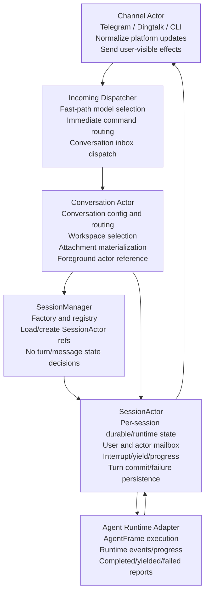

# FEATURES.md

This file records the project features that should be protected by tests.

When adding a new non-bugfix capability, decide whether it is a feature. If it is, add or update an entry here and add focused tests that protect the behavior from future regressions.

## Features

### Interruptible Conversations

- A foreground conversation can be interrupted by a newer user message while the current agent turn is still running.
- When the running turn yields, the interrupting user message is inserted as the next conversation input instead of being lost or auto-resumed past.
- Interrupted follow-up text is marked distinctly so runtime-change notices and normal user-prefix logic do not accidentally rewrite it as ordinary context.
- Regression coverage should include pending interrupt delivery to the next foreground control, interrupted follow-up coalescing, and slash/control messages not leaking into user context.

### Parallel Conversations

- Different conversations must be able to run foreground work concurrently; a long-running turn in one conversation must not block normal message dispatch for another conversation.
- Incoming dispatch and Conversation routing must not maintain long-running per-conversation queues; they may prepare and route messages, but durable ordering and waiting belong to the receiving SessionActor.
- Session actors own the per-session run claim, interrupt, yield, compaction-phase, and pending-interrupt state so independent sessions can progress concurrently.
- Server maintenance work such as idle context compaction must not run inline on the incoming-message dispatch loop in a way that globally pauses new conversation dispatch.
- Regression coverage should protect per-session interrupt scoping and non-leaking conversation queues/control messages.

### Tool Execution Lifecycle

- Tools have only two execution modes:
  - immediate: the tool returns promptly and does not require turn-level waiting semantics.
  - interruptible: the tool may wait, but must return promptly when a newer user message interrupts the turn or timeout observation asks it to yield.
- Long-running stateful work should use an explicit lifecycle:
  - start: create the job/process/task, and optionally wait for completion when that reduces API round trips.
  - wait/observe/progress: check or wait for completion; waits must be interruptible and must not kill the underlying job merely because the user interrupted the agent turn.
  - kill/cancel: explicitly terminate the job/process/task.
- `exec_start` follows the start shape while supporting default wait-until-complete; `exec_wait` is interruptible; `exec_kill` terminates explicitly.
- Remote-capable tools should use `remote="<host>"` instead of shelling out to `ssh <host>` manually. If the tool has `cwd` and `cwd` is non-empty, that `cwd` controls the remote working directory. If `cwd` is omitted or empty, the remote root is the registered workpath, falling back to the remote user's home directory when no workpath is registered.
- Download/image-style background jobs follow start + wait/progress + cancel where applicable.
- Regression coverage should protect tool execution mode annotations and the start/wait/terminate schemas for long-running tool families.

### System Prompt Refresh Semantics

- Fixed/static system prompt content is checked on every new turn and must be rewritten immediately when it changes.
- Dynamic system prompt components from both agent host and agent frame must not rewrite the canonical system prompt immediately during normal turns.
- When dynamic components change, the user-facing turn receives system notifications that describe the change instead of invalidating the existing canonical prompt prefix.
- After context compaction, the full current system prompt is rebuilt and persisted, including the latest dynamic components.
- Regression coverage should protect static prompt immediate rewrite, dynamic component notifications, and compaction-only persistence of dynamic prompt content.

### Background Agent Delivery

- A main background agent final user-facing reply is delivered to the same foreground conversation that started or owns it.
- The same final reply is inserted into the Main Foreground Agent stable context as an assistant message so later foreground turns can see it without separate sink plumbing.
- If the foreground agent is currently running, background delivery tells the foreground actor through its durable mailbox and returns without blocking on the receiver turn.
- After inserting a background result, the runtime checks foreground context size and compacts when the normal compaction threshold is reached.
- Main Background Agents have a `terminate` tool that ends the background job silently without sending a user-facing reply or inserting foreground context.
- Regression coverage should protect final reply insertion, durable mailbox delivery while the foreground is active, compaction-after-insert behavior, and silent termination.

### Cron Scheduling

- Cron task tools expose schedule timing through named fields such as `cron_second`, `cron_minute`, `cron_hour`, `cron_day_of_month`, `cron_month`, `cron_day_of_week`, and optional `cron_year`; models should not assemble positional cron strings themselves.
- Internally, named cron fields are compiled to the persisted seconds-first cron expression and interpreted in the server's local timezone.
- A cron task must not enqueue overlapping background jobs for the same task; if a previous trigger is still running, the due time is skipped rather than queued for catch-up.
- Regression coverage should protect named-field schedule compilation, rejection of partial cron-field updates, local-time exact schedules, and non-overlapping trigger behavior.

### Channel Integrations

- DingTalk Stream channels support bidirectional bot conversations through DingTalk app `client_id`/`client_secret` credentials.
- DingTalk robot channels support custom/enterprise robot webhook delivery through `DINGTALK_ROBOT_WEBHOOK_URL`; webhook access tokens should live in `.env`, not JSON config.
- DingTalk robot channels can receive HTTP callback messages when `DINGTALK_ROBOT_APP_SECRET` is configured; callbacks must validate DingTalk `timestamp`/`sign` headers with HMAC-SHA256 and reject stale or invalid requests before parsing message bodies.
- DingTalk robot channels materialize inbound non-text messages as conversation attachments when `DINGTALK_ROBOT_APP_KEY` and `DINGTALK_ROBOT_APP_SECRET` are configured; `downloadCode` is exchanged for a temporary file URL and persisted through the same `PendingAttachment` path used by Telegram.
- Without an AppSecret, DingTalk robot channels must remain send-only and must not pretend to receive user messages.

### Session Actor Architecture

- Session actors are the only owner of per-session durable state and runtime state, including pending/stable messages, visible history, active runtime phase, pending interrupts, progress state, prompt/profile/model/skill observations, usage, compaction stats, and turn completion/yield/failure state.
- Foreground and background main agents share one session actor lifecycle; differences should be expressed through session policy such as system prompt kind, enabled tools, delivery behavior, and whether final output is told to a foreground actor.
- Conversation state owns conversation-level routing and configuration: current workspace, remote workpaths, selected model/backend/sandbox settings, chat version, current foreground actor reference, and user attachment materialization for that conversation. It should hand prepared messages to session actors rather than maintaining long-running turn serialization.
- SessionManager acts as a factory and registry for `SessionId -> SessionActorRef` style actor loading/creation. It must not decide user-message handling, turn commit semantics, interrupt behavior, progress behavior, or background-to-foreground delivery semantics.
- `SessionActorRef` is the external production boundary for session operations. Production code should call explicit actor methods such as `tell_user_message`, `tell_actor_message`, runtime commit/failure, progress, interrupt, and observation APIs instead of locking or mutating actor internals directly.
- `SessionActorRef` dispatches production operations through a mailbox-backed actor loop so each session serializes its own state transitions independently of Conversation routing.
- Session actor workers have explicit lifecycle management: closing or destroying a session must persist the closed state and shut down that actor's mailbox loop so stale actor refs stop accepting production commands.
- Agent runtime adapters report runtime events, progress, yielded/completed/failed results, and user-visible messages back to the owning session actor immediately; the actor updates and persists state before emitting outbound effects for channels or runtime adapters to execute.
- User messages and actor-to-actor messages enter a session actor through actor message methods. External code should not directly mutate pending/stable/history state or separately tag interrupted follow-ups.
- A complete user message should reach the session actor after conversation-level preparation such as attachment materialization and routing; entry dispatchers must not call session interrupt hooks with raw, partially prepared text.
- Prepared user messages are persisted in the receiving session actor's durable user mailbox before they are drained into pending context, so queued user input survives service restarts and Conversation does not own session-level waiting.
- Every foreground runtime turn, including initialization, normal user turns, and `/continue`, must claim the foreground session actor before building prompt state or entering AgentFrame; failed or early-returning paths must release that claim through the actor.
- Actor-to-actor messages are persisted in the receiving session actor's durable mailbox before being applied, and tell-style delivery returns only a lightweight receipt instead of the receiver snapshot. Senders must not depend on receiver internals and queued messages survive service restarts.
- Background-to-foreground delivery should flow through the owning conversation: a background actor resolves its conversation, obtains the current foreground actor reference, and tells an actor message to that foreground actor.
- Regression coverage should protect conversation-owned foreground actor routing, actor-owned interrupt/follow-up handling, actor-owned runtime phase/progress persistence, and background result delivery through actor messages.

### DSL Orchestration Runtime

- DSL runs are exec-like long-running jobs with start/wait/kill lifecycle.
- Interrupting `dsl_start` or `dsl_wait` only interrupts the outer wait; the DSL job continues regardless of what it is doing internally.
- External DSL wait interruption does not cancel DSL code, DSL LLM calls, DSL tool calls, or child long-running tools.
- `dsl_kill` terminates the DSL job itself; child jobs continue by default unless explicit child killing is requested.
- DSL code runs in an isolated CPython worker, while DSL capabilities still flow through AgentFrame JSON-RPC callbacks.
- DSL syntax supports normal bounded Python expressions, assignments, `if` statements, f-strings, list/dict literals, attribute/index access, string methods, `type()`, `emit(text)`, `quit()`, `quit(value)`, `LLM()`, LLM handle calls, and `await tool({"name": "tool_name", "args": {"arg": value}})`.
- DSL LLM calls always use the same model as the `dsl_start` caller; model switching with `LLM(model=...)` or `handle.config(model=...)` is not allowed.
- DSL expressions use CPython semantics for arithmetic, comparisons, boolean operators, conditional expressions, builtin pure functions, slices, modulo, floor division, string operations, and JSON-like list/dict manipulation.
- DSL `select` accepts choices only as the second positional argument: `await handle.select("prompt", ["A", "B", "C"])`.
- DSL `emit(text)` appends visible DSL output; when no `quit(value)` is provided, the final result is emitted text joined by newlines, or `0` when nothing was emitted.
- DSL tool call results are assignable values and returned JSON can be accessed with normal Python dict/list syntax for later steps.
- DSL code must reject explicit or implicit loops, including `for`, `while`, `async for`, comprehensions, and generator expressions.
- DSL code must also reject imports, functions, classes, lambdas, private `_` names/attributes, recursive DSL tool calls, and other constructs that make execution unbounded, unsafe, or hard to reason about.
- DSL runtime enforces hard limits for runtime duration, LLM calls, tool calls, emitted messages, code size, and output size.
- DSL tool calls must use the single-dict `tool({"name": ..., "args": {...}})` shape and must go through the normal tool registry, preserving existing permissions, sandboxing, remote/workpath behavior, lifecycle semantics, and output limits.
- DSL cannot directly mutate canonical system prompts; dynamic prompt changes still use system notifications and compaction-time prompt rebuild.
