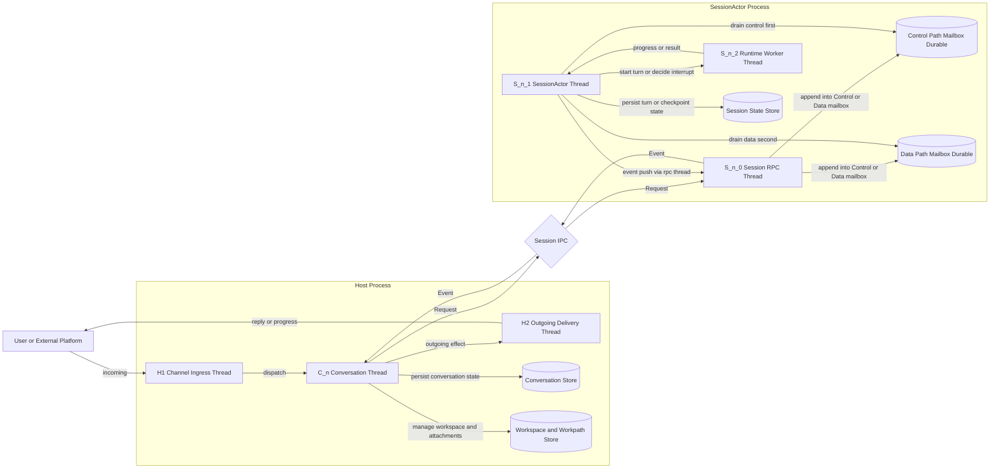
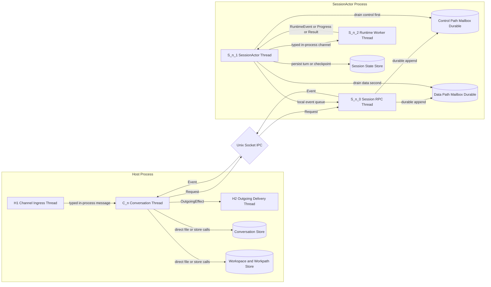
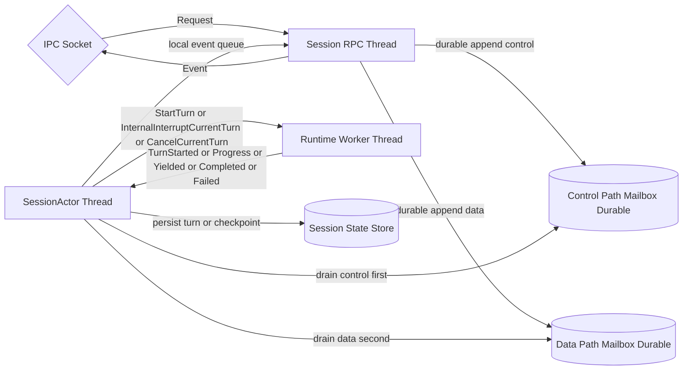
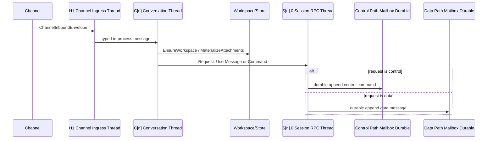
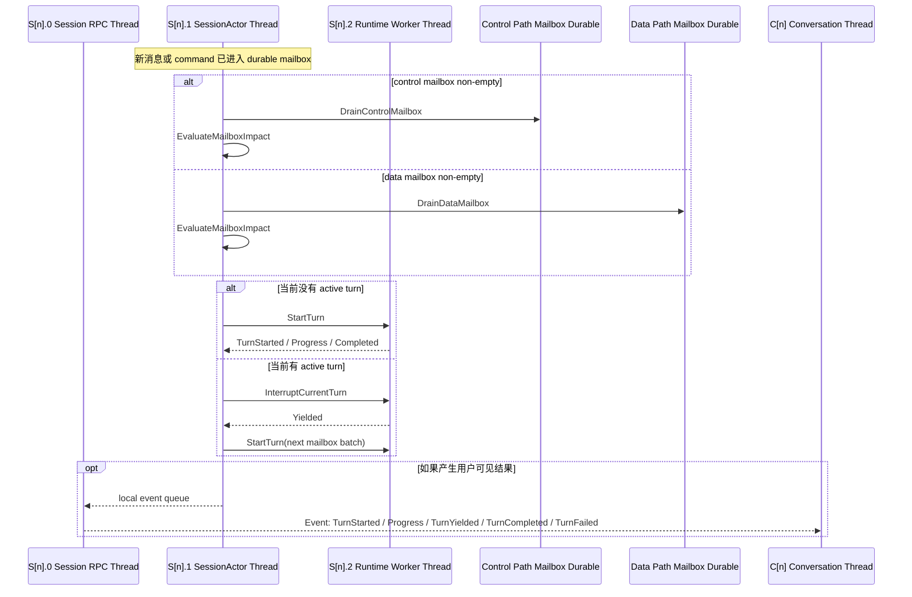

# Ideal Structure

## 1. 目标

这次重构的核心目标是把当前链路明确拆成两层：

- `Conversation` 层负责 conversation 级 durable state。
- `SessionActor` 层负责 session 级执行循环。

其中：

- 一个消息从 `Channel` 进来后，先进入 `Conversation`。
- `Conversation` 负责 workspace 是否存在、每个 agent 的 workpath/workdir 绑定、附件落盘、消息 canonicalization 和路由。
- incoming message 会先在这里被 canonicalize 成可投递给 session 的 `ChatMessage`。
- 然后由 `Conversation` 作为 router，把消息或命令投递到跨进程运行的 `SessionActor` 侧 durable mailbox。
- `SessionActor` 内部维护两条 mailbox：
  - `Control Path Mailbox`
  - `Data Path Mailbox`
- `Control Path` 的优先级高于 `Data Path`。
- `SessionActor` 只关心 session mailbox、turn loop、interrupt、yield、runtime error、turn result。

一句话概括：

`Conversation = durable boundary + router`

`SessionActor = execution boundary + state machine`

## 2. 线程优先视图

这一节改成“线程优先”表述，不再把“模块”和“线程”画成同一种框。

### 2.1 图例

- 绿色圆角框：一个真实线程。
- 黄色圆柱：durable store / 文件目录，不是线程。
- 蓝色菱形：协议或 IPC 边界，不是线程。

### 2.1.1 系统总览结构图

这张图是整个程序的总览图。

- 它先回答“系统有哪些大块，以及它们怎么连接”。
- 绿色框仍然代表真实线程。
- 黄色圆柱代表持久化存储。
- 蓝色菱形代表协议/IPC 边界。



这张总览图表达的是：

- 外部消息先进入 `H1`
- 然后被路由到某个 `C[n]`
- `C[n]` 持有 conversation 级 durable truth
- `C[n]` 自己持有这一条 session connection 的 non-blocking transport
- `S[n].0` 是专门和 `ConversationThread` 沟通的 Session RPC 线程
- `S[n].0` 只负责 non-blocking JSON-RPC 收发，以及把请求写进 SessionActor 侧的 durable mailbox
- `S[n].1` 才是真正的 SessionActor 状态机线程
- `Session IPC` 只是跨进程 transport，不代表 Host 持有消息存储
- `S[n].0` 会按优先级把请求写入两条 durable mailbox：
  - `Control Path`
  - `Data Path`
- `S[n].1` 按 `Control > Data` 的顺序 drain mailbox
- `S[n].1` 驱动 `S[n].2` 执行 turn
- 跨进程只保留两种方向的消息：
  - `Request`
  - `Event`
- 结果再回到 `C[n]`
- 最后通过 `H2` 发回外部

### 2.2 建议创建的线程

如果按这份理想结构落地，建议创建的线程是下面这些。

#### Host process 固定线程

| 线程名 | 数量 | 职责 |
|---|---|---|
| `H0 Host Main Thread` | 1 | 启动、关闭、监督其他线程；不承载正常消息处理。 |
| `H1 Channel Ingress Thread` | 1 | 接收各个 channel 的入站消息，做平台归一化，送入 conversation。 |
| `H2 Outgoing Delivery Thread` | 1 | 专门负责给 channel 发 reply / progress / error，避免发送阻塞 conversation。 |

#### Host process 按 conversation 增长的线程

| 线程名 | 数量 | 职责 |
|---|---|---|
| `C[n] Conversation Thread` | 每个 active conversation 1 个 | 这是 conversation 的唯一串行执行点；负责 workspace/workpath、附件落盘、消息 canonicalization 和路由到 session。 |

#### SessionActor process 按 session 增长的线程

| 线程名 | 数量 | 职责 |
|---|---|---|
| `S[n].0 Session RPC Thread` | 每个 session process 1 个 | 专门和 `ConversationThread` 沟通，处理 non-blocking JSON-RPC 收发；把 `UserMessage` 和其他 `Command` 写入 SessionActor 侧的 durable mailbox。 |
| `S[n].1 SessionActor Thread` | 每个 session process 1 个 | 维护 mailbox、turn state、内部 interrupt/cancel/yield 决策；按 `Control > Data` 的顺序 drain durable mailbox。 |
| `S[n].2 Runtime Worker Thread` | 每个 session process 1 个 | 真正执行 turn；运行模型、工具、compaction，向 SessionActor 回传 progress/event/result。 |

#### 总线程数公式

如果当前有：

- `C` 个 active conversations
- `S` 个 active session processes

那么总线程数大致是：

`3 + C + 3S`

其中：

- 固定线程是 `3`：`H0`、`H1`、`H2`
- 每个 active conversation 增加 `1`
- 每个 active session process 增加 `3`

如果后面把 runtime 再下沉成 child process，那么增加的是“进程”，不是这份图里的 host/session 主线程模型本身；这份图仍然保持：

- `Session RPC Thread` 负责 transport I/O
- `SessionActor Thread` 负责状态机
- `Runtime Worker Thread` 负责驱动 child runtime
- JSON-RPC transport 不阻塞 `ConversationThread` 和 `SessionActorThread`

### 2.3 单个消息路径的线程图

下面这张图只回答一件事：一条消息经过哪些线程。



### 2.4 单个 session process 内部图

这一张只看 session process 自己内部，不混入 host 侧模块。



## 3. 线程 / 进程边界

### 3.1 线程和模块怎么对应

为了避免“一个框既像线程又像模块”，这里约定：

- 图里只把真实线程画成主要执行框。
- `Store`、`IPC`、`Protocol` 一律不画成线程框。
- 如果一个东西只是模块，不是线程，就不单独占一个绿色线程框。

也就是说：

- `Conversation` 在图上代表的是 `Conversation Thread`
- `Session RPC` 在图上代表的是专门和 `ConversationThread` 沟通的线程
- `SessionActor` 在图上代表的是状态机线程
- `Workspace Manager`、`Conversation Store`、`Session Store` 都不是线程，只是被某个线程独占访问的资源或模块

### 3.2 并发域划分

| 并发域 | 实际线程 | 说明 |
|---|---|---|
| Channel ingress 域 | `H1` | 所有 channel 入站先到这里。 |
| Conversation 串行域 | `C[n]` | 同一个 conversation 的状态修改只能发生在它自己的 conversation 线程里。 |
| Outgoing I/O 域 | `H2` | 所有向外发消息的慢 I/O 统一放这里。 |
| Conversation transport 域 | `C[n]` | conversation 线程发起 non-blocking JSON-RPC，但不等待 worker 中断完成。 |
| Session RPC 域 | `S[n].0` | 专门承接来自 conversation 的 `UserMessage` 和其他 `Command`，并把它们写入 durable mailbox，避免它们被 SessionActor 内部等待过程阻塞。 |
| Session 状态机域 | `S[n].1` | session mailbox、turn state、内部 interrupt/cancel 决策都在这里；它按 `Control > Data` 的顺序 drain mailbox，不直接承担对话侧 JSON-RPC 往返。 |
| Runtime 执行域 | `S[n].2` | 真正跑模型/工具的线程；不直接拥有 session durable truth。 |

### 3.3 跨进程位置

- `H0`、`H1`、`H2`、`C[n]` 在 host process。
- `S[n].0`、`S[n].1`、`S[n].2` 在对应的 session process。
- `C[n] <-> S[n].0` 是明确的跨进程边界。

### 3.4 关键原则

- `Conversation` 只管理 conversation scope 的 durable truth。
- `SessionActor` 不直接拥有 conversation/workspace 的主数据定义权。
- `SessionActor` 消费的是由 conversation canonicalize 之后投递过来的 `ChatMessage`。
- `Conversation Thread` 和 `SessionActor Thread` 之间增加一个 `Session RPC Thread`，专门负责沟通和 non-blocking transport I/O。
- Session 侧 mailbox 本身必须是 durable 的；否则进程关闭或尚未及时处理时消息会丢失。
- Session 侧 mailbox 分成两条：
  - `Control Path`
  - `Data Path`
- `Control Path` 的优先级必须高于 `Data Path`。
- `Session RPC Thread` 必须保证 `EnqueueUserMessage` 和同类 `Command` 不会因为 worker 仍在中断 Torch 工具而被阻塞。
- JSON-RPC transport 的背压不能直接卡死 actor mailbox 处理。

## 4. 每条线的协议

为了让下面的协议表继续和线程图对齐，这里先固定一次映射关系：

- `Channel Adapter + Incoming Dispatcher` 运行在 `H1`
- `Conversation Actor` 运行在 `C[n]`
- `Outgoing Sink` 运行在 `H2`
- `Session RPC` 运行在 `S[n].0`
- `SessionActor Loop` 运行在 `S[n].1`
- `Turn Runner / Runtime Adapter` 运行在 `S[n].2`

| 线路 | 边界类型 | 建议协议 | 原因 |
|---|---|---|---|
| `Channel Adapter -> Incoming Dispatcher` | 同进程跨任务 | typed Rust message + `tokio::mpsc` | 轻量、无需序列化。 |
| `Incoming Dispatcher -> Conversation Actor` | 同进程跨任务 | typed Rust actor mailbox + `tokio::mpsc` | 保证同 conversation 串行。 |
| `Conversation Actor <-> Conversation Store / Workspace Manager` | 同线程 | 直接 trait / function call | 这是本地持久化边界，不需要 IPC。 |
| `Conversation Actor -> Session RPC` | 跨进程 | 长连接 JSON-RPC，推荐 `Unix Domain Socket + length-prefixed JSON` | `Request` 方向，只承接 `UserMessage` 和其他 `Command`。 |
| `Session RPC -> Conversation Actor` | 跨进程 | 同一条 JSON-RPC 连接上的单向 event push | `Event` 方向，只承接 turn 生命周期和进度事件。 |
| `Session RPC <-> Durable Mailboxes` | 同进程 | append-only durable queue write | RPC 线程把请求按类型写入 `Control` 或 `Data` mailbox。 |
| `SessionActor Loop <-> Durable Mailboxes` | 同进程 | prioritized mailbox drain | SessionActor 按 `Control > Data` 的优先级消费 mailbox。 |
| `SessionActor Loop <-> Session State Store` | 同线程 | 直接 trait / function call | session mailbox/checkpoint 必须由 loop 串行持有。 |
| `SessionActor Loop <-> Turn Runner` | 同进程跨线程 | typed in-process channel | turn 执行可能阻塞，必须和 actor loop 解耦。 |
| `Conversation Actor -> Outgoing Sink / Channel` | 同进程跨任务 | typed Rust message + async send | 统一把用户可见输出从 Conversation 发回 channel。 |

### 4.1 为什么 `Conversation <-> SessionActor` 不建议直接用函数调用

因为它已经是跨进程边界，而且是这次架构里最重要的 fault boundary：

- `SessionActor` 可以 crash，但 `Conversation` 不应丢 durable state。
- `SessionActor` 可以重启，但 `Conversation` 仍然知道哪些 `ChatMessage` 已持久化、哪些还未被消费。
- `SessionActor` 内部可以在收到新消息后自行决定是否 yield / interrupt / fail，而 `Conversation` 只需要根据 IPC event 做持久化和路由。
- `InterruptCurrentTurn` 不会立即返回，因为 runtime worker 需要时间来中断内部工具。
- 因此必须把“和 ConversationThread 沟通”的职责放在独立的 `Session RPC Thread` 上，不能让它被 worker 中断耗时拖住。
- 这份协议里不再单独定义 `Accepted` 这类回包；跨边界只保留 `Request` 和 `Event` 两种方向。

## 5. 消息类型总表

这里区分两类概念：

- `transport message`：组件之间在线路上传的消息。
- `durable record`：落盘后的稳定对象。

### 5.1 Channel -> Conversation

| 消息类型 | 发出方 -> 接收方 | 何时发出 | 用途 |
|---|---|---|---|
| `ChannelInboundEnvelope` | `Channel Adapter -> Incoming Dispatcher` | 平台收到一条新消息 | 把 Telegram/Web/CLI 的原始输入统一成 host 可处理的标准入站结构。 |
| `ConversationCommand::AcceptInbound` | `Incoming Dispatcher -> Conversation Actor` | 这条消息属于某个 conversation，且不是 immediate fast-path | 把入站消息交给 conversation 串行处理。 |
| `ConversationCommand::Control` | `Incoming Dispatcher -> Conversation Actor` | conversation close、channel control、system side signal | 处理非普通聊天类事件。 |

建议 `ChannelInboundEnvelope` 至少包含：

- `channel_id`
- `conversation_key`
- `remote_message_id`
- `sender`
- `text`
- `attachments`
- `received_at`
- `control`

### 5.2 Conversation 内部 durable 边界

| 消息/记录类型 | 发出方 -> 接收方 | 何时发出 | 用途 |
|---|---|---|---|
| `WorkspaceCommand::EnsureWorkspace` | `Conversation Actor -> Workspace Manager` | conversation 首次收消息，或 workspace 缺失 | 保证 workspace 存在。 |
| `WorkspaceCommand::EnsureAgentWorkpath` | `Conversation Actor -> Workspace Manager` | 需要为 foreground/background/subagent 分配 workpath/workdir 时 | 保证每个 agent 的文件根明确可恢复。 |
| `WorkspaceCommand::MaterializeAttachments` | `Conversation Actor -> Workspace Manager` | 入站消息含附件 | 把附件落到 workspace/conversation 管理的路径下。 |
| `ConversationRecord::IngressEnvelope` | `Conversation Actor -> Conversation Store` | 入站消息被 conversation 接收并完成路由前置处理时 | 记录 conversation 侧的 ingress / routing 元信息，而不是 session mailbox 本体。 |
| `ConversationRecord::RoutingDecision` | `Conversation Actor -> Conversation Store` | 准备把消息转发到某个 session 时 | 记录这条 message 被路由到哪个 session，便于恢复与去重。 |

这里的关键要求是：

- 入站消息在 `Conversation` 层就转成 `ChatMessage`。
- 附件路径在这里就 canonicalize 成 workspace-relative path。
- 从这一层往下，不再传 platform-specific message shape。
- session mailbox 的 durable 持久化不放在 `Conversation` 侧完成，而是在 `SessionActor` 侧的 durable mailbox 内完成。
- `Conversation` 不应该再持久化一份 session transcript 或 assistant/tool 完整历史。
- `Conversation` 持有的是 ingress/routing/delivery metadata，而不是 session full transcript 的第二份副本。

### 5.3 Conversation -> SessionActor IPC

| 消息类型 | 发出方 -> 接收方 | 何时发出 | 用途 |
|---|---|---|---|
| `SessionRequest::EnqueueUserMessage` | `Conversation Actor -> Session RPC` | 一条用户消息已经完成 canonicalization 并准备投递给 session | 把 canonical `ChatMessage` 非阻塞地写入 `Data Path Mailbox`。 |
| `SessionRequest::EnqueueActorMessage` | `Conversation Actor -> Session RPC` | 另一个 session/background/subagent 的结果需要投递到当前 session | 把 actor-to-actor delivery 非阻塞地写入 `Data Path Mailbox`。 |
| `SessionRequest::CancelTurn` | `Conversation Actor -> Session RPC` | 用户明确取消，或 conversation 被关闭 | 把 cancel command 非阻塞地写入 `Control Path Mailbox`。 |
| `SessionRequest::ResumePending` | `Conversation Actor -> Session RPC` | SessionActor 重启恢复，发现有未消费的已持久化 message | 把恢复 command 非阻塞地写入 `Control Path Mailbox`。 |
| `SessionRequest::UpdateWorkspaceBinding` | `Conversation Actor -> Session RPC` | workspace/workpath/remote execution 绑定变化 | 把绑定更新 command 非阻塞地写入 `Control Path Mailbox`。 |
| `SessionRequest::ResolveHostCoordination` | `Conversation Actor -> Session RPC` | `Conversation` 已经完成某个 host-owned 协作动作 | 把 subagent/background/cron/snapshot 等 host 协作结果写入 `Control Path Mailbox`。 |
| `SessionRequest::QuerySessionView` | `Conversation Actor -> Session RPC` | `Conversation` 需要读取 session-owned durable read model | 请求 session 返回 transcript/history/live view，而不是让 `Conversation` 自己再持久化一份。 |
| `SessionRequest::Shutdown` | `Conversation Actor -> Session RPC` | 会话删除、服务退出、session 被替换 | 把 shutdown command 非阻塞地写入 `Control Path Mailbox`。 |

建议 `EnqueueUserMessage` 至少携带：

- `conversation_id`
- `session_id`
- `conversation_message_id`
- `chat_message`
- `workspace_binding_version`

关键语义：

- `Conversation` 只负责把新 user message canonicalize 后投递到 session mailbox。
- `Conversation` 不负责告诉 session “现在就去 interrupt 当前 turn”。
- 消息和 command 先由 `Session RPC Thread` 写入 SessionActor 侧的 durable mailbox。
- `Data Path` 承载 user message。
- `Data Path` 也可以承载 actor-to-actor delivery，例如 background result 或 subagent result。
- `Control Path` 承载 cancel、resume、shutdown、workspace binding update，以及 host coordination result 这类高优先级 command。
- 查询类请求仍然属于 `Request` 方向，但语义上是 read/query，而不是写 mailbox。
- `Conversation` 不再等待单独的 `Accepted` 回包；Unix Domain Socket 写入完成后，session 侧会立即把请求落入 durable mailbox。
- `SessionActor` 在收到新消息后，自己决定下一步策略：
  - 立即启动新 turn
  - 请求当前 turn yield
  - 合并多个 follow-up 再处理

### 5.4 SessionActor -> Conversation IPC event

| 消息类型 | 发出方 -> 接收方 | 何时发出 | 用途 |
|---|---|---|---|
| `SessionEvent::TurnStarted` | `SessionActor -> Session RPC -> Conversation Actor` | session 开始处理一轮 turn | 让 conversation 更新 routing/runtime 状态。 |
| `SessionEvent::Progress` | `SessionActor -> Session RPC -> Conversation Actor` | 模型调用、工具执行、压缩中等阶段变化 | conversation 决定是否向 channel 发 progress feedback。 |
| `SessionEvent::TurnYielded` | `SessionActor -> Session RPC -> Conversation Actor` | 当前 turn 因 session 内部 interrupt 决策或内部 yield 暂停 | conversation 保持 pending 状态，等待下一轮继续。 |
| `SessionEvent::TurnCompleted` | `SessionActor -> Session RPC -> Conversation Actor` | 一轮 turn 正常结束 | 返回 assistant `ChatMessage`、usage、runtime summary，供 conversation 更新 delivery/routing metadata 并下发给用户。 |
| `SessionEvent::TurnFailed` | `SessionActor -> Session RPC -> Conversation Actor` | 一轮 turn 失败但 session 仍存活 | 返回错误、resume token/pending 状态，供 conversation 决定如何记录和告警。 |
| `SessionEvent::HostCoordinationRequested` | `SessionActor -> Session RPC -> Conversation Actor` | Session 内某个 tool 或内部动作需要 host/conversation 配合 | 请求 `Conversation` 代为执行 subagent/background/cron/snapshot 之类的 host-owned 操作。 |
| `SessionEvent::InteractiveOutputRequested` | `SessionActor -> Session RPC -> Conversation Actor` | Session 生成了需要 channel 特殊渲染的交互输出 | 请求 `Conversation` 把 `ShowOptions`、进度快照、可展开 detail 等交给对应 channel。 |
| `SessionEvent::SessionViewResult` | `SessionActor -> Session RPC -> Conversation Actor` | 响应 `QuerySessionView` | 返回 transcript page/detail 或当前 live state snapshot。 |
| `SessionEvent::ControlRejected` | `SessionActor -> Session RPC -> Conversation Actor` | 某个 control command 当前状态下不可执行 | 立即回复“该 control 现在不能执行”，并允许把这个 control 从 mailbox 中丢弃。 |
| `SessionEvent::RuntimeCrashed` | `SessionActor -> Session RPC -> Conversation Actor` | runtime 子层崩溃或 session 内部不可恢复错误 | 让 conversation 做故障转移、重启或保留待恢复消息。 |

这里再收紧一条约束：

- 跨边界不再单独定义 `Accepted` 这类回包。
- mailbox append、impact evaluation、yield plan 这些都属于 `SessionActor` 内部实现细节。

`TurnCompleted` 建议至少包含：

- `session_id`
- `turn_id`
- `consumed_message_ids`
- `assistant_messages: Vec<ChatMessage>`
- `usage`
- `compaction`
- `artifacts`
- `final_status`

`TurnFailed` 建议至少包含：

- `session_id`
- `turn_id`
- `failed_phase`
- `failed_operation_kind`
- `retryable`
- `resume_strategy`
- `blocking_reason`

### 5.4.1 Host 协作型消息要单独对齐

随着功能变多，`Conversation <-> SessionActor` 之间不能只剩“用户消息 + turn 生命周期”两类消息，还要覆盖那些必须由 Host/Conversation 代办的动作。

推荐固定成这套模式：

1. `SessionActor` 通过 `SessionEvent::HostCoordinationRequested` 发起 host-owned 请求
2. `Conversation` 或 Host 侧 manager 执行真正的外部动作
3. 完成后再通过 `SessionRequest::ResolveHostCoordination` 把结果投回 session

也就是说：

- `SessionActor` 不应该直接操纵 host 全局 registry / cron manager / subagent registry
- `Conversation` 也不应该直接决定 session 内部如何继续执行
- 两边只通过 typed `HostCoordinationRequested -> ResolveHostCoordination` 往返协作

### 5.4.2 HostCoordinationRequested 的推荐子类型

| 子类型 | 谁真正执行 | 何时需要 | 返回给 Session 的结果 |
|---|---|---|---|
| `SpawnSubagent` | `Conversation + Session/Host registry` | foreground session 里的 subagent tool 请求创建子 agent | `subagent_id`、目标 session/workpath、失败原因。 |
| `StartBackgroundAgent` | `Conversation + Session/Host registry` | foreground session 请求启动 background agent | `background_agent_id`、目标 session/workpath、失败原因。 |
| `DeliverBackgroundResult` | `Conversation` | background agent 完成后，需要把结果投递回 foreground conversation | delivery 是否成功、目标 session 是否存在。 |
| `CronCreate` | `Conversation + CronManager` | session tool 请求创建 cron task | `cron_task_id`、规范化后的 schedule、失败原因。 |
| `CronUpdate` | `Conversation + CronManager` | session tool 请求更新 cron task | 更新后的任务视图或失败原因。 |
| `CronDelete` | `Conversation + CronManager` | session tool 请求删除 cron task | 删除结果或失败原因。 |
| `CronList` | `Conversation + CronManager` | session tool 请求列出当前 conversation 可见的 cron task | task 列表快照。 |
| `SnapshotSave` | `Conversation + SnapshotManager` | session/tool 请求保存 snapshot | `snapshot_id` 或失败原因。 |
| `SnapshotLoad` | `Conversation + SnapshotManager` | session/tool 请求加载 snapshot | 是否已恢复、恢复到哪个 binding。 |
| `SnapshotList` | `Conversation + SnapshotManager` | session/tool 请求列出 snapshot | snapshot 列表快照。 |

### 5.4.3 Web 功能里哪些要进协议，哪些不要进

这里最好也明确边界，避免把所有 Web 功能都塞进 `SessionActor` 协议里。

应该进入 `Conversation <-> SessionActor` 协议的：

- Web 用户通过 `/api/send` 发来的普通消息
  - 这仍然只是 `SessionRequest::EnqueueUserMessage`
- `ShowOptions`、progress、assistant 输出、tool/detail skeleton 这类由 session 产生、由 channel 特殊渲染的内容
  - 这属于 `SessionEvent::InteractiveOutputRequested` 或普通 `TurnCompleted/Progress`
- 实时 transcript append 通知
  - 这可以作为 `SessionEvent::InteractiveOutputRequested` 的一种特例，或者作为独立的 transcript-append channel event
  - 它的目的只是告诉 Web 前端“有新内容到了”，不是回传整段历史
- conversation 代表 Web/其他消费者查询 session-owned 历史或 live view
  - 这属于 `SessionRequest::QuerySessionView -> SessionEvent::SessionViewResult`

不应该进入这条协议的：

- Web conversation create/delete
- Web remote execution 绑定创建或修改
- WebSocket 客户端订阅和认证

这些都属于 `Channel / Conversation / Host service` 自己的职责，不应该伪装成 session control message。

换句话说，Web 至少有两条不同的数据路径：

1. 实时路径
   - `/api/send`
   - `Conversation -> SessionActor`
   - `SessionActor -> Conversation`
   - `/ws` 推送新的 progress / output / transcript append
2. 历史读取路径
   - Web 客户端向 Host 发 transcript list/detail 请求
   - Host 先经过 `Conversation` 做鉴权、conversation/session 解析和可见性判断
   - `Conversation` 再通过 `SessionRequest::QuerySessionView` 向 session 读取 session-owned durable read model
   - session 返回 `SessionEvent::SessionViewResult`

建议这里明确一个硬约束：

- Web history 是必须有的
- 但 session full transcript 的主数据仍然只在 session 侧
- `Conversation` 不应该因为 Web history 再复制持久化一份 session transcript
- 如果需要通过 `Conversation` 访问历史，推荐增加窄协议 `QuerySessionView`

原因不是“Web history 不属于 session”，而是：

- `SessionActor` 的主职责是推进状态机
- 但 session transcript / live view 的主数据仍然属于 session
- 所以更合理的是让 `Conversation` 通过一个只读 IPC query 去拿 session-owned 视图
- 而不是让 `Conversation` 再持久化第二份 transcript

更准确地说，实现上推荐是：

1. `Web Client -> Host Web Service`
2. `Host Web Service -> Conversation`
3. `Conversation` 校验 conversation ownership、解析当前 foreground/background session root、决定可见范围
4. `Conversation -> SessionActor IPC: QuerySessionView`
5. `Session RPC / SessionActor` 从 session-owned transcript store 或 live state 读数据
6. `SessionActor -> Conversation IPC: SessionViewResult`
7. 把读取结果回给 Web Client

这样做的好处是：

- session transcript 仍然只持久化一份
- `Conversation` 不越权直接读写 session 主数据
- 历史读取、detail 展开、live snapshot 都能通过同一条 IPC 协议扩展

### 5.4.3.1 Web 历史读取的推荐消息类型

这部分需要拆成两层：

| 消息类型 | 发出方 -> 接收方 | 用途 |
|---|---|---|
| `WebHistoryRequest::ListConversations` | `Web Client -> Host Web Service` | 获取左侧 conversation 列表。 |
| `WebHistoryRequest::ListTranscriptSkeleton` | `Web Client -> Host Web Service` | 分页拉取 transcript skeleton。 |
| `WebHistoryRequest::GetTranscriptDetail` | `Web Client -> Host Web Service` | 拉取某一段 transcript detail。 |
| `WebHistoryRequest::ListAttachments` | `Web Client -> Host Web Service` | 查询当前 conversation 可见附件。 |
| `WebHistoryEvent::TranscriptAppended` | `Host Web Service -> Web Client` | 告诉前端有新的 transcript item 已落盘。 |
| `SessionRequest::QuerySessionView` | `Conversation Actor -> Session RPC` | 向 session 查询 transcript page、detail 或 live snapshot。 |
| `SessionEvent::SessionViewResult` | `SessionActor -> Session RPC -> Conversation Actor` | 返回上面查询的结果。 |

推荐语义：

- `ListTranscriptSkeleton`
  - 先由 `Conversation` 解析读取范围，再通过 `QuerySessionView` 取 page 数据
  - 返回 newest-first 分页结果
- `GetTranscriptDetail`
  - 先由 `Conversation` 解析读取范围，再通过 `QuerySessionView` 取 detail 数据
  - 用于展开 tool result / api call detail
- `TranscriptAppended`
  - 只是增量通知
  - 前端收到后再按 id 或 cursor 去拉具体内容
- `QuerySessionView`
  - 只读
  - 不能推进 session 状态机
  - 应该支持 `TranscriptPage`、`TranscriptDetail`、`LiveSnapshot` 这几种 query kind

### 5.4.4 对 `Subagent`、`Background Agent`、`Cron` 的一条硬约束

这些能力虽然是从 session 内部的 tool 发起的，但它们本质上不是纯 session 内部行为。

因此建议文档里明确：

- `Subagent`
  - 由 `SessionActor` 发起请求
  - 由 `Conversation/Host` 分配目标 session、workpath、registry entry
- `Background Agent`
  - 由 `SessionActor` 发起请求
  - 由 `Conversation/Host` 创建后台 session，并在完成后再投递结果
- `Cron`
  - 由 `SessionActor` 发起请求
  - 由 `CronManager` 作为 host-owned manager 执行持久化与调度

这样后面协议实现时不会混淆：

- session 可以“请求”
- host/conversation 可以“执行并回填结果”
- 但双方都不应该越权直接改对方的主状态

## 6. SessionActor 内部消息

这部分虽然对外不可见，但需要在图上明确，因为它决定“新消息来了之后要不要 interrupt”到底是谁拍板。

注意：

- 这一节描述的是 `SessionActor` 内部动作，不是对外 IPC event。
- 对外只保留 `Event` 方向的生命周期消息，不再保留单独的 `Accepted`。

| 消息类型 | 发出方 -> 接收方 | 何时发出 | 用途 |
|---|---|---|---|
| `ActorLoopCommand::DrainControlMailbox` | control mailbox -> actor loop | 有 control command 可消费时 | 优先读取 `Control Path Mailbox`。 |
| `ActorLoopCommand::DrainDataMailbox` | data mailbox -> actor loop | control mailbox 暂时为空，且有 data message 可消费时 | 读取 `Data Path Mailbox`。 |
| `ActorLoopCommand::StartTurn` | actor loop -> runtime worker | actor 发现可开始新 turn | 真正启动模型/工具执行。 |
| `ActorLoopCommand::EvaluateMailboxImpact` | mailbox -> actor loop | 新 data message 或 control command 进入 mailbox，且当前可能已有 active turn | 由 SessionActor 自己判断是否需要 interrupt 当前 turn。 |
| `ActorLoopCommand::InterruptCurrentTurn` | actor loop -> runtime worker | SessionActor 内部判断应当让当前 turn 尽快让出 | 请求 runtime 尽快 yield。 |
| `ActorLoopCommand::CancelCurrentTurn` | actor loop -> runtime worker | 收到 cancel/shutdown | 请求 runtime 停止。 |
| `RuntimeEvent::Progress` | runtime worker -> actor loop | 执行中 | 回传阶段进度。 |
| `RuntimeEvent::Completed` | runtime worker -> actor loop | turn 完成 | 回传结果。 |
| `RuntimeEvent::Yielded` | runtime worker -> actor loop | turn 被中断或主动让出 | 保持 session 一致性。 |
| `RuntimeEvent::Failed` | runtime worker -> actor loop | 执行异常 | 形成稳定错误边界。 |

### 6.1 SessionActor 主循环伪代码

这里用伪代码说明整条路径，会比状态图更直接。

先固定三条语义：

- `drain` 不等于 `delete`
- `Control Path` 可以先取出再决定 reject 或执行
- `Data Path` 不应该先取出再想办法塞回去；只有当它已经进入 `active_operation / session state` 时才真正从 mailbox 弹出

```text
loop {
  if has_active_operation() {
    event = wait_runtime_event_or_mailbox_wakeup()

    if event == mailbox_wakeup and active_operation_is_user_turn() {
      request_interrupt_current_turn_if_needed()
    }

    if event is runtime_completed {
      commit_active_operation()
      clear_active_operation()
    }

    if event is runtime_failed {
      persist_failure_latch(event)
      clear_active_operation()
    }

    if event is runtime_yielded {
      clear_active_operation()
    }

    continue
  }

  control = lease_next_control_entry()
  if control exists {
    if can_execute_control(control, actor_state, failure_latch) {
      start_control_operation(control)
      continue
    } else {
      mark_control_rejected(control, reason)
      emit ControlRejected(reason, control.id)
      continue
    }
  }

  data = peek_next_data_entry()
  if data exists {
    if can_start_user_turn(data, actor_state, failure_latch) {
      persist_active_operation_from_data_head(data)
      remove_data_head_after_persist(data.id)
      start_user_turn(data)
      continue
    } else {
      continue
    }
  }

  wait_for_mailbox_wakeup()
}
```

这段伪代码想强调的是：

- `Control Path` 和 `Data Path` 的处理语义不一样。
- `Control Path` 如果当前不能执行，可以 reject，然后立刻发一个 event 告诉 conversation。
- `Data Path` 里的正常 user message 不需要额外的 requeue 抽象；如果当前不能处理，就继续留在 mailbox 队首，等下次再处理。

### 6.1.1 `drain` 之后的处理规则

为了避免后面实现时误把 `drain` 当成“弹出并销毁”，这里把规则写死：

| entry 类型 | 什么时候真正从 mailbox 移除 | 当前不能处理时怎么办 |
|---|---|---|
| `Control Path` command | 被执行或被 `rejected` 时 | 直接 reject 并回复原因。 |
| `Data Path` user message | 已经原子地写入 `active_operation / session state` 之后 | 不弹出，继续保留在 mailbox 队首。 |

所以：

- 对 control 来说，`drain -> reject -> event` 是合法路径。
- 对 user message 来说，不应该出现 `drain -> cannot process -> requeue` 这种额外折返。
- 正确语义是：`peek head -> can start -> persist to session state -> pop head`。

### 6.2 四类触发的阻塞语义

| 触发类型 | 内部归类 | 失败后是否阻塞新消息 | 说明 |
|---|---|---|---|
| `IDLE` 压缩 | `maintenance / non-gating` | 否 | 只是闲时优化，失败后延期重试即可。 |
| `Time Out` 压缩 | `maintenance / non-gating` | 否 | 也是维护类动作，不该卡住用户消息。 |
| `上下文阈值超限` 压缩 | `maintenance / gating` | 通常会 | 不压缩就无法安全继续构造下一次 prompt 时，它就是 gate。 |
| `切换模式` | `maintenance / gating` | 会 | 后续 turn 的执行语义依赖目标模式，不能在半切换状态继续。 |

约束：

- 这四类触发都应该落成 durable `Control Path` command，而不是临时内存标记。
- `SessionActor` 任意时刻只有一个 `active_operation`。
- 失败后不能简单“忘掉失败”，而要落成 `failure_latch`。

### 6.3 新消息或继续命令到来时的算法

建议固定成下面这套内部规则：

1. `Session RPC Thread` 先把 request durable append 到 `Control` 或 `Data` mailbox。
2. `SessionActor Thread` 被唤醒后，总是先 lease `Control Path`。
3. 如果某个 control 当前状态下不能执行，可以直接标记 `rejected`，并发 `ControlRejected` event。
4. 如果当前有 active user turn，就立刻发 `InterruptCurrentTurn`。
5. 在 worker 真正 `Yielded` 前，请求不会丢，只是已经 durable 地留在 mailbox 里。
6. `Yielded`、`Completed` 或 `Failed` 后，actor 再去看下一项。
7. `Data Path` 上只看队首；只有在这条 user message 已被写进 `active_operation / session state` 后，才真正从 mailbox 弹出。
8. 如果当前是 `BlockedByGatingFailure`，只允许处理能解除 gate 的 control command：
   - `RetryMaintenance`
   - `RollbackModeSwitch`
   - `ResumePending`
   - `Shutdown`
9. 如果只是 `RecoverableFailureLatched`，新的用户消息可以继续推进；失败的 maintenance 会记成 deferred retry，而不是卡死 data path。

## 7. 统一消息接入流



这条统一接入流只描述“消息如何到达 SessionActor”：

- 不区分正常消息还是 follow-up 消息
- 在到达 `SessionActor` 之前，workflow 完全一样
- `Conversation -> Session RPC` 这条 `Request` 箭头是 non-blocking 的
- `Session RPC -> durable mailbox` 这条写入箭头是 durable append，不是 JSON-RPC transport
- 消息和其他 command 真正先进入的是 SessionActor 进程侧的 durable mailbox
- `Control Path` 和 `Data Path` 是分开的
- 这里不再单独画 `Accepted`

## 8. SessionActor 内部处理分支



这两张图合起来表达的是：

- “消息进入 SessionActor 之前”的 workflow 只有一条，不应该因为是否 interrupt 而分叉。
- 差异只出现在 `SessionActor` 内部。
- `Conversation` 不参与 interrupt 判定。
- 第二张图里，只有 `Session RPC -> Conversation` 的 `Event` 回传箭头是跨边界消息。
- `SessionActor -> Runtime Worker` 和 `Runtime Worker -> SessionActor` 是进程内线程协作，不是 JSON-RPC transport。
- `SessionActor` drain mailbox 时必须先看 `Control Path`，再看 `Data Path`。
- `InterruptCurrentTurn` 不会立即返回，但这不会阻塞 `Conversation -> Session RPC` 这条 enqueue path。
- 只要 request 已经被 session 侧 durable append，这条消息或 command 就不会因为进程关闭或处理延迟而丢失。

### 8.1 对 `drain` 和 `non-blocking` 的补充说明

这里再把两个最容易误实现错的点说清楚：

- `Conversation -> Session RPC` 的 `Request` 仍然是 non-blocking 的。
- 真正可能耗时等待的只有 session process 内部的 `interrupt -> yielded`，不会反向卡住 IPC enqueue。
- `drain` 出来的 `Control Path` command 可以被立即 reject。
- `Data Path` user message 不需要额外 requeue；如果当前不能处理，就继续留在 durable mailbox 里，等能处理时再弹出。

## 9. 错误与恢复

### 9.1 SessionActor 可恢复错误

例如模型调用失败、工具失败、一次 turn 内部异常：

- `SessionActor` 发 `SessionEvent::TurnFailed`
- `Conversation` 持久化错误结果和未消费状态
- conversation 决定是否把错误转成用户可见消息
- 后续可以继续 `ResumePending`

这里建议再拆成两类：

- `user turn failure`
  - 失败对象就是当前用户 turn
  - 可以直接对外表现成这次请求失败
- `maintenance failure`
  - 失败对象是 compaction 或 mode switch
  - 不一定对应某个用户 turn
  - 对外仍可复用 `TurnFailed`，但内部必须落明 `failed_operation_kind`

### 9.2 四类 maintenance 失败后的继续规则

| 当前失败的 operation | 新到达的是 user message | 新到达的是 continue/retry command | 处理规则 |
|---|---|---|---|
| `IDLE` 压缩失败 | 直接继续处理新消息 | 允许重试，但不抢过用户消息；不合法 control 可直接 reject | 记录 deferred retry，不阻塞 data path。 |
| `Time Out` 压缩失败 | 直接继续处理新消息 | 允许重试，但不抢过用户消息；不合法 control 可直接 reject | 仍然属于 maintenance 优化失败。 |
| `上下文阈值超限` 压缩失败 | 如果上下文仍超限，则先阻塞 | 优先允许重试压缩或切模式 | 这是 gating failure，不解除 gate 就不能安全继续。 |
| `模式切换` 失败 | 如果新消息依赖目标模式，则先阻塞 | 允许 retry switch 或 rollback switch | 直到切换被提交或回滚。 |

也就是说：

- 不是所有失败都会阻塞后续消息。
- 只有影响“下一轮还能不能安全执行”的失败，才会进入 `BlockedByGatingFailure`。
- continue command 不是特权捷径，它本质上也是 `Control Path` 上的一个 command。

### 9.3 SessionActor 进程崩溃

`Conversation` 必须仍然知道：

- 哪些 canonical `ChatMessage` 已经写入 conversation history
- 哪些消息已经投递给某个 session
- 哪些请求尚未被 `TurnCompleted` 消费确认

因此建议在 `Conversation` 层维护 message delivery state：

- `persisted`
- `forwarded`
- `durable_enqueued`
- `consumed`
- `failed`

这样 `SessionActor` 重启后可以通过 `ResumePending` 精确恢复。

### 9.4 SessionActor 侧必须 durable 的内容

如果要让上面的状态机可恢复，session 侧不能只 durable mailbox item，还必须 durable actor 自己的控制状态。

建议至少有下面三类 durable record：

| durable record | 归属 | 最少字段 | 用途 |
|---|---|---|---|
| `control_mailbox_entry` | `Control Path Mailbox` | `entry_id`、`command_kind`、`payload`、`created_at`、`status` | 保存 cancel、resume、mode switch、compaction trigger 等 control command。 |
| `data_mailbox_entry` | `Data Path Mailbox` | `entry_id`、`conversation_message_id`、`chat_message_ref`、`created_at`、`status` | 保存待处理的用户消息；它应在进入 `active_operation / session state` 后才从 mailbox 中移除。 |
| `session_actor_state` | `Session State Store` | `actor_state`、`active_operation`、`last_control_cursor`、`last_data_cursor`、`interrupt_latch`、`failure_latch`、`mode_state` | 让 session 重启后知道自己停在什么阶段。 |

建议 `status` 至少覆盖这些值：

- `queued`
- `running`
- `rejected`
- `consumed`

其中 `active_operation` 建议至少包含：

- `operation_id`
- `kind`
- `source_mailbox_entry_ids`
- `started_at`
- `attempt`
- `is_gating`
- `rollback_token`

其中 `failure_latch` 建议至少包含：

- `failed_operation_id`
- `failed_operation_kind`
- `retryable`
- `is_gating`
- `last_error`
- `next_allowed_actions`

### 9.5 为什么压缩和模式切换也必须 durable

因为这些边缘情况都发生在“做到一半”的时候：

- 正在 `IDLE` 压缩时进程退出
- 正在 `Threshold` 压缩时 tool result 请求失败
- 正在模式切换时用户又发来继续命令
- 正在 interrupt 一个 Torch 工具时 worker 迟迟没有 yield

如果这些都只是内存标记，重启后我们只知道“邮箱里还有消息”，却不知道：

- 上一次正在做什么
- 那个操作是不是 gating
- 是应该 retry、rollback，还是允许直接继续服务新消息

所以正确的 durable 边界应该是：

- mailbox durable
- active operation durable
- failure latch durable
- mode/compaction checkpoint durable

## 10. 推荐的数据主权划分

### 10.1 Conversation 持有

- conversation settings
- workspace existence
- workpath/workdir binding
- ingress canonical `ChatMessage`
- attachment durable path
- message delivery state
- session routing metadata

### 10.2 SessionActor 持有

- durable control/data mailbox
- mailbox runtime view
- current turn state
- active operation
- interrupt / cancel decision and flag
- failure latch
- mode switch in-flight state
- compaction checkpoint
- runtime checkpoint
- progress state
- tool/model execution lifecycle

### 10.3 不要混放

下面这些不应该再散落在两个边界里同时拥有写权限：

- workspace/workpath 主绑定
- 入站消息的 canonicalization
- ingress canonical message history
- “消息是否已经被 session 消费” 的最终判断

## 11. 这份理想结构和当前实现的主要差异

当前实现更接近：

- channel 消息进入 host 后，很快就会碰到 session/foreground actor
- conversation 更像 manager，不是严格 actor
- user transcript 和 session mailbox 已经有 durable 设计，但 durable 边界仍偏向 session

理想目标则是：

- `Conversation` 先成为真正的 actor 和 canonical ingress boundary
- `SessionActor` 退回成纯执行状态机
- `SessionActor` 通过 IPC 接收已经 canonicalize 好的 `ChatMessage`
- session mailbox 的 durable 持久化由 `SessionActor` 自己完成
- 中断、失败、恢复全部围绕 “Conversation 先 canonicalize and route，Session 再入 mailbox 并持久化 actor state，再执行” 这条原则展开

## 12. 一个可以直接指导重构的最小结论

如果只保留最关键的改造原则，就是下面四条：

1. `Channel` 的原始消息不能直接成为 session 的事实来源，必须先在 `Conversation` 层落成 canonical `ChatMessage`。
2. `Conversation` 是 workspace/workpath/attachment/ingress canonical message/routing metadata 的唯一主边界。
3. `SessionActor` 是独立进程里的执行状态机，只接收 typed IPC request，只发出 typed IPC event，并独占 session mailbox、active operation 和 failure latch 的持久化。
4. interrupt、error、recovery 都必须建立在 “request 已先 durable 进入 session mailbox，且 interrupt 与 gate 决策完全属于 SessionActor 内部状态机” 的前提上。

## 13. Tools 与动态 Schema

这一节要回答三个问题：

- 当前系统大致有哪些 tool family。
- 每类 tool 的 schema 长什么样。
- 哪些 option 会因为 execution mode、模型模态或 session 状态不同而出现或消失。

这里的核心约束是：

- durable 的是 `conversation/session state`，不是某一轮请求时临时展开出来的 tool schema。
- tool schema 应该在真正发模型请求前，根据当前状态动态生成。
- 当某个 option 在当前状态下根本不该让模型选择时，应该直接从 schema 里移除，而不是塞一个“无效默认值”让模型猜。

### 13.1 Tool surface 的归类

当前可以按下面几组来理解：

| tool family | 代表 tool | 执行类型 | 主要用途 |
|---|---|---|---|
| 文件与补丁 | `file_read`、`file_write`、`glob`、`grep`、`ls`、`edit`、`apply_patch` | `Immediate` | 读写 workspace、搜索文件、应用 patch。 |
| Shell / Exec | `shell`、`shell_close` | `shell = Interruptible`，`shell_close = Immediate` | 运行或继续一个持久 shell session。 |
| Web | `web_fetch`、`web_search` | `Interruptible` | 获取网页或调用搜索 provider。 |
| 多模态加载与分析 | `image_load`、`pdf_load`、`audio_load`、`image_start`、`image_wait`、`image_cancel`、`pdf_query`、`audio_transcribe`、`image_generate` | 混合型，见下面明细 | 把本地媒体放进上下文，或调用 helper 做分析/生成。 |
| 下载 | `file_download_start`、`file_download_progress`、`file_download_wait`、`file_download_cancel` | 混合型，见下面明细 | 后台下载远端资源到本地。 |
| DSL | `dsl_start`、`dsl_wait`、`dsl_kill` | 混合型，见下面明细 | 运行长生命周期 DSL worker。 |
| Skill | `skill_load`、`skill_create`、`skill_update` | `Immediate` | 读取或管理 skill。 |

### 13.1.1 执行类型定义

这里把 tool 类型固定成两大类：

- `Immediate`
  - 调用后立刻完成
  - 不依赖 runtime worker 的长时间等待
  - 正常不会进入“等待中断完成”的状态
- `Interruptible`
  - 调用后可能等待较久
  - 可以被新的用户消息、timeout observation 或 actor 内部 interrupt 打断
  - 被中断时必须有稳定的返回语义，而不是静默消失

对于 `start / wait / cancel` 这类长生命周期工具，再补一条约定：

- `start`
  - 通常是 `Interruptible`
  - 因为它可能选择“立即等待一会儿”而不是纯粹 fire-and-forget
- `wait`
  - 一定是 `Interruptible`
- `cancel / kill / close`
  - 通常是 `Immediate`

### 13.2 统一的 schema 生成原则

建议把所有 tool schema 都看成：

- `静态部分`
  - tool 名字
  - 固定字段
  - 字段类型
  - 基本 required 规则
- `动态部分`
  - 某些 option 是否出现
  - 某些 tool 是否整个出现
  - 某些 enum 值是否被裁剪

推荐的输入上下文至少包含：

- `execution_mode`
- `workspace_binding`
- `session_mode`
- `upstream_capabilities`
- `helper_model_capabilities`
- `search_provider_capabilities`
- `skill_catalog`

可以把它抽象成：

```text
ToolSchemaContext {
  execution_mode,
  enable_remote_tools,
  upstream_caps,
  helper_caps,
  search_caps,
  session_mode,
  available_skills,
}
```

### 13.3 文件与补丁类 tools

| tool | 类型 | schema 关键字段 | option 含义 |
|---|---|---|---|
| `file_read` | `Immediate` | `file_path`、`offset?`、`limit?`、`remote?` | 读文本文件；`offset/limit` 控制窗口；`remote` 只在允许 remote tools 时出现。 |
| `file_write` | `Immediate` | `file_path`、`content`、`mode?`、`encoding?`、`remote?` | 写文本；`mode` 通常是 `overwrite` 或 `append`。 |
| `glob` | `Immediate` | `pattern`、`path?`、`remote?` | 做文件名模式匹配。 |
| `grep` | `Immediate` | `pattern`、`path?`、`include?`、`remote?` | 做内容搜索；`include` 是路径过滤。 |
| `ls` | `Immediate` | `path`、`remote?` | 列目录树。 |
| `edit` | `Immediate` | `path`、`old_text`、`new_text`、`replace_all?`、`create_if_missing?`、`encoding?`、`remote?` | 精确替换文本。 |
| `apply_patch` | `Immediate` | `patch`、`strip?`、`reverse?`、`check?`、`remote?` | 应用 unified diff patch。 |

这组里最重要的动态 option 是 `remote`：

- 普通本地/多 workpath 模式下：
  - `remote` 是可选 string
  - 模型可以选择本地或某个 SSH alias
- `/remote` execution mode 下：
  - `remote` 不应该出现在 schema 里
  - 当前绑定 execution root 直接成为隐式默认目标
  - 这不是 “remote=某个默认值”，而是“根本不给模型这个选择”

### 13.4 Shell / Exec 类 tools

| tool | 类型 | schema 关键字段 | option 含义 |
|---|---|---|---|
| `shell` | `Interruptible` | `session_id?`、`command?`、`input?`、`interactive?`、`wait_ms?`、`remote?` | 既能新建 session，也能继续已有 session。 |
| `shell_close` | `Immediate` | `session_id` | 关闭 shell session。 |

`shell` 的几个关键 option：

- `session_id`
  - 有值：复用已有 session
  - 无值：新建 session
- `command`
  - 有值：启动下一条命令
  - 无值：只观察当前状态
- `input`
  - 给交互式进程写 stdin
  - 和 `command` 互斥
- `interactive`
  - 只允许在新建 session 时出现
- `remote`
  - 和文件类 tools 一样，受 execution mode 裁剪

### 13.5 Web 与搜索类 tools

| tool | 类型 | schema 关键字段 | option 含义 |
|---|---|---|---|
| `web_fetch` | `Interruptible` | `url`、`timeout_seconds`、`max_chars?`、`headers?` | 直接取网页或 HTTP 资源。 |
| `web_search` | `Interruptible` | `query`、`timeout_seconds`、`max_results?`、`images?` | 调搜索 provider；`images` 只在支持 vision search 时出现。 |

这里的动态点在于 `images`：

- 如果当前 search provider / helper model 支持 vision input：
  - schema 里出现 `images: string[]`
- 如果不支持：
  - `images` 直接从 schema 里移除

### 13.6 多模态加载与分析类 tools

| tool | 类型 | schema 关键字段 | option 含义 |
|---|---|---|---|
| `image_load` | `Immediate` | `path` | 把图片直接加载进下一次模型请求。 |
| `pdf_load` | `Immediate` | `path` | 把 PDF 直接加载进下一次模型请求。 |
| `audio_load` | `Immediate` | `path` | 把音频直接加载进下一次模型请求。 |
| `image_start` | `Interruptible` | `path`、`question`、`return_immediate?`、`wait_timeout_seconds?`、`on_timeout?` | 启动后台图片分析。 |
| `image_wait` | `Interruptible` | `image_id`、`wait_timeout_seconds?`、`on_timeout?` | 等待或观察图片任务。 |
| `image_cancel` | `Immediate` | `image_id` | 取消图片任务。 |
| `pdf_query` | `Interruptible` | `path`、`question`、`images?` | 用 helper 分析 PDF。 |
| `audio_transcribe` | `Interruptible` | `path`、`question?`、`images?` | 转录或分析音频。 |
| `image_generate` | `Interruptible` | `prompt`、`images?` | 生成新图片，可选参考图。 |

这组有两类动态裁剪：

1. `load` 类 tool 是否能用，取决于当前主模型是否原生支持对应模态。
   - 例如 `image_load` 依赖 `native_image_input`
   - `pdf_load` 依赖 `native_pdf_input`
   - `audio_load` 依赖 `native_audio_input`
2. helper 分析/生成类 tool 上的 `images` option 是否出现，取决于 helper/upstream 是否支持 vision input。

也就是说：

- 有些情况下是“tool 还在，但某个 option 消失”
- 有些情况下是“整个 tool 不该暴露，或调用会被明确拒绝”

### 13.7 下载、图片任务、DSL 这类长生命周期 tools

这几类其实共享同一套 lifecycle schema 模式：

| 阶段 | 代表 tool | 类型 | 常见字段 | 语义 |
|---|---|---|---|
| `start` | `file_download_start`、`image_start`、`dsl_start` | `Interruptible` | `return_immediate?`、`wait_timeout_seconds?`、`on_timeout?` | 启动任务，并决定是立即返回还是先等一会儿。 |
| `progress/read` | `file_download_progress` | `Immediate` | `download_id` | 只读快照，不阻塞。 |
| `wait` | `file_download_wait`、`image_wait`、`dsl_wait` | `Interruptible` | `<task_id>`、`wait_timeout_seconds?`、`on_timeout?` | 等待任务，但 timeout 不等于自动取消。 |
| `cancel/kill` | `file_download_cancel`、`image_cancel`、`dsl_kill` | `Immediate` | `<task_id>`、`kill_children?` | 终止任务。 |

这组通用 option 的语义建议固定：

- `return_immediate`
  - `true`：只返回 handle/snapshot，不长等
  - `false`：先等一小段时间
- `wait_timeout_seconds`
  - 只控制这一次 wait 的外层等待时长
  - 不等于任务本身的生命周期上限
- `on_timeout`
  - 常见值是 `continue` 或 `kill`
  - 表示 wait 超时后，后台任务是继续跑还是被终止

### 13.8 Skill 类 tools

| tool | 类型 | schema 关键字段 | option 含义 |
|---|---|---|---|
| `skill_load` | `Immediate` | `skill_name` | `skill_name` 应来自当前可用 skill 列表，通常是 enum。 |
| `skill_create` | `Immediate` | `skill_name` | 从工作区内 staged skill 持久化为新 skill。 |
| `skill_update` | `Immediate` | `skill_name` | 更新已存在 skill。 |

这组的动态点在于：

- `skill_load.skill_name` 不应该是自由文本
- 它应该根据当前 runtime 可见 skill catalog 动态生成 enum

### 13.9 哪些状态会改变 schema

建议文档里明确把下面几类状态视为 schema 裁剪输入：

| 状态来源 | 影响 |
|---|---|
| `execution_mode = remote` | 移除各类 tool 上的 `remote` 参数。 |
| 主模型原生模态能力变化 | 控制 `image_load` / `pdf_load` / `audio_load` 是否暴露。 |
| helper/search provider 的 vision 能力变化 | 控制 `images` option 是否暴露。 |
| 当前 session mode 切换 | 可能改变整个 tool surface，而不是只改一个字段。 |
| 当前可用 skill 集变化 | 改变 `skill_load` 的 enum 值。 |

这里要再加一条硬约束：

- schema 切换必须发生在某个稳定边界上，通常是“下一次模型请求构造前”。
- 如果当前正处于 `mode switch in-flight`，那就只能使用“切换前 schema”或“切换后 schema”其中之一，不能混出一个半旧半新的 schema。
- 这也是为什么 mode switch 失败会被归类为 gating failure。

### 13.10 持久化什么，不持久化什么

这里建议明确：

- 持久化：
  - conversation mode / execution mode
  - workspace binding
  - session mode
  - upstream capability snapshot
  - active mode switch state
- 不持久化：
  - 某一轮请求时展开后的完整 tool schema JSON

理由是：

- 完整 schema 是派生视图
- 真正 durable 的应该是生成 schema 所依赖的状态
- 这样 session 重启后，能够重新生成与当前状态一致的 schema，而不是恢复一份过期 schema
