# Optimization Plan

本文件是对当前 ClawParty2.0 代码库主要抽象的架构盘点。目标不是立刻删代码，而是把“哪些抽象值得保留、哪些可以合并、哪些属于冗余兼容层”讲清楚，避免后续重构时把历史修复重新弄坏。

> 注意：仓库里已有一个历史误拼文件 `OPTMIZATION_PLAN.md`。本文件使用正确拼写 `OPTIMIZATION_PLAN.md`，后续建议迁移旧内容后删除误拼文件。

## 读历史结论

根据 `VERSION` 最近条目，优化时必须保护这些已修复或新增的关键行为：

- `0.18.1`：system prompt 静态内容变化要能刷新 canonical prompt；动态组件变化只发最小 system notice；压缩后完整重组。
- `0.18.0` 到 `0.16.0`：token estimation 已经支持模板、tokenizer、HuggingFace 缓存和 bubblewrap 映射，不能回退到粗估。
- `0.15.5`：conversation 级 remote workpaths 会重建到 prompt，不应要求 compaction 摘要重复保存。
- `0.15.4`：interactive progress 是独立 progress API，不应退回只靠 SessionState 低频更新。
- `0.15.2`：per-tool remote SSH execution 中 `exec_start` 决定 remote，`exec_wait/observe/kill` 通过 exec_id 继承 remote。
- `0.15.1`：bubblewrap 不应默认暴露 Docker socket。

## 总览

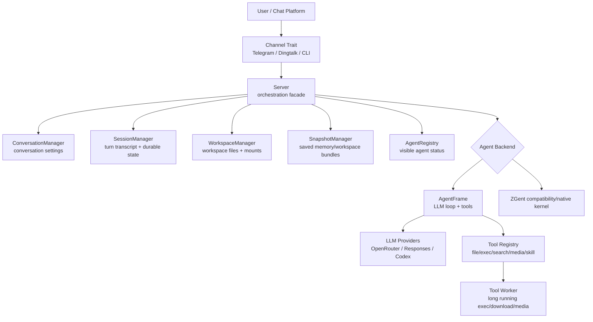

当前架构的核心分层是合理的：

- `agent_host` 负责产品侧：channel、conversation、session、workspace、snapshot、admin command、sandbox、backend routing。
- `agent_frame` 负责 agent runtime：system prompt wrapper、LLM request loop、tool protocol、compaction、token estimation。
- `zgент` 相关代码是兼容/实验后端，不应该污染 AgentFrame 主路径。

主要问题不是“缺少抽象”，而是抽象数量已经足够多，有些边界被兼容逻辑、历史字段和大模块拖重了。

## 抽象清单和判断

| 分组 | 代表类型 | 必要性 | 可合并性 | 判断 |
| --- | --- | --- | --- | --- |
| 基础消息域 | `ChannelAddress`, `IncomingMessage`, `OutgoingMessage`, `StoredAttachment`, `SessionMessage` | 高 | 低 | 保留。它们是 channel 与 host 的稳定数据契约。 |
| Channel 边界 | `Channel`, `AttachmentSource`, `PendingAttachment`, `ProgressFeedback` | 高 | 中 | `Channel` 必要；progress 可以考虑拆成可选子 trait，但现在不急。 |
| Server 编排 | `Server`, `ServerRuntime`, `ForegroundTurnOutcome`, `TimedRunOutcome` | 高 | 中 | `Server` 是明显 God object，应该继续拆，但不应和 manager 合并。 |
| Conversation | `ConversationManager`, `ConversationSettings`, `ConversationSnapshot` | 高 | 低 | 必要。conversation 是跨 session/agent 的共享配置层。 |
| Session | `SessionManager`, `Session`, `SessionSnapshot`, `DurableSessionState`, `SessionCheckpointData` | 高 | 高 | 必要但过厚。`history/messages/session_state.messages` 有合并空间。 |
| Workspace | `WorkspaceManager`, `WorkspaceRecord`, `WorkspaceMountRecord`, `WorkspaceMountMaterialization` | 高 | 低 | 保留。workspace 是文件生命周期和 mount 的独立边界。 |
| Snapshot | `SnapshotManager`, `SnapshotRecord`, `SnapshotBundle`, `LoadedSnapshot` | 中高 | 中 | 保留 manager；可和 workspace copy helper 共享内部工具。 |
| Subagent | `HostedSubagent`, `PersistedSubagentState`, `SubagentState` | 高 | 中 | 保留；但和 background session 有少量状态机重复。 |
| Agent status | `AgentRegistry`, `ManagedAgentRecord`, `ManagedAgentState` | 中 | 中 | 有 UI/admin 价值；可减少和 subagent/session 的状态重复。 |
| Config | `ServerConfig`, `ModelConfig`, `MainAgentConfig`, `ToolingConfig`, `SandboxConfig`, versioned loaders | 高 | 高 | loader 必要；runtime config 仍混入 legacy alias，应该收敛。 |
| Prompt | `AgentPromptKind`, `AgentSystemPromptState`, component hashes | 高 | 低 | 最近刚修好，不要合并回普通字符串。 |
| AgentFrame loop | `SessionState`, `SessionPhase`, `SessionErrno`, `SessionEvent`, `PersistentSessionRuntime` | 高 | 中 | 状态机必要；事件/状态字段可更集中。 |
| Tool runtime | `Tool`, `ToolExecutionMode`, `ExecutionTarget`, `ProcessMetadata`, `ToolWorkerJob` | 高 | 中 | `Tool` 必要；`tooling.rs` 模块边界需要拆。 |
| LLM abstraction | `UpstreamConfig`, `ChatMessage`, `ToolCall`, `TokenUsage`, provider modules | 高 | 低 | 保留。它隔离不同 provider payload。 |
| Compaction | `ContextCompactionReport`, `StructuredCompactionOutput`, `MemorySystem` | 高 | 低 | 保留。上下文压缩是核心功能，不宜弱化。 |
| Token estimation | `TokenEstimator`, template/tokenizer configs/cache keys/calibration | 高 | 低 | 保留。历史修复说明这是重要成本控制能力。 |
| Sandbox | `SandboxConfig`, `PersistentChildRuntime`, `ChildCommand` | 高 | 中 | 保留；但 bubblewrap setup 与 child runtime 可分文件。 |
| ZGent | `PersistentZgentKernelSession`, bridge/client/tools/context types | 中 | 低 | 作为后端边界保留，不要揉进 AgentFrame。 |
| Telegram rich text | `RichDocument`, `RichBlock`, `RichInline`, `TelegramEntityBuilder` | 中 | 中 | channel 内部必要；可以拆成 `telegram/formatting.rs`。 |

## 主要运行流程

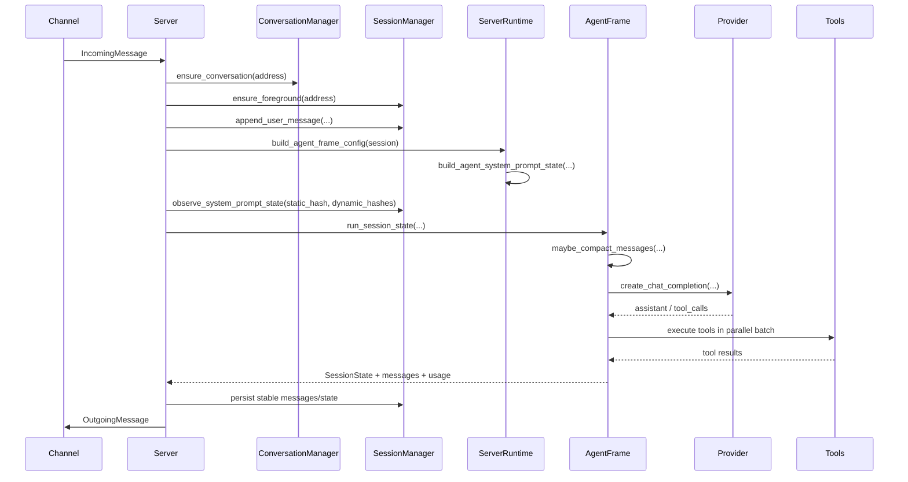

伪代码：

```text
handle_incoming(message):
    conversation = conversations.ensure(address)
    session = sessions.ensure_foreground(address)
    sessions.append_user_message(address, message)

    prompt_state = build_agent_system_prompt_state(...)
    observation = sessions.observe_system_prompt_state(
        prompt_state.static_hash,
        prompt_state.dynamic_hashes,
    )

    request_messages = session.stable_messages + session.pending_messages
    if observation.static_changed:
        request_messages[0] = prompt_state.system_prompt
    else:
        request_messages += minimal_dynamic_system_notices(observation)

    result = selected_backend.run(request_messages, tools)
    sessions.record_turn(result)
    channel.send(result.final_message)
```

## Prompt 抽象

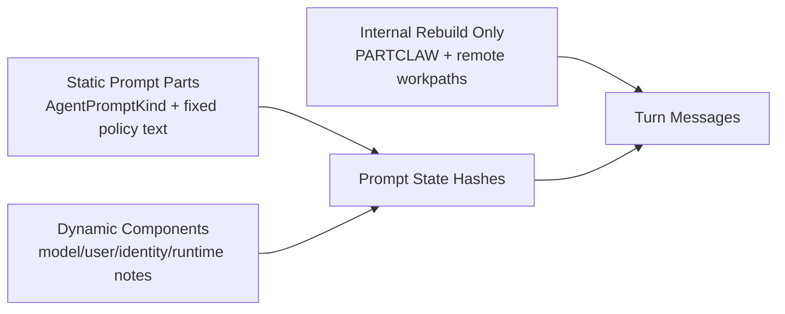

当前设计必要：

- `AgentPromptKind` 表达 main foreground/background/subagent 的固定身份差异。
- `AgentSystemPromptState` 同时携带完整 prompt、静态 hash、动态组件 hash 和通知文本。
- 这个抽象直接保护 prompt cache，不能退回“每 turn 重写完整 system prompt”。

可优化：

- `build_static_intro_prompt_parts`, `build_kind_static_prompt_parts`, `build_memory_static_prompt_parts` 已经是好的方向。
- 下一步可以把 dynamic components 明确枚举化，而不是字符串 key：

```rust
enum PromptComponent {
    CurrentModelProfile,
    AvailableModels,
    Identity,
    UserMeta,
    WorkspaceSummary,
    RuntimeNotes,
    RuntimeContext,
}
```

是否冗余：

- 不冗余。它是成本控制和正确性边界。
- 但字符串 key 是弱类型，可以小重构。

## Session 抽象

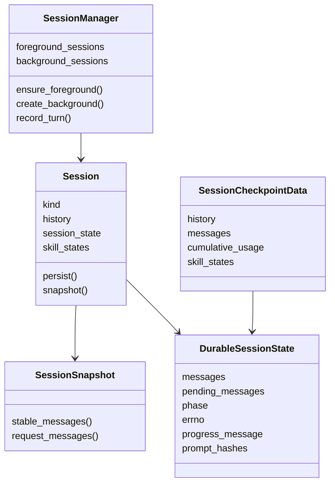

必要性：

- `SessionManager` 必要：它是 foreground/background session 的持久化边界。
- `SessionSnapshot` 必要：避免外部拿到可变 session 内部引用。
- `DurableSessionState` 必要：AgentFrame 可恢复状态、pending messages、progress message、prompt hashes 都需要持久化。
- `SessionCheckpointData` 必要：snapshot/export/import 需要一个可序列化 bundle。

冗余风险：

- `Session.history` 和 `DurableSessionState.messages` 是两套“对话历史”概念：
  - `history: Vec<SessionMessage>` 是 channel/user-visible history。
  - `session_state.messages: Vec<ChatMessage>` 是 LLM transcript。
  - 两者都合理，但名字太接近，容易误用。
- `SessionCheckpointData.messages` 仍有 `alias = "agent_messages"`，说明 runtime 还背着旧 schema。

建议：

1. 把 `DurableSessionState.messages` 重命名为 `transcript` 或 `llm_messages`。
2. 把 `Session.history` 重命名为 `visible_history`。
3. 通过 workdir upgrade 清理 `agent_messages` alias，然后 runtime 只读最新字段。
4. 把 prompt hash 和 progress message 拆成子结构，降低 `DurableSessionState` 平铺字段。

伪代码目标：

```rust
struct DurableSessionState {
    transcript: TranscriptState,
    turn: TurnState,
    prompt: PromptState,
    progress: Option<ProgressMessageState>,
}

struct TranscriptState {
    stable: Vec<ChatMessage>,
    pending: Vec<ChatMessage>,
}
```

合并判断：

- 不建议把 `SessionManager` 和 `ConversationManager` 合并。
- 建议合并/重命名 session 内部的同义字段，而不是合并 manager。

## Conversation 抽象

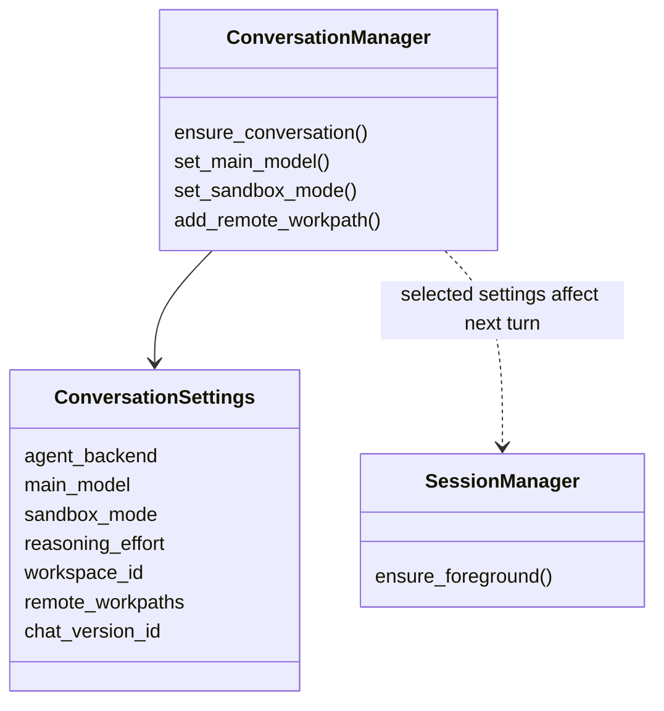

必要性：

- 必要。Conversation 是“同一个聊天房间/私聊”的设置层。
- remote workpaths 是 conversation 级共享状态，不能放进单个 session，否则 background/subagent 看不到。

可优化：

- `ConversationSettings` 现在混合了 runtime selection、sandbox、workspace、remote workpaths。
- 可以拆成小结构，便于 hash/通知/升级：

```rust
struct ConversationSettings {
    selection: AgentSelection,
    runtime: ConversationRuntimeOptions,
    workspace: ConversationWorkspaceBinding,
    remote_workpaths: Vec<RemoteWorkpath>,
    chat_version_id: Uuid,
}
```

是否冗余：

- Manager 不冗余。
- Settings 内部字段可以分组，不一定要减少字段数。

## Workspace 和 Snapshot 抽象

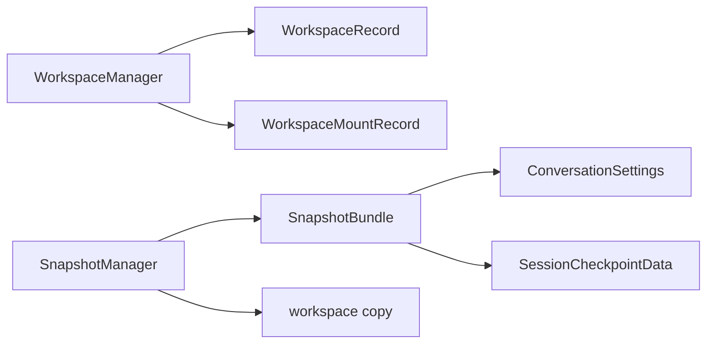

必要性：

- `WorkspaceManager` 必要：管理 workspace 生命周期、mount、复制、历史 workspace。
- `SnapshotManager` 必要：用户显式保存/恢复工作状态，需要稳定 artifact。

可合并性：

- 不建议合并 managers。workspace 是活动工作区，snapshot 是历史 frozen bundle。
- 可以合并内部 copy/sanitize helper，避免两个模块各自维护文件复制逻辑。

冗余风险：

- `SnapshotBundle` 引用了 `SessionCheckpointData`，而 session checkpoint 仍携带旧兼容字段。等 session schema 收敛后，snapshot 会自然变轻。

## Tool 抽象

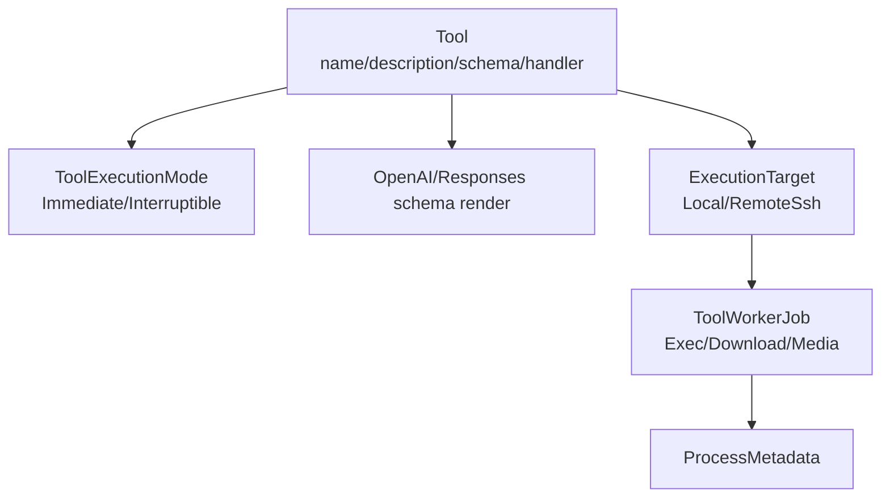

必要性：

- `Tool` 必要：统一 tool schema、description、handler。
- `ToolExecutionMode` 必要：让 prompt/schema 能表达 interruptible 工具，减少模型乱传 timeout。
- `ExecutionTarget` 必要：remote/local 是 per-tool 行为，不应靠 shell 里手写 ssh。
- `ToolWorkerJob` 必要：跨进程长任务需要可序列化 job。

冗余风险：

- `agent_frame/src/tooling.rs` 过大，混合了：
  - tool schema
  - 参数解析
  - 文件工具
  - exec runtime metadata
  - remote SSH helper
  - media tools
  - skill tools
  - cleanup tools
- `LegacyProcessMetadata` 和 runtime conversion 属于 workdir upgrade 的职责，不应长期留在 hot path。

建议拆分：

```text
agent_frame/src/tooling/
  mod.rs              # Tool, ToolExecutionMode, registry assembly
  args.rs             # shared argument parsing
  fs_tools.rs         # file_read/write/glob/grep/ls/edit
  exec_tools.rs       # exec_start/wait/observe/kill
  remote.rs           # SSH target, quoting, remote helpers
  media_tools.rs      # image/audio/pdf/download
  skill_tools.rs      # load/create/update skills
  runtime_state.rs    # metadata, cleanup, summaries
```

伪代码目标：

```rust
fn build_tool_registry(ctx: ToolContext) -> Vec<Tool> {
    [
        fs_tools::tools(ctx.fs()),
        exec_tools::tools(ctx.exec()),
        media_tools::tools(ctx.media()),
        skill_tools::tools(ctx.skills()),
    ].concat()
}
```

合并判断：

- 不合并 `Tool` 和 `ToolWorkerJob`。一个是 LLM tool contract，一个是 worker process contract。
- 可以合并重复的 local/remote 文件工具逻辑到 shared `FileToolBackend`。

## AgentFrame SessionState 抽象

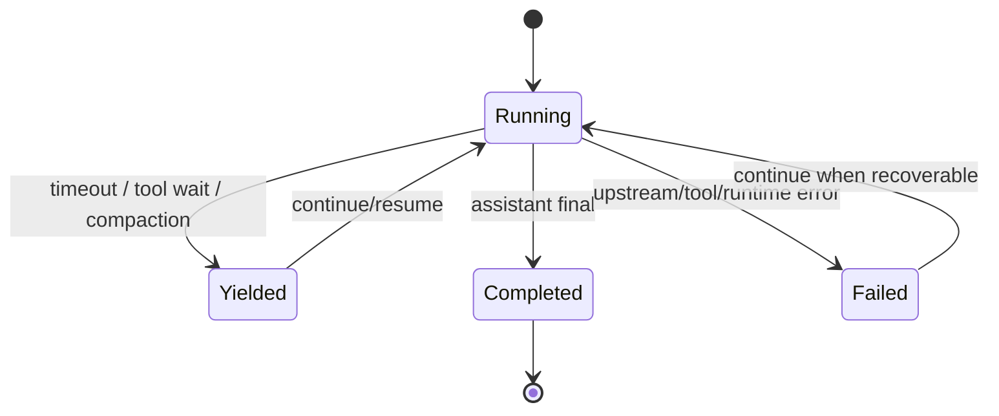

必要性：

- `SessionState`, `SessionPhase`, `SessionErrno` 必要。Host 需要持久化、恢复、中断、继续。
- `SessionEvent` 必要。progress API 和 host UI 依赖它。
- `PersistentSessionRuntime` 必要。Provider session、Codex websocket、Responses continuation 不能每轮无脑重建。

可优化：

- `SessionEvent` 与 `ExecutionProgress` 可以成为更明确的 event stream：

```rust
enum RuntimeEvent {
    PhaseChanged(SessionPhase),
    Progress(ExecutionProgress),
    Checkpoint(SessionState),
    Usage(TokenUsage),
}
```

冗余风险：

- `SessionState` 同时是 checkpoint、status、resume payload。字段增长会越来越快。
- 建议拆出 `RuntimeCheckpoint` 和 `RuntimeStatusView`，避免 UI 字段污染恢复协议。

## Server 抽象

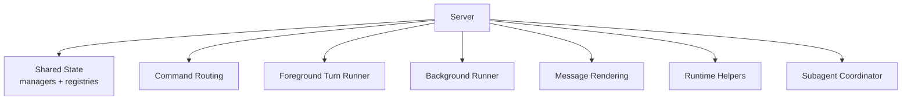

必要性：

- 一个顶层 `Server` facade 是必要的。它持有 channel、manager、registry、backend selection。

问题：

- `Server` 字段太多，说明它已经是 service locator。
- `server.rs` 仍然承担太多 glue 和 command 实现。

建议：

1. 引入只读/共享 state 容器：

```rust
struct ServerState {
    workdir: PathBuf,
    agent_workspace: AgentWorkspace,
    config: RuntimeConfigView,
    managers: Managers,
}

struct Managers {
    conversations: Arc<Mutex<ConversationManager>>,
    sessions: Arc<Mutex<SessionManager>>,
    workspaces: WorkspaceManager,
    snapshots: Arc<Mutex<SnapshotManager>>,
}
```

2. 将 turn execution 抽成 `TurnCoordinator`：

```rust
struct TurnCoordinator {
    prompt_builder: PromptBuilder,
    backend_router: BackendRouter,
    progress: ProgressReporter,
}
```

3. 命令解析和命令执行继续从 `server.rs` 下沉到 `server/commands.rs` 和 `server/command_routing.rs`。

合并判断：

- 不合并 managers 到 Server。
- 应拆 Server，不是继续加字段。

## Config 抽象

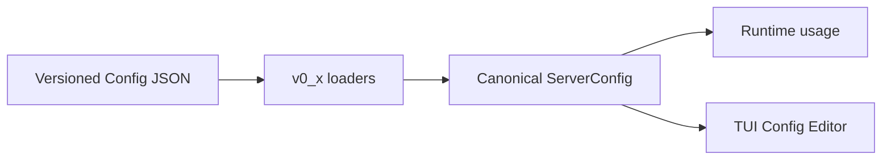

必要性：

- Versioned loaders 必要。AGENTS.md 也明确要求旧配置可升级。
- `ModelConfig`, `MainAgentConfig`, `ToolingConfig`, `SandboxConfig` 都是用户配置边界，不宜合并。

冗余风险：

- Runtime config 仍然有旧字段 alias 或 normalization：
  - old file tool names normalization
  - `supports_vision_input` 与 `capabilities`
  - old compaction names
  - legacy sandbox aliases
- 这些应该在 loader 阶段消化。

建议：

```rust
trait ConfigLoader {
    fn load_and_upgrade(&self, value: Value) -> Result<CanonicalServerConfig>;
}

struct CanonicalServerConfig {
    channels: ChannelConfigs,
    models: BTreeMap<String, ModelConfig>,
    main_agent: MainAgentConfig,
    tooling: ToolingConfig,
    sandbox: SandboxConfig,
}
```

执行顺序：

1. 保留 `v0_*` loader。
2. 让 loader 输出 canonical shape。
3. Runtime config 删除 legacy aliases。
4. Config editor 只编辑 canonical shape。

## Channel 和 Telegram 渲染抽象

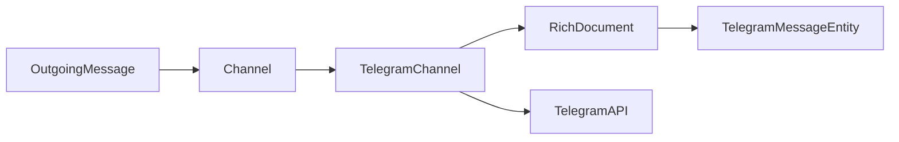

必要性：

- `Channel` trait 是必要边界。
- Telegram rich text AST 必要，因为 Telegram entity offset 是 UTF-16，Markdown 不能直接透传。

可优化：

- Telegram 文件过大，可拆：

```text
channels/telegram/
  mod.rs            # polling/send orchestration
  formatting.rs     # RichDocument/RichBlock/RichInline/entities
  api.rs            # Telegram DTOs + request builders
  progress.rs       # draft/progress message lifecycle
```

合并判断：

- 不要把 Telegram 渲染抽到通用 channel 层。不同平台 rich text 差异太大。
- 可以把 progress lifecycle 放在 channel 通用 trait 的 default helper，但不强制。

## ZGent 抽象

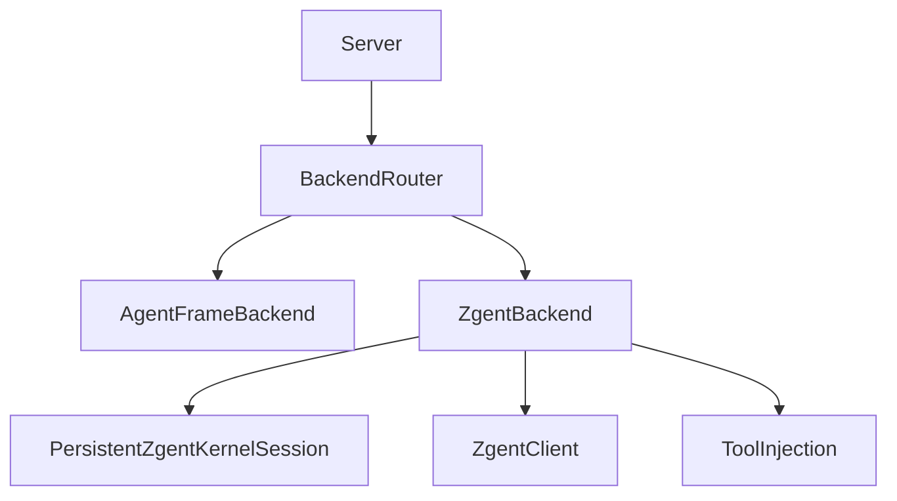

必要性：

- ZGent 是独立 backend。保留独立模块是对的。
- `chat_compat`, `kernel`, `app_bridge`, `tools` 分开是合理的。

风险：

- ZGent compatibility prompt 和 AgentFrame prompt 容易重复。最近 remote 指令已经从 host prompt 移到 frame，类似规则要继续避免重复。
- Tool catalog/injection 逻辑可能和 AgentFrame registry 演化出两套真相。

建议：

- 建立一个 backend-neutral `ToolContract` 只描述 name/schema/description。
- AgentFrame 和 ZGent injection 都消费这个 contract，减少 drift。

## Upgrade 抽象


必要性：

- `WorkdirUpgrader` 和 `v0_x` 模块必要。
- 它们是删除 runtime legacy branches 的前提。

当前问题：

- Runtime 仍有一些旧 schema 兼容：
  - `SessionCheckpointData` alias `agent_messages`
  - `PersistedSession` 的 legacy field
  - process metadata legacy conversion

建议：

1. 为旧 session/process metadata 增加更彻底的 upgrade。
2. 升级后 runtime 只接受 latest shape。
3. 删除 hot path legacy conversion。

## 可合并或删除候选清单

| 优先级 | 候选 | 操作 | 原因 | 风险 |
| --- | --- | --- | --- | --- |
| P0 | `SessionCheckpointData.messages` 的 `agent_messages` alias | 迁移后删除 alias | runtime 不应长期读旧字段 | 需要旧 workdir fixture |
| P0 | `LegacyProcessMetadata` / `ProcessMetadataRecord::Legacy` | 迁移到 workdir upgrade 后删除 | exec hot path 变简单 | 需要确认旧 runtime process 文件路径 |
| P1 | `DurableSessionState.messages` 命名 | 重命名为 `transcript` 或 `llm_messages` | 降低和 visible history 混淆 | workdir schema 变更 |
| P1 | `Server` 字段堆积 | 拆 `ServerState`/`TurnCoordinator` | 降低新增功能时的改动面 | 大范围机械改动 |
| P1 | `tooling.rs` 大文件 | 拆模块 | 提高 remote/exec/file tool 可维护性 | 需要小步提交 |
| P1 | Telegram rich text DTO/AST | 拆 `formatting.rs` | Telegram 文件太大 | 纯移动代码，低风险 |
| P2 | `ModelConfig.supports_vision_input` + `capabilities` | loader 归一到 capabilities | 双字段表达同一能力 | config migration/editor 同步 |
| P2 | `SessionEvent`/`ExecutionProgress` | 合成统一 event stream | progress/状态事件更清楚 | 需要 host/frame 双边改 |
| P2 | snapshot/workspace copy helpers | 共享 helper | 减少重复文件复制 | 低风险 |

## 功能增量/保护性抽象专项审计

这一节专门看“为了新增功能且不影响原本行为”而加出来的抽象。判断标准：

- 这个抽象现在是否仍然保护一个真实功能？
- 如果合并，会不会让历史修复失效？
- 是否只是为了过渡兼容，已经可以迁移到 upgrade/config loader？
- 是否可以改成更小的结构，而不是继续作为独立类型存在？

### 1. Prompt Cache 保护层

涉及类型：

- `AgentSystemPromptState`
- `SystemPromptStateObservation`
- `TurnSystemPromptState`
- `DurableSessionState.system_prompt_static_hash`
- `DurableSessionState.system_prompt_component_hashes`
- `DurableSessionState.pending_system_prompt_component_notices`

最初目的：

- 避免每个 turn 都替换历史开头 system prompt，导致 provider KV/prompt cache 失效。
- 同时允许 USER/IDENTITY/model catalog/runtime notes 等动态信息在下一 turn 被模型看到。
- 保证静态 prompt 文案变更时，旧 session 仍能刷新 canonical system prompt。

当前必要性：

- `AgentSystemPromptState` 必要。它是完整 prompt、static hash、dynamic hash 的聚合边界。
- `SystemPromptStateObservation` 必要但可以重命名。它表达“这次和持久化状态相比有什么变化”。
- `TurnSystemPromptState` 是比较薄的前台 turn 内部 carrier，必要性中等。

是否可合并：

| 类型 | 是否可合并 | 建议 |
| --- | --- | --- |
| `AgentSystemPromptState` | 不建议 | 它是 prompt cache 策略核心，合并回 `String` 会重现 0.18.1 要解决的问题。 |
| `SystemPromptStateObservation` | 可重命名/增强，不建议删除 | 改成 `PromptStateDiff` 更直观，包含 `static_changed` 和 `dynamic_notice_keys`。 |
| `TurnSystemPromptState` | 可以合并到 `ForegroundTurnContext` | 如果后续引入 turn context，它可作为字段；单独结构现在略薄。 |
| 三个 durable prompt 字段 | 可合成子结构 | 建议变成 `DurablePromptState`，减少 `DurableSessionState` 平铺字段。 |

合并影响：

- 如果删除 hash 分层，动态信息会再次刷新完整 system prompt，直接损害 prompt cache 成本。
- 如果只合并 `TurnSystemPromptState` 到更大的 turn context，不影响功能。

建议目标：

```rust
struct DurableSessionState {
    transcript: TranscriptState,
    prompt: DurablePromptState,
    progress: Option<SessionProgressMessageState>,
    phase: SessionPhase,
    error: Option<SessionErrorState>,
}

struct DurablePromptState {
    static_hash: Option<String>,
    component_hashes: BTreeMap<PromptComponent, String>,
    pending_notice_components: BTreeSet<PromptComponent>,
}
```

结论：

- 保留语义。
- 合并字段形态。
- 不要回退到每 turn 直接替换完整 prompt。

### 2. Interactive Progress 保护层

涉及类型：

- AgentFrame: `ExecutionProgress`, `ExecutionProgressPhase`, `ToolExecutionProgress`, `ToolExecutionStatus`
- AgentHost channel: `ProgressFeedback`, `ProgressFeedbackUpdate`, `ProgressFeedbackFinalState`
- Session persistence: `SessionProgressMessageState`
- Telegram internal: `TelegramProgressMessage`

最初目的：

- 解决只靠 `SessionState` 更新不够实时的问题。
- 让 Telegram 中能显示“思考中...”和“工具执行中...”。
- 服务重启后仍能找到并删除旧 progress message，避免残留。

当前必要性：

- AgentFrame 的 `ExecutionProgress` 必要：它是 runtime 到 host 的中立事件。
- Host 的 `ProgressFeedback` 必要：channel 不应该知道 AgentFrame 内部结构。
- `SessionProgressMessageState` 必要：它是跨重启持久化 message id 的最小状态。
- `TelegramProgressMessage` 必要性中等：它是 Telegram 内存缓存，可以和 session persisted id 配合。

是否可合并：

| 类型 | 是否可合并 | 建议 |
| --- | --- | --- |
| `ExecutionProgress` 和 `ProgressFeedback` | 不建议 | 一个是 runtime event，一个是 channel UI command，职责不同。 |
| `ProgressFeedbackUpdate` | 可改名，不必删除 | 可改成 `ProgressMessageMutation`，语义更清楚。 |
| `SessionProgressMessageState` 和 `TelegramProgressMessage` | 不建议直接合并 | 前者持久化、跨 channel；后者 Telegram 内部缓存。 |
| `ToolExecutionStatus` | 可以简化 | 现在用户不需要实时状态，若 runtime 也不需要 completed/failed 列表，可只保留 active tools。 |

合并影响：

- 把 `ExecutionProgress` 直接塞进 `SessionState` 会回到旧问题：反馈不及时。
- 把 Telegram message id 只存在内存会重启后删不掉。

建议目标：

```rust
enum RuntimeEvent {
    Progress(ExecutionProgress),
    Checkpoint(SessionState),
    Completed,
}

enum ProgressMessageMutation {
    None,
    Store { message_id: String },
    Clear,
}
```

结论：

- 保留 runtime progress API。
- 可以压缩状态粒度，但不要删除 `SessionProgressMessageState`。

### 3. Remote SSH 功能保护层

涉及类型：

- `ExecutionTarget`
- `ProcessMetadata.remote`
- `ToolWorkerJob::Exec { remote }`
- `RemoteWorkpath`
- `RemoteAgentsMdLoad`

最初目的：

- 支持 per-tool remote SSH，避免模型手写 `ssh host '...'` 带来的引号转义错误。
- `exec_start` 绑定 remote，后续 `exec_wait/observe/kill` 通过 `exec_id` 继承 remote。
- conversation 级 remote workpaths 让多 agent 共享远端目录上下文。

当前必要性：

- `ExecutionTarget` 必要：它把 remote/local 从字符串参数转换成类型化执行目标。
- `ProcessMetadata.remote` 必要：长进程后续操作必须知道在哪台机器。
- `ToolWorkerJob::Exec.remote` 必要：worker 进程需要知道自己要不要 SSH。
- `RemoteWorkpath` 必要：conversation 级持久化上下文。
- `RemoteAgentsMdLoad` 必要性中等：它主要是加载结果的展示/JSON 载体。

是否可合并：

| 类型 | 是否可合并 | 建议 |
| --- | --- | --- |
| `ExecutionTarget` | 不建议 | 删除会让 remote 参数重新变成散落字符串逻辑。 |
| `ProcessMetadata.remote` | 不建议 | 删除会破坏 exec follow-up。 |
| `ToolWorkerJob::Exec.remote` | 不建议 | worker 隔离执行需要显式携带。 |
| `RemoteWorkpath` 和 `ExecutionTarget` | 不建议 | 一个是持久化工作目录，一个是单次工具执行目标。 |
| `RemoteAgentsMdLoad` | 可以内聚进 `RemoteWorkpathContext` | 如果未来需要缓存 AGENTS.md 内容，可把 host/path/description/load result 合成一个 prompt render context。 |

合并影响：

- 把 remote workpath 当默认 cwd 会改变工具语义，风险高。
- 删除 follow-up remote metadata 会让 `exec_wait` 无法跨机器续接。

建议目标：

```rust
struct RemoteWorkpathContext {
    workpath: RemoteWorkpath,
    agents_md: RemoteAgentsMdLoad,
}

fn render_remote_workpaths_for_prompt(contexts: &[RemoteWorkpathContext]) -> String
```

结论：

- remote execution 与 remote context 是两个抽象，不要合并。
- `RemoteAgentsMdLoad` 可与 prompt render context 合并，但不是 P0。

### 4. Session 持久化保护层

涉及类型：

- `Session`
- `PersistedSession`
- `SessionSnapshot`
- `SessionCheckpointData`
- `DurableSessionState`
- `SessionMessage`
- `ChatMessage`

最初目的：

- 在不破坏旧 workdir 的情况下引入新 SessionState、pending messages、progress message、system prompt hashes。
- 同时保留用户可见 history 和 LLM transcript。
- 支持 snapshot/export/import。

当前必要性：

- `Session` 必要：内存可变实体。
- `PersistedSession` 必要，但应该只代表 latest disk schema。
- `SessionSnapshot` 必要：只读快照边界。
- `SessionCheckpointData` 必要：snapshot/import/export 需要稳定格式。
- `DurableSessionState` 必要，但内部字段已经过多。
- `SessionMessage` 和 `ChatMessage` 都必要：前者是用户可见历史，后者是 LLM protocol。

冗余或过渡痕迹：

- `SessionCheckpointData.messages` 仍有 `alias = "agent_messages"`。
- `PersistedSession` 还在处理 legacy message 字段。
- `SessionSnapshot` 大量复制字段，导致构造测试很重。
- `DurableSessionState.messages` 命名不清楚，和 visible history 容易混。

是否可合并：

| 类型 | 是否可合并 | 建议 |
| --- | --- | --- |
| `Session` 和 `SessionSnapshot` | 不建议 | snapshot 是借用边界，直接暴露 Session 会扩大可变面。 |
| `SessionCheckpointData` 和 `DurableSessionState` | 部分可合并 | checkpoint 可以嵌入 durable state，而不是复制 prompt hash/usage 等字段。 |
| `SessionMessage` 和 `ChatMessage` | 不建议 | UI history 与 LLM transcript 不同。 |
| `PersistedSession` legacy 字段 | 应删除 | 迁移到 workdir upgrade。 |

建议目标：

```rust
struct PersistedSession {
    metadata: SessionMetadata,
    visible_history: Vec<SessionMessage>,
    durable: DurableSessionState,
}

struct SessionCheckpointData {
    metadata: SessionCheckpointMetadata,
    visible_history: Vec<SessionMessage>,
    durable: DurableSessionState,
}
```

合并影响：

- 清理 legacy 字段需要 workdir upgrade，不能直接删。
- 重命名 `messages` 需要 schema bump。

结论：

- 这是最大可优化区域之一。
- 优先做字段重命名和 legacy 迁移，不合并核心 Session/Snapshot 边界。

### 5. Backend 选择和运行时保护层

涉及类型：

- `AgentBackendKind`
- `AgentConfig` / `AgentBackendConfig`
- `ToolingConfig` / `ToolingTarget`
- `ActiveForegroundAgentFrameRuntime`
- `ActiveNativeZgentSession`
- `ForegroundRuntimePhase`
- `PersistedYieldedForegroundTurn`

最初目的：

- 在不破坏 AgentFrame 的情况下接入 ZGent。
- 允许不同模型属于不同 backend。
- 前台 turn yield 后可恢复。

当前必要性：

- `AgentBackendKind` 必要。
- `AgentConfig` 必要，但名字容易和 AgentFrame 的 `AgentConfig` 混淆。
- `ActiveForegroundAgentFrameRuntime` 和 `ActiveNativeZgentSession` 必要性中等：它们是两个 backend 的 live runtime holder。
- `ForegroundRuntimePhase` 必要：防止 status/interrupt/progress 找不到当前阶段。
- `PersistedYieldedForegroundTurn` 必要性中等：它是恢复 yielded turn 的保护层。

是否可合并：

| 类型 | 是否可合并 | 建议 |
| --- | --- | --- |
| `ActiveForegroundAgentFrameRuntime` + `ActiveNativeZgentSession` | 可合并成 enum | `ActiveForegroundRuntime::AgentFrame/NativeZgent` 可减少 Server map 数量。 |
| `AgentConfig` 名称 | 应重命名 | 改为 `BackendModelConfig` 或 `BackendAvailabilityConfig`，避免和 AgentFrame config 混。 |
| `ToolingTarget` 和 model capability | 可部分合并 | Tooling target 是 routing 配置，capability 是模型能力，不完全等价。 |
| `PersistedYieldedForegroundTurn` 和 `DurableSessionState` | 可评估 | 如果 yielded state 已完整在 DurableSessionState，可减少单独 persisted holder。 |

建议目标：

```rust
enum ActiveForegroundRuntime {
    AgentFrame(Arc<Mutex<ActiveForegroundAgentFrameRuntime>>),
    NativeZgent(Arc<ActiveNativeZgentSession>),
}

struct BackendAvailabilityConfig {
    agent_frame: AgentBackendConfig,
    zgent: AgentBackendConfig,
}
```

合并影响：

- 合并 live runtime maps 会触碰 foreground interrupt/resume/status，需完整测试。
- 重命名 config 类型不影响 schema，但影响代码面较大。

结论：

- 可合并 live runtime holder。
- 不要合并 backend enum 和 model config。

### 6. Subagent / Background / AgentRegistry 状态保护层

涉及类型：

- `HostedSubagent`
- `PersistedSubagentState`
- `SubagentState`
- `BackgroundJobRequest`
- `AgentRegistry`
- `ManagedAgentRecord`
- `ManagedAgentState`

最初目的：

- Subagent 是 foreground turn 的内部助手。
- Background agent 是独立异步任务，可自行回报用户。
- AgentRegistry 是 admin/status 可见的统一列表。

当前必要性：

- 三者语义不同，不能简单合并。
- 但是状态字段重复：
  - running/ready/failed/destroyed
  - model/backend/description
  - last result/error/usage

是否可合并：

| 类型 | 是否可合并 | 建议 |
| --- | --- | --- |
| `SubagentState` 和 `ManagedAgentState` | 可以映射，不建议直接合并 | Registry 是 view model，Subagent 是 runtime state。 |
| `PersistedSubagentState` 和 `ManagedAgentRecord` | 不建议 | 一个是执行恢复，一个是管理视图。 |
| `BackgroundJobRequest` 和 subagent queue | 不建议 | 背景任务有独立 user-facing lifecycle。 |

可优化方案：

```rust
trait AgentStatusView {
    fn managed_record(&self) -> ManagedAgentRecord;
}

impl AgentStatusView for HostedSubagent { ... }
impl AgentStatusView for BackgroundSession { ... }
```

结论：

- 不合并执行态和展示态。
- 可以统一状态投影，减少字段复制。

### 7. Tool Worker 任务保护层

涉及类型：

- `ToolWorkerJob`
- `BackgroundTaskMetadata`
- `ProcessMetadata`
- `LegacyProcessMetadata`
- `ProcessMetadataRecord`
- `RuntimeTaskCleanupReport`

最初目的：

- 长任务要在独立 worker 中执行，避免阻塞 agent loop。
- exec 需要 stdin/wait/observe/kill。
- image/pdf/audio/download/web fetch 等异步任务需要状态文件。
- 旧 process metadata 需要兼容。

当前必要性：

- `ToolWorkerJob` 必要：worker process 的序列化协议。
- `ProcessMetadata` 必要：exec 的 follow-up 操作依赖它。
- `BackgroundTaskMetadata` 必要性中等：非 exec 异步任务的状态索引。
- `RuntimeTaskCleanupReport` 必要性低：只是 cleanup 返回摘要。
- `LegacyProcessMetadata` / `ProcessMetadataRecord::Legacy` 是过渡兼容，应迁移后删除。

是否可合并：

| 类型 | 是否可合并 | 建议 |
| --- | --- | --- |
| `ProcessMetadata` 和 `BackgroundTaskMetadata` | 不建议直接合并 | exec 有 stdin/requests/status/remote，普通 background task 没有。 |
| `RuntimeTaskCleanupReport` | 可内联或保留 | 如果只用于少数调用，可变成 plain JSON/summary。 |
| `LegacyProcessMetadata` | 应删除 | 通过 workdir upgrade 写成 current shape。 |

建议目标：

```rust
enum RuntimeTaskRecord {
    Exec(ProcessMetadata),
    Background(BackgroundTaskMetadata),
}
```

结论：

- worker job 和 metadata 是必要协议层。
- legacy metadata 是明确冗余，应进入 P0/P1 cleanup。

### 8. Config 兼容保护层

涉及类型：

- `ConfigLoader`
- `ServerConfig`
- `MainAgentConfigRaw`
- `AgentConfigRaw` in AgentFrame
- `ModelConfig.supports_vision_input`
- `ModelConfig.capabilities`

最初目的：

- 旧 config 不崩。
- 新功能逐步加字段时保留旧别名。

当前必要性：

- `ConfigLoader` 和 `v0_*` loader 必要。
- Raw config structs 必要，但只应该存在 loader 边界。
- Runtime 的 legacy alias 已经不太必要。

是否可合并：

| 类型/字段 | 是否可合并 | 建议 |
| --- | --- | --- |
| `supports_vision_input` + `capabilities` | 可以归一 | loader 把旧字段转成 `ModelCapability::ImageIn`。 |
| `MainAgentConfigRaw` legacy compaction fields | 可迁移 | loader 输出 canonical `ContextCompactionConfig`。 |
| Host `AgentConfig` 和 AgentFrame `AgentConfig` | 不合并 | 同名但层级不同，应重命名 host 的 backend availability config。 |

合并影响：

- 配置字段是用户可见 schema，任何删除都要走 config minor bump 和 editor 更新。

结论：

- 保留 loader。
- runtime canonical 化是中期目标。

### 9. Snapshot / Workspace Value Move 保护层

涉及类型：

- `WorkspaceRecord`
- `WorkspaceMountRecord`
- `WorkspaceMountMaterialization`
- `ValueMoveSummary`
- `MovedPath`
- `SnapshotBundle`
- `LoadedSnapshot`

最初目的：

- 不破坏 active workspace 的情况下查看/复制历史 workspace。
- Snapshot 保存 workspace + conversation settings + session checkpoint。
- Value move 用于把旧 workspace 内容转移到当前 workspace。

当前必要性：

- Workspace 和 Snapshot 边界都必要。
- `ValueMoveSummary`/`MovedPath` 是 user-facing operation result，保留。
- `WorkspaceMountMaterialization` 必要，因为 host/sandbox/placeholder 三种模式不同。

是否可合并：

| 类型 | 是否可合并 | 建议 |
| --- | --- | --- |
| `SnapshotBundle` 和 `WorkspaceRecord` | 不建议 | snapshot 是 frozen artifact，workspace 是 active registry。 |
| `LoadedSnapshot` 和 `SnapshotRecord` | 不建议 | loaded 多了 workspace path 和 bundle。 |
| copy helpers | 可以合并 | workspace/snapshot 内部复制逻辑可共享。 |

结论：

- 抽象必要。
- 优化点是共享 helper，不是合并模型。

### 10. Channel Rich Text 保护层

涉及类型：

- `RichDocument`
- `RichBlock`
- `RichInline`
- `TelegramRenderedText`
- `TelegramMessageEntity`
- `TelegramEntityBuilder`

最初目的：

- Telegram 不支持完整 Markdown，需要转换成 HTML/entities。
- UTF-16 offset、blockquote、pre/code block、table flatten 都是平台细节。

当前必要性：

- 必要。直接删掉会回退到格式错乱、实体 offset 错误。

是否可合并：

- 不建议和 `OutgoingMessage` 合并。
- 可以从 `telegram.rs` 拆到 `telegram/formatting.rs`。

结论：

- 抽象必要，但文件位置需要拆。

## 合并优先级矩阵


明确结论：

- “删除 prompt hash layer”“把 progress 重新塞回 SessionState”“让 remote exec 回退手写 ssh”都属于高风险低价值，不做。
- “拆 tooling.rs”“拆 telegram formatting”是低风险高价值，优先做。
- “删除 legacy process metadata”“删除 session legacy alias”价值高，但必须走 workdir upgrade。
- “canonical runtime config”价值最高，但涉及 config schema/editor，必须单独规划。

## 不建议合并的抽象

- `ConversationManager` 和 `SessionManager`：conversation 是长期设置，session 是 turn transcript 和 runtime state。
- `WorkspaceManager` 和 `SnapshotManager`：workspace 是活动文件系统，snapshot 是 frozen archive。
- `Tool` 和 `ToolWorkerJob`：前者是 LLM tool contract，后者是 worker process contract。
- `Channel` 和具体 channel 实现：平台差异太大。
- `AgentFrame` 和 `ZGent`：两个 backend 生命周期和协议不同。
- `AgentSystemPromptState` 和普通 prompt string：这个抽象是 prompt cache 成本控制的关键。

## 建议执行顺序

```mermaid
gantt
    title Optimization Roadmap
    dateFormat  X
    axisFormat  %s
    section Low Risk
    Split Telegram formatting        :1, 2
    Split tooling.rs modules         :2, 4
    Share copy helpers               :3, 2
    section Schema Cleanup
    Remove session legacy aliases    :5, 3
    Remove process metadata legacy   :7, 3
    Rename session transcript fields :9, 4
    section Larger Refactors
    Canonical config runtime shape   :12, 5
    ServerState / TurnCoordinator    :15, 6
```

推荐先做低风险移动：

1. 拆 `telegram.rs` formatting。
2. 拆 `tooling.rs`，保持 public API 不变。
3. 再做 workdir schema cleanup。
4. 最后做 config canonical 和 Server 拆分。

## 验收标准

每个优化 PR/commit 应满足：

- 不改变用户可见行为，除非明确说明。
- 如涉及 config/workdir schema，遵守 `AGENTS.md` 的 version/upgrade/VERSION changelog 规则。
- 更新或新增回归测试，尤其是历史 VERSION 中提到的修复点。
- 本地至少通过：

```bash
cargo fmt --manifest-path agent_frame/Cargo.toml --check
cargo fmt --manifest-path agent_host/Cargo.toml --check
cargo test --manifest-path agent_frame/Cargo.toml
cargo test --manifest-path agent_host/Cargo.toml
git diff --check
```

## 结论

当前最值得做的不是“发明新抽象”，而是把已有抽象的边界重新变清楚：

- Host 层 managers 保留，但 `Server` 要瘦身。
- Runtime 层 `Tool`/`SessionState`/`PromptState` 保留，但大文件和弱类型 key 要拆。
- Legacy compatibility 应集中到 `config/v0_*` 和 `upgrade/v0_*`，不要散在 runtime hot path。
- 对 prompt cache、remote exec、token estimation、progress feedback 这些近期重要特性，要把测试当护栏，不要为重构牺牲它们。
