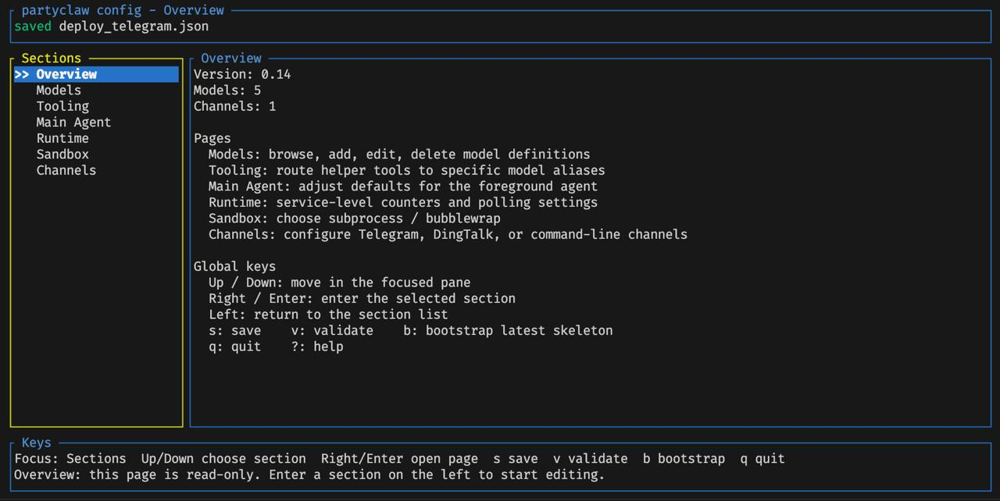

<div align="center">

# 🦀 ClawParty

**A self-hosted, multi-agent service framework built in Rust.**

*Agents as services, not scripts.*

---

</div>

## What is ClawParty?

ClawParty is a **production-grade agent hosting framework** that turns LLM agents into always-on, multi-channel services. It is designed from day one as a **persistent service** — it runs 24/7, connects to messaging platforms like Telegram, and manages multiple independent conversations concurrently.

<div align="center">
<table><tr>
<td align="center" width="260">
  
  <br />
  <sub>💬 Multi-conversation via group chats</sub>
</td>
<td align="center" width="320">
  
  <br />
  <sub>🔀 Interruptible turns with live feedback</sub>
</td>
<td align="center" width="420">
  
  <br />
  <sub>⚙️ TUI config editor</sub>
</td>
</tr></table>
</div>

<div align="center">
  
  <br />
  <sub>Actor architecture: Conversation prepares and routes; SessionActor owns session state, mailboxes, interruption, progress, and persistence.</sub>
</div>

---

## Why ClawParty?

### Landscape

There are several ways to run LLM agents today. Here's where ClawParty fits:

| | **Claude Code** | **OpenClaw** | **ClawParty** |
|:--|:----------------|:-------------|:--------------|
| **What is it** | Anthropic's official CLI coding agent | Open-source personal AI assistant with massive channel ecosystem | Self-hosted multi-agent service framework |
| **Primary use case** | Interactive coding in a terminal | Personal automation across 90+ messaging platforms and companion apps | Developer / engineering workflows as always-on services |
| **Stack** | Closed-source, Node.js | Open-source, TypeScript/Node.js (~1M LoC) | Open-source, Rust (~54K LoC) |
| **Runtime model** | CLI process, one session at a time | WebSocket Gateway daemon + Node runner; companion apps (macOS, iOS, Android) + ACP bridge for IDE integration | `systemd` daemon, single binary, multi-conversation |
| **Channels** | Terminal only | 90+ extensions (Telegram, WhatsApp, Discord, Slack, Feishu, Teams, IRC, …) | Telegram, DingTalk, CLI — extensible |
| **Agent topology** | Single agent | Multi-agent: subagent registry, skill-based routing, agent scopes | Main + sub-agents + background agents, per-conversation with configurable sinks |
| **Interruption** | Kill & restart | `chat.abort` cancels active runs | Mid-turn yield at safe tool boundaries: new messages interrupt gracefully, no work lost, agent sees new context |
| **Sandbox** | OS-level only | Docker containers with remote FS bridge, SSH backend, network modes | Three modes: disabled / subprocess / bubblewrap (Linux namespace isolation, no Docker dependency) |
| **Memory** | Session-scoped | Context engine with compaction, session transcripts, QMD memory format | Multi-layer: threshold / idle / timeout-observation compaction + conversation memory files + shared user/identity profiles |
| **Scheduling** | None | Cron, webhooks, wakeups | Cron with checker commands + configurable sink routing (direct, broadcast, multi-target) |
| **Skills / Plugins** | — | 53 built-in skills + 5,400+ via ClawHub + MCP server support | `SKILL.md`-based reusable workflows with runtime change detection + persistent skill memory |
| **Model flexibility** | Claude only | Multi-provider (Anthropic, OpenAI, Google, DeepSeek, vLLM, Groq, …) with model fallback chains | Multiple providers per instance (OpenRouter, Codex WS, custom), per-conversation model switching |
| **Coding tool depth** | Deep (native) | Full tool suite (bash, file I/O, web, subagents, image, TTS, video, MCP tools, canvas) | Deep: 40+ built-in tools (file I/O, shell with PTY, grep/glob, patch, sub-agents, cron, workspace management) |
| **Config UX** | CLI flags | YAML config + TUI wizard + Control UI web panel | JSON config + built-in Ratatui TUI editor with one-key bootstrap |
| **Codebase weight** | Closed | ~6K source files, ~1M lines, 90+ extensions, 4 companion apps | 2 crates, ~50 source files, ~54K lines — single binary, no runtime dependencies |

**TL;DR**: Claude Code is the polished single-user coding CLI. OpenClaw is the full-featured personal assistant platform with massive channel and plugin coverage, companion apps, and IDE integration. ClawParty is a **lean, Rust-native service** focused on engineering workflows — with deep coding tools, crash-safe state persistence, cooperative turn interruption, and the ability to run multiple isolated agent conversations as a single lightweight daemon.

### Key Design Principles

- **Service-first**: Agents run as daemons, not interactive CLI programs
- **Conversation = Group Chat**: Each Telegram group with the bot is an independent conversation with its own workspace, model, and agent state
- **Graceful interruption**: User messages yield running turns at safe boundaries — no lost work
- **Crash-safe**: All state is persisted; process restarts resume where they left off

---

## Interruptible Turns & Real-Time Feedback

Traditional CLI agents are **blocking** — once a task starts, you wait silently until it finishes, or kill it and lose everything. ClawParty solves this with two key mechanisms:

**🔀 Interruptible tools** — When you send a new message while the agent is working, ClawParty yields the current turn at a safe boundary. The agent sees your new input, adjusts its plan, and continues — no work is lost, no restart needed.

**💬 `user_tell` — mid-turn progress messages** — The agent can push status updates to you *while still working*, as separate chat bubbles. You see what's happening in real time instead of staring at a spinner.

Together, these turn a one-shot request-response pattern into a **continuous, collaborative conversation** — even during long-running tasks like code generation, web research, or multi-file refactoring.

<div align="center">
  
  <br />
  <sub>Real interaction: user sends follow-up instructions mid-task → agent acknowledges immediately and adapts</sub>
</div>

---

## Multi-Conversation via Group Chats

Each Telegram group chat with the bot creates an **independent conversation** with its own:
- Workspace (isolated filesystem)
- Model selection
- Session history & memory
- Sandbox mode

Create a new group, add the bot, and you have a fresh conversation — no commands needed. Each conversation is fully isolated — different groups can use different models, sandboxes, and skill sets simultaneously.

---

## Native Multimodal

ClawParty handles multimodal content **natively** across the full pipeline — not bolted on, but designed into the channel and tool layers from the start:

| Capability | How it works |
|:-----------|:-------------|
| 📷 **Image input** | Send images in chat → model sees them directly via vision-capable models |
| 🎨 **Image generation** | `image_generate` tool → helper model creates images → delivered back in chat |
| 📄 **PDF input** | Send PDF files → content extracted and passed to the model |
| 🎵 **Audio input** | Send voice messages → transcribed and injected into context |
| 📎 **File attachments** | Upload any file → stored in workspace, accessible to all tools |
| 🖼️ **Image output** | Agents generate plots, diagrams, screenshots → sent as chat attachments |

Multimodal routing is **per-model configurable**: each model declares its `capabilities` (e.g., `image_in`, `audio_in`), and helper models can be assigned for specific tooling tasks (image generation, web search, etc.). The channel layer handles format conversion transparently — the agent just works.

---

## Built-in Tool System

40+ built-in tools available to every agent, covering:

| Category | Tools |
|:---------|:------|
| **File I/O** | `file_read`, `file_write`, `edit`, `apply_patch` |
| **Repository exploration** | `glob`, `grep`, `ls` |
| **Shell execution** | `exec_start`, `exec_observe`, `exec_wait`, `exec_kill` (with PTY support) |
| **Web** | `web_fetch`, `web_search` (interruptible) |
| **Image** | `image_generate`, `image_load` |
| **Downloads** | `file_download_start`, `file_download_progress`, `file_download_wait`, `file_download_cancel` |
| **Agent coordination** | `subagent_start`, `subagent_join`, `subagent_kill`, `start_background_agent` |
| **Scheduling** | `create_cron_task`, `update_cron_task`, `remove_cron_task`, `list_cron_tasks` |
| **Memory & workspace** | `workspaces_list`, `workspace_mount`, `workspace_content_move`, `shared_profile_upload` |
| **Skills** | `skill_load`, `skill_create`, `skill_update` |
| **Communication** | `user_tell` (mid-turn progress messages) |

Tools are classified as **immediate** (return promptly) or **interruptible** (can be yielded when a new user message arrives). Long-running `exec`, `file_download`, and `image` tasks survive across turns and context compactions.

---

## Agent Topology

Each conversation owns routing and workspace context, while each foreground or background session runs as an independent `SessionActor`:

<div align="center">
  
</div>

- **Conversation** owns conversation-level config, workspace selection, attachment materialization, and the current foreground actor reference.
- **SessionActor** owns all per-session durable and runtime state: stable context, pending context, visible history, user mailbox, actor mailbox, active phase, interrupt state, progress state, and turn commit/failure state.
- **Foreground and background agents** share the same session actor lifecycle; they differ through session policy such as system prompt kind, enabled tools, and delivery behavior.
- **Sub-agents** run bounded helper tasks and return results to their owning foreground or background agent.
- **Actor-to-actor delivery** uses durable tell-style messages, so background results can be inserted into the foreground actor without blocking and survive restarts.

---

## Context Management

ClawParty implements multi-layer context management to handle long-running conversations:

| Layer | Mechanism |
|:------|:----------|
| **Threshold compaction** | Automatic compression when context approaches model limits |
| **Idle compaction** | Background compression between turns when conversation is idle |
| **Timeout-observation compaction** | Compress and retry when model times out on large context |
| **High-fidelity zone** | Recent messages preserved at full detail during compaction |
| **Conversation memory** | `MEMORY.json` + rollout summaries for cross-session recall |
| **Shared profiles** | `USER.md` / `IDENTITY.md` injected into every system prompt |
| **Runtime change detection** | Profile updates, skill changes, model catalog changes → synthetic system messages |

Running `exec` processes, active downloads, and alive sub-agents are preserved in compaction summaries so subsequent turns can continue using them.

---

## Skill System

Skills are `SKILL.md`-based reusable workflows:

```
.skills/
  └─ web-report-deploy/
       ├─ SKILL.md          # Instructions + trigger description
       ├─ references/       # Reference files
       ├─ scripts/          # Helper scripts
       └─ assets/           # Static assets
```

- **Discovery**: Skill metadata is preloaded; agent loads full instructions on demand
- **Persistence**: `skill_create` / `skill_update` persist skills to the runtime store
- **Shared state**: `.skill_memory/<skill-name>/` for cross-workspace persistent data
- **Runtime sync**: Description or content changes trigger automatic notifications to the agent

---

## Sandbox Isolation

Three isolation levels, configurable per conversation via `/sandbox`:

| Mode | Isolation | Use case |
|:-----|:----------|:---------|
| `disabled` | None | Trusted environments, development |
| `subprocess` | Separate process | Basic isolation |
| `bubblewrap` | Linux namespace container | Production — restricted filesystem, network-aware |

Bubblewrap mode exposes only the current workspace, runtime dir, `.skills/`, and `.skill_memory/`. DNS is forwarded, read-only mounts are cleaned up on turn completion.

---

## TUI Config Editor

ClawParty ships with a built-in terminal UI for editing configurations — no need to hand-edit JSON:

```bash
./target/release/partyclaw config deploy_telegram.json
```

Sections include Models, Tooling, Main Agent, Runtime, Sandbox, and Channels. Supports keyboard navigation, inline validation (`v`), and one-key bootstrap (`b`) for new configs.

---

## Quick Start

### 1. Environment

```bash
cp .env.example .env
# Fill in:
#   OPENROUTER_API_KEY=sk-or-...
#   BRAVE_SEARCH_API_KEY=...    (optional: for Brave Search helper model)
#   TELEGRAM_BOT_TOKEN=...        (for Telegram channel)
#   DINGTALK_ROBOT_WEBHOOK_URL=... (for DingTalk robot replies)
#   DINGTALK_ROBOT_APP_KEY=...     (optional: enables DingTalk attachment downloads)
#   DINGTALK_ROBOT_APP_SECRET=...  (optional: enables DingTalk robot HTTP callbacks)
```

For DingTalk enterprise/outgoing robot receive mode, expose the configured local
callback listener through HTTPS and set the DingTalk callback URL to the same
path, for example `/dingtalk/robot`.

### 2. Build & Run

```bash
# Build
cargo build --release --manifest-path agent_host/Cargo.toml --bin partyclaw

# Run with config
./target/release/partyclaw --config config.json --workdir ./workdir
```

### 3. Minimal Config

```json
{
  "version": "0.27",
  "models": {
    "main": {
      "type": "openrouter",
      "api_endpoint": "https://openrouter.ai/api/v1",
      "model": "anthropic/claude-sonnet-4",
      "capabilities": ["chat", "image_in"],
      "api_key_env": "OPENROUTER_API_KEY",
      "context_window_tokens": 200000,
      "description": "Primary chat model"
    }
  },
  "agent": {
    "agent_frame": { "available_models": ["main"] }
  },
  "main_agent": { "language": "zh-CN" },
  "channels": [{
    "kind": "telegram",
    "id": "telegram-main",
    "bot_token_env": "TELEGRAM_BOT_TOKEN"
  }]
}
```

### 4. Brave Search Helper

If you want `tooling.web_search` to use Brave Search instead of a chat-completions-compatible search model, add a helper model like this:

```json
{
  "models": {
    "main": {
      "type": "openrouter",
      "api_endpoint": "https://openrouter.ai/api/v1",
      "model": "anthropic/claude-sonnet-4.6",
      "capabilities": ["chat"]
    },
    "brave_search": {
      "type": "brave-search",
      "api_endpoint": "https://api.search.brave.com",
      "model": "brave-web-search",
      "capabilities": ["web_search"],
      "api_key_env": "BRAVE_SEARCH_API_KEY",
      "chat_completions_path": "/res/v1/web/search",
      "timeout_seconds": 30,
      "agent_model_enabled": false
    }
  },
  "tooling": {
    "web_search": "brave_search"
  }
}
```

ClawParty will call Brave's `GET /res/v1/web/search` endpoint with the `X-Subscription-Token` header and return compacted result snippets plus citation URLs to the agent.

### 5. systemd Deployment

```bash
./target/release/partyclaw setup --config config.json --workdir ./workdir
# Generates systemd user unit files, then:
systemctl --user enable --now partyclaw
```

---

## Telegram Commands

| Command | Description |
|:--------|:------------|
| `/agent` | Select conversation model |
| `/status` | Token usage, cache stats, cost estimation |
| `/compact` | One-off context compaction |
| `/compact_mode` | Toggle automatic compaction |
| `/sandbox` | Switch sandbox mode |
| `/think` | Toggle extended thinking |
| `/set_api_timeout` | Adjust per-request timeout |
| `/continue` | Resume an interrupted turn |
| `/snapsave` `/snapload` `/snaplist` | Conversation state snapshots |
| `/help` | Show available commands |

---

## CI / CD

| Trigger | Action |
|:--------|:-------|
| Push / Pull Request | `cargo fmt --check` + `cargo test` for both crates |
| `VERSION` changed on `main` | Auto-tag `vX.Y.Z` + publish release binaries |

---

## Documentation

- [Deployment Guide](docs/DEPLOY.md)
- [Version History](VERSION)

---

<div align="center">

**Built with 🦀 Rust** · **Powered by LLMs** · **Agents as Services**

</div>
