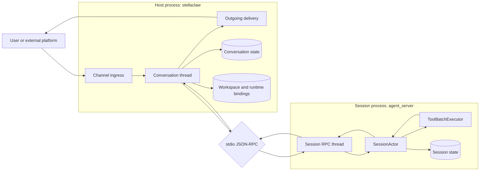

<div align="center">

# Stellaclaw

**A Rust-native agent server for long-running, multi-channel AI conversations.**

Agents as durable services, not disposable prompts.

[Roadmap](ROAD_MAP.md) · [Version History](VERSION) · [Example Config](example_config.json)

</div>

---

## What Is Stellaclaw?

Stellaclaw is the next-generation runtime for ClawParty: a self-hosted agent server that runs continuously, receives messages from external channels, and drives LLM sessions with durable state, tools, skills, workspaces, and crash recovery.

The current implementation is intentionally split into two runtime layers:

| Layer | Binary / Crate | Owns |
|---|---|---|
| Host | `stellaclaw` | Channels, conversations, workdirs, Telegram UI, config, routing, delivery, runtime skill persistence. |
| Session execution | `agent_server` + `stellaclaw_core` | SessionActor state machine, provider calls, tool batches, compaction, session history, runtime metadata. |

In one line:

```text
Conversation = durable boundary + router
SessionActor = execution boundary + state machine
```

This shape keeps platform concerns out of the model loop and keeps session execution recoverable, testable, and easy to isolate.

---

## Current Status

Stellaclaw is already usable as a Telegram-backed agent host.

Implemented today:

- Telegram channel with inbound messages, attachments, typing indicator, progress panel, and final success/failure delivery.
- Per-conversation model switching, sandbox switching, remote workspace switching, status query, cancel, and continue.
- `agent_server` subprocess boundary using stdin/stdout line-delimited JSON-RPC.
- SessionActor control/data mailboxes, turn loop, tool batch executor, idle compaction, crash recovery, and unfinished-turn continuation.
- Codex subscription provider using the official websocket shape, including access token refresh and priority service tier support.
- OpenRouter chat-completions / responses providers, Claude provider, Brave Search provider, and provider-backed media helpers.
- Model-aware multimodal input normalization with graceful downgrade to text context when a model cannot accept a file modality.
- Built-in tools for files, search, patching, shell, downloads, web fetch/search, media, cron, subagents, and host coordination.
- Runtime `SKILL.md` system with `skill_load`, `skill_create`, `skill_update`, and `skill_delete`.
- Workdir migration from legacy PartyClaw layouts into the current Stellaclaw layout.

Planned next surfaces:

- Web channel.
- RESTful API for external systems and admin UI.
- Richer host management and observability.

See [ROAD_MAP.md](ROAD_MAP.md) for the full architecture direction.

---

## Architecture



### Why This Split?

- Channel code stays platform-specific and user-facing.
- Conversation code owns durable routing decisions and workspace materialization.
- SessionActor owns the model/tool loop and session history.
- Provider requests and tools can evolve without turning Telegram or future Web code into session internals.
- A crashed or restarted service can resume from persisted conversation/session state.

---

## Telegram Experience

The Telegram channel is the primary product surface right now.

Supported controls:

| Command | Purpose |
|---|---|
| `/model` | Change the conversation model. |
| `/remote` | Select or clear remote workspace execution mode. |
| `/sandbox` | Override sandbox mode for this conversation. |
| `/status` | Show current conversation/session status. |
| `/continue` | Continue a recoverable failed or unfinished turn. |
| `/cancel` | Cancel the active turn where possible. |

During a turn, Telegram receives:

- typing status while the agent is working;
- editable progress feedback;
- final assistant output;
- recoverable failure prompts when `/continue` is available.

Each conversation has its own workspace, model snapshot, sandbox override, remote binding, and foreground/background session bindings.

---

## Tooling

Stellaclaw exposes tools through a dynamic catalog that is rebuilt from runtime state, model capabilities, session type, and remote mode.

| Family | Examples |
|---|---|
| Files and search | `file_read`, `file_write`, `edit`, `apply_patch`, `grep`, `glob`, `ls` |
| Shell | `shell`, `shell_close` |
| Web | `web_fetch`, `web_search` |
| Downloads | `file_download_start`, `file_download_progress`, `file_download_wait`, `file_download_cancel` |
| Media | `image_load`, `pdf_load`, `audio_load`, provider-backed analysis/generation tools |
| Host coordination | subagents, background sessions, cron, status and conversation bridge tools |
| Skills | `skill_load`, `skill_create`, `skill_update`, `skill_delete` |

Remote mode is schema-aware:

- selectable mode exposes a `remote` field where tools can choose a local or SSH target;
- fixed remote mode hides `remote` entirely and treats the bound execution root as implicit.

The shell tool intentionally uses `command` for new commands. It does not accept a `cmd` alias.

---

## Skills

Skills are `SKILL.md` directories synced into each workspace:

```text
.skill/
  web-report-deploy/
    SKILL.md
    references/
    scripts/
    assets/
```

The runtime tracks skill metadata and loaded skill content. When a skill changes, the session receives a runtime skill update before the next real user message.

Persistent skill operations are host bridge tools:

- `skill_create` persists a staged workspace skill into `rundir/.skill/<name>`.
- `skill_update` validates and updates an existing runtime skill.
- `skill_delete` removes it from the runtime store and existing conversation workspaces.

`SKILL.md` frontmatter should include at least:

```yaml
---
name: web-report-deploy
description: Generate and deploy static web reports.
---
```

---

## Multimodal Input

Files and media are normalized at the session boundary, just before provider requests are built.

If the selected model supports the modality, Stellaclaw sends it using the configured model transport. If it does not, the file becomes plain text context containing the file path, name, media type, and downgrade reason.

That means a conversation can keep working even when a model lacks `image_in`, `pdf`, `audio_in`, or generic file input support.

---

## Providers

Current provider support includes:

- Codex subscription websocket with automatic access token refresh.
- OpenRouter chat completions.
- OpenRouter responses.
- OpenAI-compatible image generation and edits.
- Claude messages.
- Brave Search.

Model behavior is configured with `ModelConfig`, including capabilities, multimodal input transport, context window, timeout, retry mode, token estimation, cache TTL, and optional fast/priority service tier.

---

## Quick Start

### 1. Build

```bash
cargo build --workspace --release
```

This produces:

```text
target/release/stellaclaw
target/release/agent_server
```

### 2. Configure

Start from [example_config.json](example_config.json).

Important fields:

- `version`: current config schema version, currently `0.3`.
- `agent_server.path`: path to the `agent_server` binary.
- `models`: named model configs.
- `channels`: Telegram and future channel definitions.
- `sandbox`: default sandbox mode.

For a release build, set:

```json
{
  "agent_server": {
    "path": "target/release/agent_server"
  }
}
```

Set the environment variables referenced by your config, for example:

```bash
export TELEGRAM_BOT_TOKEN=...
export OPENROUTER_API_KEY=...
export BRAVE_SEARCH_API_KEY=...
```

### 3. Run

```bash
target/release/stellaclaw \
  --config example_config.json \
  --workdir ./stellaclaw_workdir
```

The workdir stores conversations, sessions, runtime skills, logs, and migration markers.

### 4. systemd

The local deployment used by this repository runs as a user service:

```bash
systemctl --user restart stellaclaw
systemctl --user status stellaclaw --no-pager
```

Your unit should point `ExecStart` at `target/release/stellaclaw` and pass `--config` plus `--workdir`.

---

## Version Files

Stellaclaw deliberately has separate version tracks:

| File / Field | Meaning |
|---|---|
| Root `VERSION` | Project release version and changelog. Starts at `1.0.0`. |
| Config JSON `version` | Config schema version. Currently `0.3`. |
| Workdir `STELLA_VERSION` | Workdir schema version. Currently `0.4`. |
| Legacy workdir `VERSION` | PartyClaw compatibility input, not the project release version. |

Before bumping the root `VERSION`, check whether the previous GitHub Release exists. If it does not, merge the unpublished changelog into the next release notes so release history does not skip user-visible changes.

---

## CI/CD

GitHub Actions currently provides:

| Workflow | Trigger | What it does |
|---|---|---|
| CI | push to `main`, pull request | `cargo fmt --all --check`, `cargo test --workspace --locked` |
| Release | successful CI on `main` | If root `VERSION` changed and tag is missing, build release binaries, create `vX.Y.Z`, and publish a GitHub Release. |

Release artifacts include:

- `stellaclaw`
- `agent_server`
- `VERSION`
- `example_config.json`

---

## Repository Layout

```text
.
├── agent_server/     # Minimal session process wrapper around stellaclaw_core
├── core/             # SessionActor, providers, tool catalog, tool executor
├── stellaclaw/       # Host process, Telegram channel, config, workdir upgrade
├── ROAD_MAP.md       # Architecture roadmap and implementation notes
├── VERSION           # Project release version and changelog
└── example_config.json
```

---

## Development

Useful checks:

```bash
cargo fmt --all --check
cargo test --workspace --locked
cargo build --workspace --release --locked
```

When changing durable layouts or config schemas, read [AGENTS.md](AGENTS.md) first. It defines the required migration and versioning responsibilities.

---

<div align="center">

Built with Rust. Designed for durable agents, real conversations, and long-running work.

</div>
