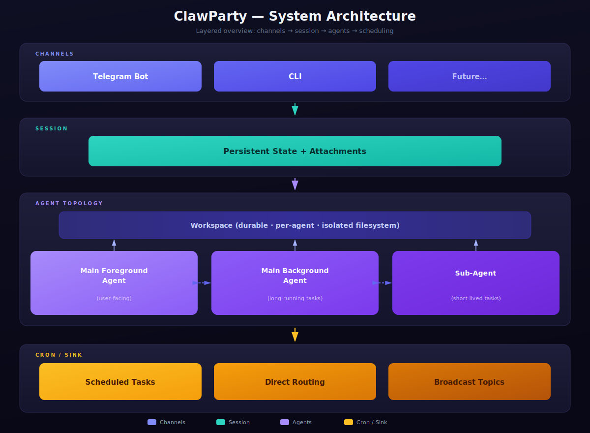

<div align="center">

# 🦀 ClawParty

**A self-hosted, multi-agent service framework built in Rust.**

*Agents as services, not scripts.*

---

</div>

## What is ClawParty?

ClawParty is a **production-grade agent hosting framework** that turns LLM agents into always-on, multi-channel services. Unlike CLI-only tools like Claude Code or OpenClaw, ClawParty is designed from day one as a **persistent service** — it runs 24/7, connects to messaging platforms like Telegram, and manages multiple independent conversations concurrently.

<div align="center">
  
  <br />
  <sub>Layered architecture: Channels → Session → Agent Topology → Cron / Sink</sub>
</div>

---

## Why ClawParty?

### vs. Claude Code / OpenClaw

| Dimension | Claude Code / OpenClaw | **ClawParty** |
|:----------|:----------------------|:--------------|
| **Deployment** | CLI tool, one session at a time | Always-on service, `systemd` managed |
| **Conversations** | Single terminal session | Multiple concurrent conversations via group chats |
| **Channels** | Terminal only | Telegram, DingTalk, CLI — extensible |
| **Multimodal** | Text + code only | Native image/PDF/audio input, image generation, file downloads |
| **Agent topology** | Single agent | Main agent + background agents + sub-agents per conversation |
| **Interruption** | Kill & restart | Mid-turn yield: new messages interrupt running tools gracefully |
| **Persistence** | Session-scoped | Full state survives restarts — sessions, workspaces, cron tasks, agent registry |
| **Scheduling** | None | Built-in cron with checker commands and sink routing |
| **Sandbox** | OS-level only | Three modes: disabled / subprocess / bubblewrap (namespace isolation) |
| **Memory** | Context window only | Multi-layer: context compaction + idle compaction + conversation memory + shared profiles |
| **Skills** | Not available | `SKILL.md`-based reusable workflows with runtime change detection |
| **Model flexibility** | Single provider | Multiple providers per instance, per-conversation model switching |

### Key Design Principles

- **Service-first**: Agents run as daemons, not interactive CLI programs
- **Conversation = Group Chat**: Each Telegram group with the bot is an independent conversation with its own workspace, model, and agent state
- **Graceful interruption**: User messages yield running turns at safe boundaries — no lost work
- **Crash-safe**: All state is persisted; process restarts resume where they left off

---

## Multi-Conversation via Group Chats

Each Telegram group chat with the bot creates an **independent conversation** with its own:
- Workspace (isolated filesystem)
- Model & agent backend selection
- Session history & memory
- Sandbox mode

Create a new group, add the bot, and you have a fresh conversation — no commands needed.

<div align="center">
  
  <br />
  <sub>Each group is an independent agent workspace with full context isolation</sub>
</div>

---

## Native Multimodal

ClawParty handles multimodal content **natively** across the full pipeline — not bolted on, but designed into the channel and tool layers from the start:

| Capability | How it works |
|:-----------|:-------------|
| 📷 **Image input** | Send images in chat → model sees them directly via vision-capable models |
| 🎨 **Image generation** | `image_generate` tool → helper model creates images → delivered back in chat |
| 📄 **PDF input** | Send PDF files → content extracted and passed to the model |
| 🎵 **Audio input** | Send voice messages → transcribed and injected into context |
| 📎 **File attachments** | Upload any file → stored in workspace, accessible to all tools |
| 🖼️ **Image output** | Agents generate plots, diagrams, screenshots → sent as chat attachments |

Multimodal routing is **per-model configurable**: each model declares its `capabilities` (e.g., `image_in`, `audio_in`), and helper models can be assigned for specific tooling tasks (image generation, web search, etc.). The channel layer handles format conversion transparently — the agent just works.

---

## Built-in Tool System

40+ built-in tools available to every agent, covering:

| Category | Tools |
|:---------|:------|
| **File I/O** | `file_read`, `file_write`, `edit`, `apply_patch` |
| **Repository exploration** | `glob`, `grep`, `ls` |
| **Shell execution** | `exec_start`, `exec_observe`, `exec_wait`, `exec_kill` (with PTY support) |
| **Web** | `web_fetch`, `web_search` (interruptible) |
| **Image** | `image_generate`, `image_load` |
| **Downloads** | `file_download_start`, `file_download_progress`, `file_download_wait`, `file_download_cancel` |
| **Agent coordination** | `subagent_start`, `subagent_join`, `subagent_kill`, `start_background_agent` |
| **Scheduling** | `create_cron_task`, `update_cron_task`, `remove_cron_task`, `list_cron_tasks` |
| **Memory & workspace** | `workspaces_list`, `workspace_mount`, `workspace_content_move`, `shared_profile_upload` |
| **Skills** | `skill_load`, `skill_create`, `skill_update` |
| **Communication** | `user_tell` (mid-turn progress messages) |

Tools are classified as **immediate** (return promptly) or **interruptible** (can be yielded when a new user message arrives). Long-running `exec`, `file_download`, and `image` tasks survive across turns and context compactions.

---

## Agent Topology

Each conversation supports a three-tier agent hierarchy:

```
Conversation
  └─ Main Foreground Agent (user-facing, one active turn at a time)
       ├─ Sub-Agents (session-bound helpers, delegated tasks)
       └─ Background Agents (independent async work, report back via sinks)
```

- **Main agent** handles user messages, runs tools, manages workspace
- **Sub-agents** run bounded tasks in parallel (e.g., search, fact gathering)
- **Background agents** run independently and deliver results later via configurable sinks (direct message, broadcast topic, multi-target fan-out)

---

## Context Management

ClawParty implements multi-layer context management to handle long-running conversations:

| Layer | Mechanism |
|:------|:----------|
| **Threshold compaction** | Automatic compression when context approaches model limits |
| **Idle compaction** | Background compression between turns when conversation is idle |
| **Timeout-observation compaction** | Compress and retry when model times out on large context |
| **High-fidelity zone** | Recent messages preserved at full detail during compaction |
| **Conversation memory** | `MEMORY.json` + rollout summaries for cross-session recall |
| **Shared profiles** | `USER.md` / `IDENTITY.md` injected into every system prompt |
| **Runtime change detection** | Profile updates, skill changes, model catalog changes → synthetic system messages |

Running `exec` processes, active downloads, and alive sub-agents are preserved in compaction summaries so subsequent turns can continue using them.

---

## Skill System

Skills are `SKILL.md`-based reusable workflows:

```
.skills/
  └─ web-report-deploy/
       ├─ SKILL.md          # Instructions + trigger description
       ├─ references/       # Reference files
       ├─ scripts/          # Helper scripts
       └─ assets/           # Static assets
```

- **Discovery**: Skill metadata is preloaded; agent loads full instructions on demand
- **Persistence**: `skill_create` / `skill_update` persist skills to the runtime store
- **Shared state**: `.skill_memory/<skill-name>/` for cross-workspace persistent data
- **Runtime sync**: Description or content changes trigger automatic notifications to the agent

---

## Sandbox Isolation

Three isolation levels, configurable per conversation via `/sandbox`:

| Mode | Isolation | Use case |
|:-----|:----------|:---------|
| `disabled` | None | Trusted environments, development |
| `subprocess` | Separate process | Basic isolation |
| `bubblewrap` | Linux namespace container | Production — restricted filesystem, network-aware |

Bubblewrap mode exposes only the current workspace, runtime dir, `.skills/`, and `.skill_memory/`. DNS is forwarded, read-only mounts are cleaned up on turn completion.

---

## TUI Config Editor

ClawParty ships with a built-in terminal UI for editing configurations — no need to hand-edit JSON:

```bash
./target/release/partyclaw config deploy_telegram.json
```

<div align="center">
  
  <br />
  <sub><code>partyclaw config</code> — browse, edit, validate, and save configurations interactively</sub>
</div>

Sections include Models, Tooling, Main Agent, Runtime, Sandbox, and Channels. Supports keyboard navigation, inline validation, and one-key bootstrap for new configs.

---

## Quick Start

### 1. Environment

```bash
cp .env.example .env
# Fill in:
#   OPENROUTER_API_KEY=sk-or-...
#   TELEGRAM_BOT_TOKEN=...        (for Telegram channel)
```

### 2. Build & Run

```bash
# Build
cargo build --release --manifest-path agent_host/Cargo.toml --bin partyclaw

# Run with config
./target/release/partyclaw --config config.json --workdir ./workdir
```

### 3. Minimal Config

```json
{
  "version": "0.14",
  "models": {
    "main": {
      "type": "openrouter",
      "api_endpoint": "https://openrouter.ai/api/v1",
      "model": "anthropic/claude-sonnet-4",
      "capabilities": ["chat", "image_in"],
      "api_key_env": "OPENROUTER_API_KEY",
      "context_window_tokens": 200000,
      "description": "Primary chat model"
    }
  },
  "agent": {
    "agent_frame": { "available_models": ["main"] }
  },
  "main_agent": { "language": "zh-CN" },
  "channels": [{
    "kind": "telegram",
    "id": "telegram-main",
    "bot_token_env": "TELEGRAM_BOT_TOKEN"
  }]
}
```

### 4. systemd Deployment

```bash
./target/release/partyclaw setup --config config.json --workdir ./workdir
# Generates systemd user unit files, then:
systemctl --user enable --now partyclaw
```

---

## Telegram Commands

| Command | Description |
|:--------|:------------|
| `/agent` | Select agent backend & model |
| `/status` | Token usage, cache stats, cost estimation |
| `/compact` | One-off context compaction |
| `/compact_mode` | Toggle automatic compaction |
| `/sandbox` | Switch sandbox mode |
| `/think` | Toggle extended thinking |
| `/set_api_timeout` | Adjust per-request timeout |
| `/continue` | Resume an interrupted turn |
| `/snapsave` `/snapload` `/snaplist` | Conversation state snapshots |
| `/help` | Show available commands |

---

## CI / CD

| Trigger | Action |
|:--------|:-------|
| Push / Pull Request | `cargo fmt --check` + `cargo test` for both crates |
| `VERSION` changed on `main` | Auto-tag `vX.Y.Z` + publish release binaries |

---

## Documentation

- [Deployment Guide](docs/DEPLOY.md)
- [Version History](VERSION)

---

<div align="center">

**Built with 🦀 Rust** · **Powered by LLMs** · **Agents as Services**

</div>
