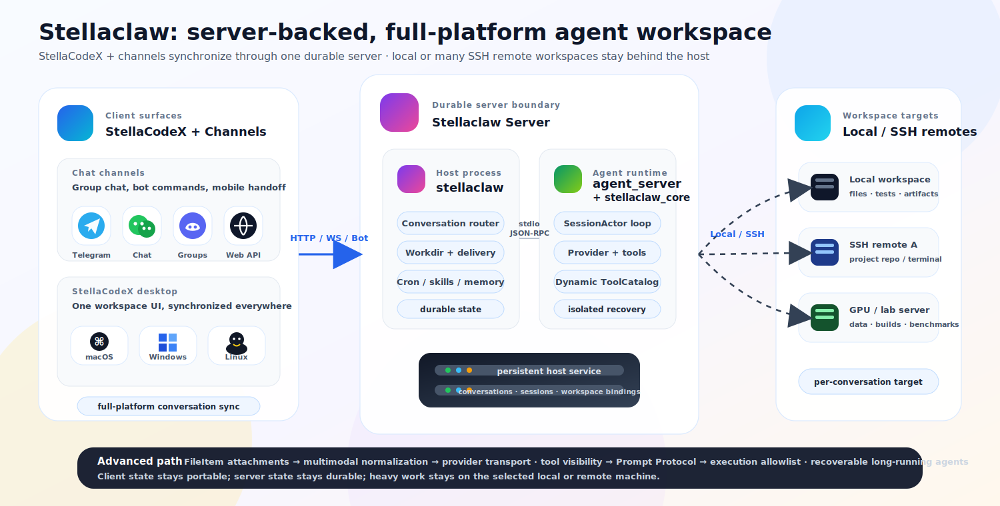

<div align="center">

# Stellaclaw

**A Rust-native agent host for long-running, multi-channel AI work.**

Durable conversations. Isolated execution. Recoverable agents.

[中文 README](README_zh.md) · [Roadmap](ROAD_MAP.md) · [Version History](VERSION) · [Example Config](example_config.json)

</div>

---

## What Is Stellaclaw?

Stellaclaw is the next-generation runtime for ClawParty: a self-hosted agent system that stays online, receives messages from external channels, and drives LLM sessions with durable state, tools, skills, workspaces, and crash recovery.

Stellaclaw is multi-channel by design. StellaCodeX is the desktop surface; Telegram groups can act as lightweight conversation surfaces; and the Web API can power other clients. They all share the same Stellaclaw backend, durable conversations, session runtime, provider configuration, and workspace model.

StellaCodeX lets you open the same agent workspace from any computer: the UI runs locally, but the files, terminal, tool calls, and code changes belong to the Stellaclaw server workspace that the conversation is connected to.


That makes StellaCodeX similar in spirit to VS Code Server, but centered on long-running agents instead of manual remote editing. The repository lives where the server can access it; the agent works there; the user can supervise, interrupt, inspect files, open terminals, and take over from anywhere.

Telegram is a first-class surface too. Creating different Telegram groups gives you quick separate conversations for different tasks or roles, while they still share the same backend service.


Each conversation can independently choose its model, sandbox policy, and remote execution binding. Remote mode can make a conversation behave as if it is running directly on another server that Stellaclaw can access over SSH, which is how Stellaclaw supports SSH Remote workflows without making the client own remote execution.

One of its product advantages is the three-hop work path enabled by StellaCodeX and Remote mode:

```text
StellaCodeX / Channel Host -> Stellaclaw Server -> Remote Workspace Server
```

StellaCodeX, Telegram groups, and Web clients provide the user-facing host surface. Stellaclaw runs as the durable agent server that owns conversations, routing, sessions, delivery, and recovery. Remote mode can then bind a conversation to another server's workspace, terminal, and filesystem through SSH/sshfs, so the agent can work where the project actually lives.

That gives Stellaclaw a practical deployment advantage: users get a local desktop or channel experience, the central agent service stays durable, and heavy project work can happen on a separate remote machine without moving the conversation state out of the host.

The current Rust implementation is split across these runtime layers:

| Layer | Binary / Crate | Owns |
|---|---|---|
| Client and channel surface | `apps/stellacodeX/electron`, Telegram, Web API | User interaction, desktop workspace browsing, terminal UI, attachments, delivery. |
| Host server | `stellaclaw` | Channels, conversations, workdirs, Telegram/Web surfaces, config, routing, delivery, runtime skill persistence. |
| Agent server | `agent_server` + `stellaclaw_core` | SessionActor state machine, provider/tool loop, compaction, session history, runtime metadata. |
| Remote workspace server | SSH/sshfs target | Optional fixed or selectable remote workspace, remote shell, project files, execution root. |

In one line:

```text
Conversation = durable boundary + router
SessionActor = execution boundary + state machine
```

This keeps platform concerns out of the model loop, keeps remote workspace concerns out of the client, and gives each conversation a recoverable execution boundary.

---

## Highlights

- **Three-hop work path**: StellaCodeX / Telegram / Web clients talk to the Stellaclaw host, while Remote mode can bind the same conversation to a second SSH workspace server.
- **Multiple surfaces, one backend**: desktop, Telegram groups, and Web API clients share the same durable conversation runtime, model config, skill store, memory store, and workspace model.
- **Per-conversation control**: each conversation carries its own model snapshot, sandbox override, reasoning effort, remote binding, and foreground/background/subagent session bindings.
- **Recoverable execution**: unfinished turns, cooperative interrupts, crashed runtimes, provider failures, compaction, and long tool batches are handled as lifecycle events instead of silent state loss.
- **Server-backed desktop workspace**: StellaCodeX can browse, preview, upload/download, open terminals, inspect tool details, and render message attachments against the server-side workspace.
- **Remote-aware tools**: file, shell, download, patch, and visibility tools are schema-aware; fixed SSH Remote mode hides the `remote` choice and treats the bound remote cwd as implicit.
- **Runtime skills and memory**: `SKILL.md` directories can be loaded or persisted at runtime, while Memory v1 keeps durable user, conversation, and public facts separate from transient chat history.

## Advanced Capabilities

These are the higher-level features to call out when describing Stellaclaw:

| Capability | What it means in the current code |
|---|---|
| Durable host / isolated execution split | `Conversation` owns routing, workspace materialization, attachments, state, and delivery; `SessionActor` owns the provider/tool loop inside `agent_server`. |
| Dynamic ToolCatalog | Tool schemas are rebuilt from runtime state, model capabilities, remote mode, session kind, host tool scope, and provider visibility. The filtered catalog is also the local execution allowlist. |
| Prompt Protocol | Tool-use instructions live beside tool definitions and are injected only when their required tools are visible to the selected provider. |
| Memory v1 | Host-side memory has `user`, `conversation`, and `public` scopes. User memory becomes a system prompt snapshot; conversation/public memory enters context by explicit search or compression recall. |
| FileItem / attachment pipeline | User uploads, tool products, and assistant attachment tags resolve to structured files, stable workspace paths, previews, downloads, and provider-time multimodal normalization. |
| Codex subscription support | The Codex websocket provider keeps auth state, supports priority service tier, preserves encrypted reasoning continuation, and stores streamed reasoning summaries. |
| Rich StellaCodeX UI | Electron supports conversation lists, WebSocket foreground updates, workspace tree, file/message attachment preview, sandboxed HTML preview, split Git diff tool details, xterm terminals, plan panel, usage panel, and theme colors. |

## Typical Workloads

Stellaclaw is built for long-running research and engineering workflows where the user, agent, files, terminals, and remote machines need to stay in the same recoverable context:

- **Paper wiki and research knowledge bases**: summarize large paper collections, compare venues or years, extract trends, and keep generated reports attached to the conversation workspace.
- **Remote server experiments**: bind one conversation to each project or machine, let the agent run builds, tests, traces, and scripts where the data and GPUs actually live, and inspect results from StellaCodeX or Telegram.
- **Benchmark-driven code optimization**: let the agent iterate on low-level code, run benchmarks, inspect diffs and artifacts, and keep the full optimization trail in one conversation.
- **Long background jobs**: start an agent task from desktop, close the client, and later check progress or continue from another device/channel because the runtime lives on the backend.
- **Paper and artifact development**: keep manuscript edits, experiment scripts, figures, generated files, and remote terminals connected to the same project conversation.

---

## Current Status

Stellaclaw is already usable as a Telegram-backed and StellaCodeX/Web-backed agent host. The implementation is Rust-first and keeps the host/runtime boundary explicit.

Implemented today:

- Telegram channel with inbound messages, group-based conversations, attachments, typing indicator, editable progress panel, final success/failure delivery, and `/model` / `/remote` / `/sandbox` / `/status` / `/continue` / `/cancel` controls.
- Web channel APIs for models, conversations, messages, status, workspace list/read/upload/download/move/delete, terminals, foreground WebSocket updates, conversation streams, and seen-state tracking.
- StellaCodeX Electron desktop client with server profiles, conversation list, chat, paste/drop attachments, workspace browser, previews, HTML sandbox rendering, terminal dock, plan/overview panels, usage breakdown, configurable themes, and Git diff tool detail rendering.
- Per-conversation model switching, sandbox switching, reasoning effort, remote workspace switching, status query, cancel, continue, foreground/background/subagent bindings, and managed-agent status.
- `agent_server` subprocess boundary using stdin/stdout line-delimited JSON-RPC.
- `SessionActor` control/data mailboxes, turn loop, tool batch executor, provider worker isolation, idle compaction, crash recovery, unfinished-turn continuation, and closed tool-call history repair.
- Codex subscription provider using the official websocket shape, including access token refresh, priority service tier, encrypted reasoning continuation, and streamed reasoning summary persistence.
- OpenRouter chat-completions / responses providers, Claude provider, Brave Search provider, OpenAI-compatible image generation/editing, and provider-backed media helpers.
- Model-aware multimodal input normalization with graceful downgrade to text/file context when a model cannot accept a file modality.
- Built-in tools for files, search, patching, fresh-process shell, downloads, web fetch/search, media, cron, subagents, background agents, memory, and host coordination.
- Runtime `SKILL.md` system with `skill_load`, `skill_create`, `skill_update`, and `skill_delete`, persisted through `.stellaclaw/skill/`.
- Workdir migration from legacy PartyClaw layouts into the current Stellaclaw layout.

Planned next surfaces:

- Stabilized REST/admin API shape for external systems.
- Richer host management and observability.

See [ROAD_MAP.md](ROAD_MAP.md) for the full architecture direction.

---

## Architecture



The important runtime boundary is still:

```text
Conversation = durable boundary + router
SessionActor = execution boundary + state machine
```

Stellaclaw intentionally keeps the local client/channel surface, durable host server, isolated agent runtime, and optional remote workspace as separate layers. The UI can restart, the agent runtime can crash and recover, and the project repository can stay on a different SSH server without moving conversation history out of the host workdir.

### Why This Split?

- Channel code stays platform-specific and user-facing.
- Conversation code owns durable routing decisions and workspace materialization.
- SessionActor owns the model/tool loop and session history.
- Remote workspace behavior can evolve without turning StellaCodeX, Telegram, or Web code into session internals.
- A crashed or restarted service can resume from persisted conversation/session state.
- The client/channel surface, durable host server, internal agent server, and optional remote workspace server each stay at clear boundaries.

### Remote Mode: SSHFS Workspace Illusion

Remote mode is designed to make the agent behave as if it is working inside the remote project, while Stellaclaw still keeps the durable conversation and session state on the host server.


In fixed Remote mode, file tools operate on the sshfs-mounted workspace path, so reads, writes, search, patches, uploads, and downloads look local to the agent. Interactive terminals avoid running through the FUSE mount for command execution; they connect with SSH and start in the configured remote cwd. The conversation binding records which remote workspace is active, while session history and recovery metadata stay in the Stellaclaw workdir.

That is the illusion: the agent receives a normal workspace path, but the bytes and shell are backed by a remote server.


With the Web Channel, StellaCodeX can connect to a Stellaclaw server that is itself remote from the user's laptop. Remote mode can then jump again from that Stellaclaw server into another remote project server. The active work is resumable because the conversation and session state are persisted by Stellaclaw, while the actual repository remains on the remote machine where builds, tests, terminals, and file edits should happen.

---

## Telegram Experience

The Telegram channel is the primary product surface right now.

Supported controls:

| Command | Purpose |
|---|---|
| `/model` | Change the conversation model. |
| `/remote` | Select or clear remote workspace execution mode. |
| `/sandbox` | Override sandbox mode for this conversation. |
| `/status` | Show current conversation/session status. |
| `/continue` | Continue a recoverable failed or unfinished turn. |
| `/cancel` | Cancel the active turn where possible. |

During a turn, Telegram receives:

- typing status while the agent is working;
- editable progress feedback;
- final assistant output;
- recoverable failure prompts when `/continue` is available.

Each conversation has its own workspace, model snapshot, sandbox override, remote binding, and foreground/background session bindings.

---

## Tooling

Stellaclaw exposes tools through a dynamic catalog rebuilt from runtime state, model capabilities, session type, host tool scope, provider visibility, and remote mode. The same filtered catalog drives provider request schemas, Prompt Protocol injection, and local execution allowlisting.

| Family | Examples |
|---|---|
| Files, search, visibility | `file_read`, `file_write`, `grep`, `apply_patch`, `shell_make_visible`, `attachment_make_visible` |
| Fresh-process shell | `shell_exec`, `shell_write_stdin`, `shell_stop` |
| Web and downloads | `web_fetch`, `web_search`, `file_download_start`, `file_download_progress`, `file_download_wait`, `file_download_cancel` |
| Media | `image_load`, `pdf_load`, `audio_load`, provider-backed analysis/generation tools |
| Host coordination | `user_tell`, `update_plan`, subagents, background agents, cron, managed-agent status |
| Memory | `memory_search`, `memory_write`, `memory_update`, `memory_delete` |
| Skills | `skill_load`, `skill_create`, `skill_update`, `skill_delete` |

Remote mode is schema-aware:

- selectable mode exposes a `remote` field where tools can choose a local or SSH target;
- fixed remote mode hides `remote` entirely and treats the bound execution root as implicit;
- `apply_patch` normalizes absolute paths under the active workspace/remote cwd to relative paths, and rejects paths outside the execution root.

The shell surface is deliberately process-based. New work starts with `shell_exec.command`; long-running commands return a `process_id`; later calls observe/interact with `shell_write_stdin` or stop with `shell_stop`. There is no hidden reusable shell session and no `cmd` alias.

---

## Skills

Skills are `SKILL.md` directories synced into each conversation workspace under `.stellaclaw/skill/`:

```text
.stellaclaw/skill/
  web-report-deploy/
    SKILL.md
    references/
    scripts/
    assets/
```

The runtime tracks skill metadata and loaded skill content. When a skill changes, the session receives a runtime skill update before the next real user message.

Persistent skill operations are host bridge tools:

- `skill_create` persists a staged workspace skill into the runtime skill store at `.stellaclaw/skill/<name>`.
- `skill_update` validates and updates an existing runtime skill. If root config `skill_sync` includes the skill, Stellaclaw commits the runtime skill and pushes it to each configured upstream. Each push has a short timeout; failures are reported as warnings and do not fail the skill update.
- `skill_delete` removes it from the runtime store and existing conversation workspaces.

`SKILL.md` frontmatter should include at least:

```yaml
---
name: web-report-deploy
description: Generate and deploy static web reports.
---
```

Skills capture reusable workflows; durable project/user facts should go through Memory v1 or normal repository documentation instead of being inflated into every system prompt.

---

## Multimodal Input

Files and media are normalized at the session boundary, just before provider requests are built.

If the selected model supports the modality, Stellaclaw sends it using the configured model transport. If it does not, the file becomes plain text context containing the file path, name, media type, and downgrade reason.

That means a conversation can keep working even when a model lacks `image_in`, `pdf`, `audio_in`, or generic file input support.

Each local conversation workspace has a `shared/` directory linked to `rundir/shared`, so files placed there are visible from other conversation workspaces in the same workdir. `sandbox.software_dir` can also expose a shared software/tooling directory; in bubblewrap mode it is mounted at `sandbox.software_mount_path` (default `/opt`) and tools receive `STELLACLAW_SOFTWARE_DIR`.

---

## Providers

Current provider support includes:

- Codex subscription websocket with automatic access token refresh, priority service tier mapping, encrypted reasoning continuation, and streamed reasoning summary persistence.
- OpenRouter chat completions and OpenRouter responses.
- OpenAI-compatible image generation and edits.
- Claude messages.
- Brave Search, including image, video, and news verticals.
- Provider-backed media helpers.

Model behavior is configured with `ModelConfig`, including capabilities, multimodal input transport, context window, output token cap, timeout, retry mode, token estimation, cache TTL, and optional fast/priority service tier. Provider-specific request shaping happens after provider-neutral `ChatMessage` and `FileItem` history has been normalized.

Provider pricing configuration lives under `pricing/` and is split by provider type. Missing model prices mean Stellaclaw reports token usage without computing dollar cost.

For `openai_image`, configure `url` as the API base such as `https://host/v1`; Stellaclaw routes generation requests to `/images/generations` and image edit requests to `/images/edits`.

---

## Quick Start

### 1. Build

```bash
cargo build --workspace --release
```

This produces:

```text
target/release/stellaclaw
target/release/agent_server
```

### 2. Configure

Start from [example_config.json](example_config.json).

Important fields:

- `version`: current config schema version, currently `0.12`.
- `agent_server.path`: path to the `agent_server` binary.
- `models`: named model configs.
- `skill_sync`: optional runtime skill git sync targets.
- `channels`: Telegram and Web channel definitions.
- `sandbox`: default sandbox mode.

Optional Web channel config:

```json
{
  "kind": "web",
  "id": "web-main",
  "bind_addr": "127.0.0.1:3111",
  "token_env": "STELLACLAW_WEB_TOKEN"
}
```

The Web channel exposes JSON APIs under `/api/` and accepts
`Authorization: Bearer <token>`.

Current Web channel endpoints include:

- `GET /api/models`
- `GET /api/conversations?offset=0&limit=50`
- `POST /api/conversations`
- `PATCH /api/conversations/{conversation_id}`
- `DELETE /api/conversations/{conversation_id}`
- `POST /api/conversations/{conversation_id}/seen`
- `GET /api/conversations/{conversation_id}/messages?offset=0&limit=50`
- `GET /api/conversations/{conversation_id}/messages/{message_id}`
- `POST /api/conversations/{conversation_id}/messages`
- `GET /api/conversations/{conversation_id}/status`
- `GET /api/conversations/{conversation_id}/workspace`
- `GET /api/conversations/{conversation_id}/workspace/file`
- `POST /api/conversations/{conversation_id}/workspace/upload`
- `GET /api/conversations/{conversation_id}/workspace/download`
- `PATCH /api/conversations/{conversation_id}/workspace`
- `DELETE /api/conversations/{conversation_id}/workspace`
- `GET /api/conversations/{conversation_id}/terminals`
- `POST /api/conversations/{conversation_id}/terminals`
- `GET /api/conversations/{conversation_id}/terminals/{terminal_id}`
- `DELETE /api/conversations/{conversation_id}/terminals/{terminal_id}`

Message detail responses include `rendered_text`, `attachments`, and
`attachment_errors`. Structured `ChatMessageItem::File`,
`ToolResult.result.file`, and assistant output tags such as
`<attachment>report.png</attachment>` are resolved against the conversation
workspace or `shared/` when possible; mapped attachment `url` values point at
the workspace file API.

For a release build, set:

```json
{
  "agent_server": {
    "path": "target/release/agent_server"
  }
}
```

Set the environment variables referenced by your config, for example:

```bash
export TELEGRAM_BOT_TOKEN=...
export OPENROUTER_API_KEY=...
export BRAVE_SEARCH_API_KEY=...
```

### 3. Run

```bash
target/release/stellaclaw \
  --config example_config.json \
  --workdir ./stellaclaw_workdir
```

The workdir stores conversations, sessions, runtime skills, logs, and migration markers.

### 4. systemd

The local deployment used by this repository runs as a user service:

```bash
systemctl --user restart stellaclaw
systemctl --user status stellaclaw --no-pager
```

Your unit should point `ExecStart` at `target/release/stellaclaw` and pass `--config` plus `--workdir`.

---

## Version Files

Stellaclaw deliberately has separate version tracks:

| File / Field | Meaning |
|---|---|
| Root `VERSION` | Project release version and changelog. Starts at `1.0.0`. |
| Config JSON `version` | Config schema version. Currently `0.12`. |
| Workdir `STELLA_VERSION` | Workdir schema version. Currently `0.17`. |
| Legacy workdir `VERSION` | PartyClaw compatibility input, not the project release version. |

Before bumping the root `VERSION`, check whether the previous GitHub Release exists. If it does not, merge the unpublished changelog into the next release notes so release history does not skip user-visible changes.

---

## CI/CD

GitHub Actions currently provides:

| Workflow | Trigger | What it does |
|---|---|---|
| CI | push to `main`, pull request | `cargo fmt --all --check`, `cargo test --workspace --locked` |
| Release | successful CI on `main` | If root `VERSION` changed and tag is missing, build release binaries, create `vX.Y.Z`, and publish a GitHub Release. |

Release artifacts include:

- `stellaclaw`
- `agent_server`
- `VERSION`
- `example_config.json`

---

## Repository Layout

```text
.
├── agent_server/     # Session process wrapper around stellaclaw_core
├── core/             # SessionActor, providers, tool catalog, tool executor
├── docs/assets/      # README diagrams and documentation assets
├── stellaclaw/       # Host process, channels, config, workdir upgrade
├── ROAD_MAP.md       # Architecture roadmap and implementation notes
├── VERSION           # Project release version and changelog
└── example_config.json
```

---

## Development

Useful checks:

```bash
cargo fmt --all --check
cargo test --workspace --locked
cargo build --workspace --release --locked
```

When changing durable layouts or config schemas, read [AGENTS.md](AGENTS.md) first. It defines the required migration and versioning responsibilities.

---

<div align="center">

Built with Rust. Designed for durable agents, real conversations, and long-running work.

</div>
