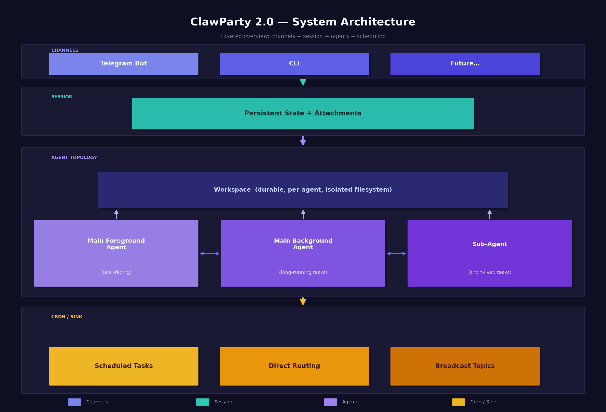
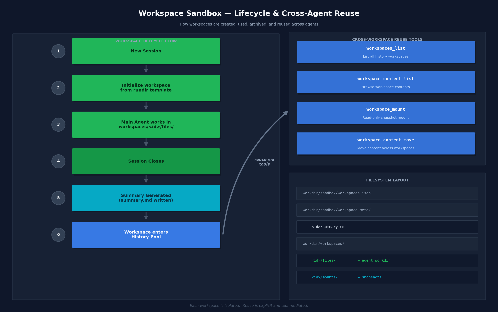

<div align="center">

# 🦀 ClawParty

**A Rust-based multi-agent host and next-generation agentic framework.**

[](#ci--cd)
[](#)
[](#)
[](#status)

*Agents as services, not scripts.*

</div>

---

## 🏗️ Architecture

<div align="center">
  
  <br />
  <em>Layered architecture: Channels → Session → Agent Topology → Cron / Sink</em>
</div>

---

## 📦 Repository Structure

```
ClawParty/
├── agent_frame/    # 🔧 Standalone agent runtime (tools, skills, compaction)
├── agent_host/     # 🚀 Long-running service host (channels, sessions, cron, recovery)
├── zgent/          # 🔌 Compatibility layer for zgent-core
└── docs/           # 📄 Documentation & diagrams
```

---

## 🔧 `agent_frame` — Agent Runtime

A self-contained Rust library and CLI binary for running a single LLM agent session.

### ✨ Capabilities

| Feature | Details |
|:--------|:--------|
| 🛠️ **Built-in tools** | File I/O, patch apply, shell execution, web fetch, web search, image inspection |
| 📚 **Skill system** | `SKILL.md`-based skill discovery with `load_skill` tool |
| 🗜️ **Context compaction** | Automatic compression when context approaches model limits |
| 📊 **Token accounting** | Tracks `cache_read` / `cache_write` / `cache_hit` / `cache_miss` per request |
| ⏱️ **Tool timeouts** | Every tool call has an explicit timeout budget |
| 🛑 **Cancellation** | `SessionExecutionControl` with `AtomicBool` cancel flag — checked before every LLM call and tool execution |
| 💾 **Checkpoint callback** | Optional callback fired after each tool round for mid-session state persistence |
| 🎛️ **Modes** | CLI binary (`run_agent`) or embedded library |

### 🔨 Build & Test

```bash
cargo test --manifest-path agent_frame/Cargo.toml
```

### ⚙️ Configuration

See [`agent_frame/example_config.json`](agent_frame/example_config.json) and [`agent_frame/example_openrouter_config.json`](agent_frame/example_openrouter_config.json).

> **Web search**: set either `native_web_search.enabled = true` (suppresses standalone `web_search` tool) or configure an external search provider under `external_web_search`. Only one should be active per model.

---

## 🚀 `agent_host` — Service Host

The production layer that wraps `agent_frame` into a long-running, multi-channel service.

### 🔑 Key Features

| Feature | Description |
|:--------|:------------|
| 💾 **Session persistence** | State survives process restarts; attachment lifecycle managed automatically |
| 📋 **Agent registry** | Background and subagent state persisted across restarts |
| ⏰ **Cron tasks** | Scheduled work with optional checker commands, stored durably |
| 📡 **Background sinks** | Direct routing, broadcast topics, multi-target fan-out |
| 📝 **Structured logging** | JSONL logs with per-agent / per-session / per-channel views |
| 🔄 **Failure recovery** | Automatic handling of timeouts, upstream errors, and restart scenarios |

---

## 🔄 Workspace Lifecycle

<div align="center">
  
  <br />
  <em>Workspace creation, usage, archival, and cross-agent reuse</em>
</div>

---

## ⚙️ Configuration Reference

`agent_host` is driven by a single JSON config file:

```jsonc
{
  "models":     { /* named model profiles */ },
  "main_agent": { /* agent behavior settings */ },
  "channels":   [ /* one or more channel configs */ ]
}
```

<details>
<summary><b>📋 Model Profile (<code>models.&lt;name&gt;</code>)</b></summary>
<br />

Each named entry under `models` describes one LLM endpoint. `main_agent.model` selects which one the foreground agent uses.

| Field | Type | Default | Description |
|:------|:-----|:--------|:------------|
| `api_endpoint` | string | — | Base URL of the OpenAI-compatible API |
| `model` | string | — | Model identifier passed to the API |
| `backend` | `"agent_frame"` \| `"zgent"` | `"agent_frame"` | Agent execution backend |
| `supports_vision_input` | bool | `false` | Whether to pass images to the model |
| `image_tool_model` | string \| `"self"` | null | A separate model name for the `image` tool; `"self"` = this model |
| `api_key` | string | null | Inline API key (prefer `api_key_env`) |
| `api_key_env` | string | `"OPENAI_API_KEY"` | Env var from which to read the API key |
| `chat_completions_path` | string | `"/chat/completions"` | Path appended to `api_endpoint` |
| `timeout_seconds` | float | `120.0` | Per-request LLM timeout |
| `context_window_tokens` | int | `128000` | Context window size for compaction budget |
| `cache_ttl` | string | null | Cache TTL hint (e.g. `"5m"`), enables cache control headers |
| `reasoning` | object | null | Reasoning config (budget tokens, effort level) |
| `headers` | object | `{}` | Extra HTTP headers sent with every request |
| `native_web_search` | object | null | Provider-native search (mutually exclusive with `external_web_search`) |
| `external_web_search` | object | null | External search via a separate model/endpoint |
| `description` | string | `""` | Human-readable label; shown to agents in model catalog |

</details>

<details>
<summary><b>🤖 Main Agent (<code>main_agent</code>)</b></summary>
<br />

| Field | Type | Default | Description |
|:------|:-----|:--------|:------------|
| `model` | string | — | Must match a key in `models` |
| `language` | string | `"zh-CN"` | Reply language injected into the system prompt |
| `timeout_seconds` | float | null | Wall-clock timeout for a full agent turn (null = unlimited) |
| `enabled_tools` | string[] | all built-ins | Tools made available to the agent |
| `max_tool_roundtrips` | int | `12` | Max LLM → tool → LLM cycles per turn |
| `enable_context_compression` | bool | `true` | Enable automatic mid-turn compaction |
| `effective_context_window_percent` | float | `0.9` | Fraction of `context_window_tokens` before compaction triggers |
| `auto_compact_token_limit` | int | null | Hard token budget that triggers compaction |
| `retain_recent_messages` | int | `8` | Minimum recent messages preserved during compaction |
| `enable_idle_context_compaction` | bool | `false` | Run compaction in the background between turns |
| `idle_context_compaction_poll_interval_seconds` | int | `15` | How often to check for idle compaction opportunity |

</details>

---

## 🚀 Quick Start

### 1. Environment Setup

```bash
cp .env.example .env
```

Fill in the required variables:

```dotenv
OPENROUTER_API_KEY=sk-or-...       # For agent_frame / agent_host
TELEGRAM_BOT_TOKEN=...             # For Telegram channel (agent_host)
```

### 2. CLI Mode

```json
{
  "models": {
    "main": {
      "backend": "agent_frame",
      "api_endpoint": "https://openrouter.ai/api/v1",
      "model": "openai/gpt-4o-mini",
      "supports_vision_input": true,
      "api_key_env": "OPENROUTER_API_KEY",
      "cache_ttl": "5m",
      "context_window_tokens": 128000,
      "description": "Fast general-purpose chat model."
    }
  },
  "main_agent": { "model": "main", "language": "zh-CN" },
  "channels": [{ "kind": "command_line", "id": "local-cli", "prompt": "you> " }]
}
```

```bash
./run_test.sh agent_host/example_config.json
```

### 3. Telegram Bot Mode

```json
{
  "models": {
    "main": {
      "backend": "agent_frame",
      "api_endpoint": "https://openrouter.ai/api/v1",
      "model": "openai/gpt-4o-mini",
      "supports_vision_input": true,
      "api_key_env": "OPENROUTER_API_KEY",
      "description": "Fast general-purpose chat model."
    }
  },
  "main_agent": { "model": "main", "language": "zh-CN" },
  "channels": [{
    "kind": "telegram",
    "id": "telegram-main",
    "bot_token_env": "TELEGRAM_BOT_TOKEN"
  }]
}
```

```bash
./run_test.sh test_telegram.json
```

> See [`agent_host/example_config.json`](agent_host/example_config.json) and [`agent_host/example_telegram_config.json`](agent_host/example_telegram_config.json) for full examples.

---

## 🔌 Agent Backend: `agent_frame` vs `zgent`

The `backend` field in each model profile selects the agent execution backend. Default is `"agent_frame"`. Setting it to `"zgent"` routes through a compatibility layer.

> ⚠️ `zgent` is useful for quick endpoint verification but is **not recommended for production**.

<details>
<summary><b>📊 Full Comparison Table</b></summary>
<br />

| Dimension | `agent_frame` | `zgent` (compat) | Impact |
|:----------|:--------------|:------------------|:-------|
| **Multimodal input** | ✅ Native | ❌ Stripped | User images invisible to LLM |
| **Context compaction** | ✅ Token-aware | ❌ Always `false` | Long sessions overflow |
| **Native web search** | ✅ Injected | ❌ Cleared | Silently disabled |
| **Streaming** | ✅ Supported | ❌ `stream: false` | Higher latency |
| **Checkpoint callback** | ✅ Per-round | ❌ Not wired | No mid-turn persistence |
| **Cache token stats** | ✅ Full | ❌ All zeros | Incomplete billing |
| **`max_tokens`** | ✅ Configurable | ⚠️ Hard-coded `4096` | Long completions truncated |
| **Temperature** | ✅ Configurable | ⚠️ Hard-coded `0.0` | Always deterministic |
| **System prompt update** | ✅ Marker-aware | ⚠️ Unconditional overwrite | Not safe |
| **Cancellation** | ✅ | ✅ | Identical |
| **Skills** | ✅ | ✅ | Identical |
| **Tokio runtime** | Sync on caller | ⚠️ New runtime per call | Extra overhead |

> **Constraint**: when `backend` is `"zgent"`, `chat_completions_path` must remain the default (`"/chat/completions"`).

</details>

---

## 📐 Sandbox Design

[`SANDBOX_DESIGN.md`](./SANDBOX_DESIGN.md) contains a detailed design for multi-agent workspace isolation.

**Core idea**: per-agent scratch workspace + durable `projects/` store + enforced mount manager.

Key mechanisms:
- 🔒 Read/write leases with epoch validation (stale writers can't commit)
- 📂 Overlay / copy-on-write writable mounts
- 🗑️ Tombstone-based safe project deletion
- 🔄 Startup recovery for stale leases and crashed agents

> 📌 This design is **specified but not yet implemented**. It is only worth building with hard enforcement — soft prompt conventions are not enough.

---

## 🔁 CI / CD

| Trigger | Action |
|:--------|:-------|
| Push / Pull Request | `cargo fmt --check` + `cargo test` for both crates |
| Version tag `v*.*.*` | Release binaries: `agent_host`, `agent_frame/run_agent` |

---

## 🙈 Not Tracked in Git

| Path | Reason |
|:-----|:-------|
| `.env` | Secrets |
| `*_workdir/` | Runtime state |
| `logs/`, `sessions/` | Live data |
| `target/` | Build artifacts |

---

## 📊 Status

| Component | Version | State |
|:----------|:--------|:------|
| `agent_frame` | `0.1.0` | ✅ Stable |
| `agent_host` | `0.1.0` | ✅ Active — cancellation hardening in progress |
| Sandbox design | — | 📐 Designed, not yet implemented |

---

<div align="center">

**Built with 🦀 Rust** · **Powered by LLMs** · **Agents as Services**

</div>
