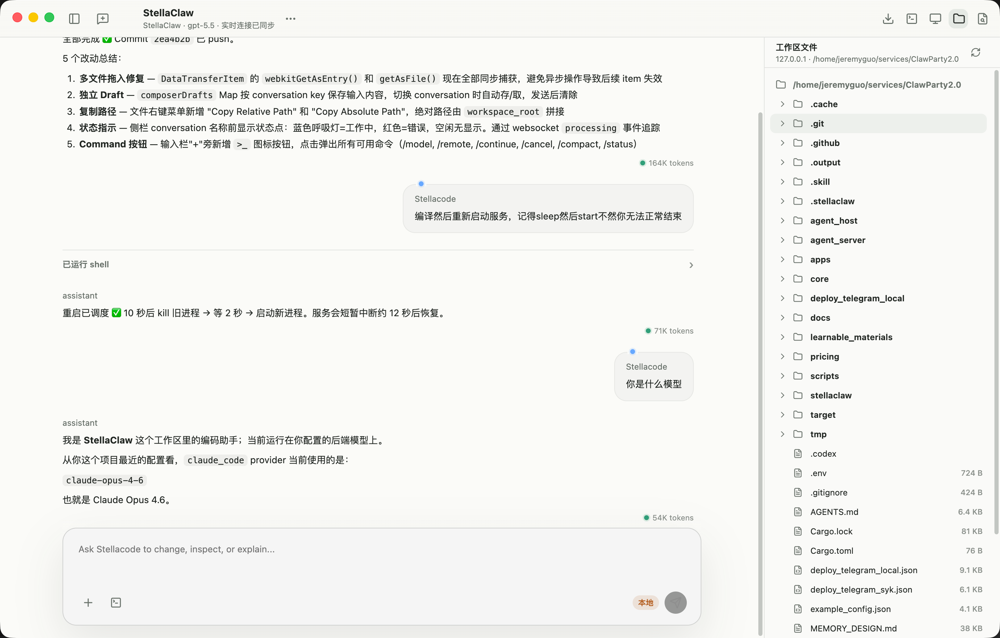
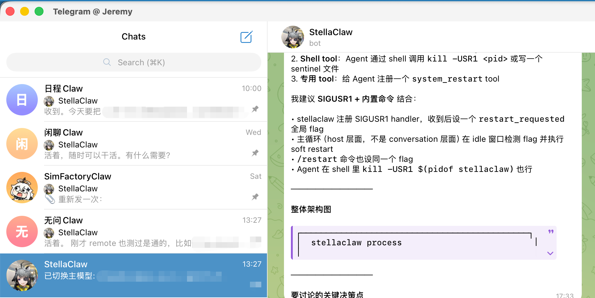
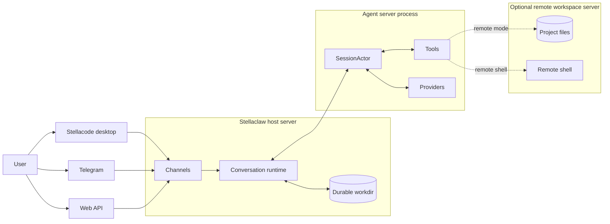
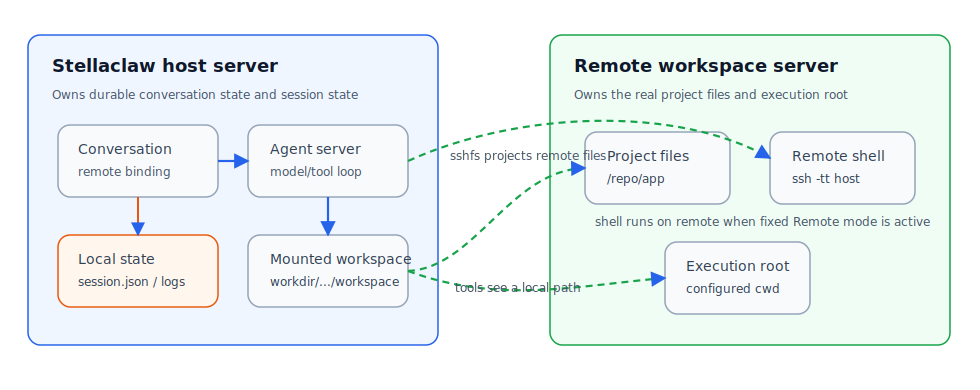
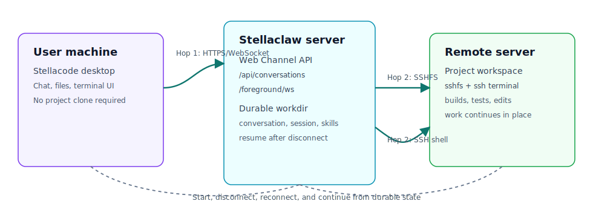

<div align="center">

# Stellaclaw

**面向长期运行、多入口协作的 Rust Agent Host。**

持久对话。隔离执行。可恢复 Agent。

[English README](README.md) · [Roadmap](ROAD_MAP.md) · [版本记录](VERSION) · [配置示例](example_config.json)

</div>

---

## Stellaclaw 是什么？

Stellaclaw 是 ClawParty 的下一代运行时：一个自托管 Agent 系统。它常驻在线，从不同 channel 接收消息，并以持久状态、工具、技能、workspace 和崩溃恢复来驱动 LLM session。

Stellaclaw 是多入口设计。Stellacode 是桌面入口；Telegram group 可以作为轻量 conversation surface；Web API 可以支撑其他客户端。它们共享同一个 Stellaclaw 后端、持久 conversation、session runtime、provider 配置和 workspace 模型。

Stellacode 让你可以从任何电脑打开同一个 Agent 工作界面：UI 在本机运行，但文件、终端、工具调用和代码修改都发生在当前 conversation 连接的 Stellaclaw server workspace 里。



它有点像 VS Code Server，但核心不是远程手写代码，而是远程 Agent 工作。代码仓库放在服务器能访问的位置；Agent 在那里读写文件、运行命令、维护上下文并推进任务；用户可以从任意机器监督、打断、查看文件、打开终端，必要时接管。

Telegram 也是一等入口。通过创建不同 Telegram group，可以快速创建多个不同任务或不同功能的 conversation；它们仍然共享同一个后端服务。



每个 conversation 都可以独立选择模型、沙盒策略和 remote execution binding。Remote mode 可以让某个 conversation 表现得像是直接运行在 Stellaclaw 能通过 SSH 访问的另一台服务器上，这就是 Stellaclaw 支持 SSH Remote 工作流的方式：远程执行属于后端 conversation/runtime，而不是客户端自己承担。

Stellacode 和 Remote mode 让 Stellaclaw 支持一条实用的三跳工作路径：

```text
Stellacode / Channel Host -> Stellaclaw Server -> Remote Workspace Server
```

Stellacode、Telegram group 和 Web client 是用户侧 host surface。Stellaclaw server 拥有 conversation、routing、session、delivery 和 recovery。Remote mode 可以再把某个 conversation 绑定到另一台服务器的 workspace、terminal 和 filesystem，让 Agent 在项目真正所在的位置工作。

这带来的部署优势是：用户保留本地桌面或 channel 体验，中心 Agent 服务保持持久运行，重型项目工作可以发生在另一台远程机器上，而 conversation state 不需要迁移出 host。

当前 Rust 实现分成这些运行层：

| 层 | Binary / Crate | 负责 |
|---|---|---|
| Client / channel surface | `apps/stellacode2`、Telegram、Web API | 用户交互、桌面 workspace 浏览、terminal UI、附件、delivery |
| Host server | `stellaclaw` | Channels、conversations、workdirs、Telegram/Web surfaces、config、routing、delivery、runtime skill persistence |
| Agent server | `agent_server` + `stellaclaw_core` | SessionActor 状态机、provider/tool loop、compaction、session history、runtime metadata |
| Remote workspace server | SSH/sshfs target | 可选 fixed/selectable remote workspace、remote shell、项目文件、执行根目录 |

一句话边界：

```text
Conversation = 持久边界 + 路由器
SessionActor = 执行边界 + 状态机
```

这个拆分让平台/channel 逻辑不进入 model loop，让 remote workspace 逻辑不污染 client，并让每个 conversation 都有可恢复的执行边界。

---

## Highlights

- **Host -> server -> server 工作流**：Stellacode、Telegram 或其他 channel 连接 Stellaclaw server，Remote mode 让 conversation 在第二台服务器的 workspace 中工作。
- **多入口共享同一后端**：桌面端、Telegram group 和 Web API client 共享同一个持久 Stellaclaw 后端和 conversation runtime。
- **Conversation 级独立控制**：每个 conversation 可以独立设置模型、沙盒策略和 remote execution binding。
- **Server-backed Stellacode workspace**：任何电脑看到同一个 conversation UI，而文件、terminal、tools 和 Agent 编辑都发生在 Stellaclaw server 可访问的 workspace。
- **持久 conversation**：conversation state、session state、runtime skills、workspace 和 migration marker 都在 workdir 中持久化，而不是只存在内存聊天循环里。
- **多 channel 设计**：Telegram 当前已经可用，可以用 group 快速创建不同任务 conversation；Web channel 和 REST-style API 提供桌面端和外部集成入口。
- **可恢复执行**：未完成 turn、runtime 崩溃、provider 失败、长时间 tool batch 都作为 session lifecycle event 处理，而不是静默丢状态。
- **Remote-aware Stellacode**：workspace 浏览、文件上传/下载、terminal session 和 Agent tools 可以跟随 conversation 的 local/remote execution mode。
- **Runtime skills**：`SKILL.md` 目录可以在运行时加载、创建、更新、删除、持久化并同步到 workspace。

---

## 当前状态

Stellaclaw 已经可以作为 Telegram-backed Agent host 使用，并包含逐步完善的 Web channel、桌面端和外部集成 API。

当前已实现：

- Telegram channel：入站消息、group-based conversations、附件、typing indicator、progress panel、最终成功/失败 delivery。
- Web channel API：conversations、messages、status、workspace 浏览、上传/下载、terminals、foreground WebSocket 更新。
- Per-conversation model switching、sandbox switching、remote workspace switching、status query、cancel、continue。
- `agent_server` 子进程边界：stdin/stdout line-delimited JSON-RPC。
- SessionActor control/data mailbox、turn loop、tool batch executor、idle compaction、崩溃恢复、未完成 turn 继续执行。
- Codex subscription provider：使用官方 websocket shape，支持 access token refresh 和 priority service tier。
- OpenRouter chat-completions / responses providers、Claude provider、Brave Search provider、provider-backed media helpers。
- Model-aware multimodal input normalization：模型不支持某种文件模态时降级成文本 context。
- 内置 tools：文件、搜索、patch、shell、downloads、web fetch/search、media、cron、subagents、host coordination。
- Runtime `SKILL.md` 系统：`skill_load`、`skill_create`、`skill_update`、`skill_delete`。
- 从 legacy PartyClaw workdir 布局迁移到当前 Stellaclaw 布局。

下一步计划：

- 面向外部系统和 admin UI 的 RESTful API。
- 更完整的 host 管理和 observability。

完整架构方向见 [ROAD_MAP.md](ROAD_MAP.md)。

---

## 架构



这个结构的关键点：

- Channel 代码保持平台相关和用户可见。
- Conversation 代码拥有持久路由决策和 workspace materialization。
- SessionActor 拥有 model/tool loop 和 session history。
- Remote workspace 行为可以演进，而不需要把 Stellacode、Telegram 或 Web 代码变成 session internals。
- 服务崩溃或重启后，可以从持久 conversation/session state 恢复。

### Remote Mode：SSHFS Workspace Illusion

Remote mode 的目标是让 Agent 像在远程项目目录里工作一样，同时 Stellaclaw 仍把持久 conversation 和 session state 保存在 host server 上。



在 fixed Remote mode 下，file tools 操作 sshfs mount 后的 workspace path，所以 read、write、search、patch、upload、download 对 Agent 来说都像本地文件操作。交互式 terminal 不通过 FUSE mount 执行命令，而是通过 SSH 连接并进入配置的 remote cwd。Conversation binding 记录当前 remote workspace；session history 和 recovery metadata 仍留在 Stellaclaw workdir。

也就是说：Agent 拿到的是普通 workspace path，但文件字节和 shell 都由远程服务器支撑。



通过 Web Channel，Stellacode 可以连接到一台远离用户笔记本的 Stellaclaw server。Remote mode 还可以从这台 Stellaclaw server 再跳到另一台项目服务器。因为 conversation 和 session state 由 Stellaclaw 持久化，当前工作可以恢复；真实仓库则留在适合构建、测试、terminal 和文件编辑的远程机器上。

---

## Telegram 体验

Telegram channel 是当前主要可用产品 surface。

支持的控制命令：

| 命令 | 用途 |
|---|---|
| `/model` | 查看或切换 conversation 的模型 |
| `/remote` | 选择或清除 remote workspace execution mode |
| `/sandbox` | 查看或切换 sandbox mode |
| `/status` | 查看 conversation 状态、模型、remote、sandbox、usage |
| `/continue` | 继续最近被中断的 turn |
| `/cancel` | 请求取消当前 turn |
| `/compact` | 主动压缩当前上下文 |

---

## Tooling

Stellaclaw 通过动态 catalog 暴露 tools。Catalog 会根据 runtime state、模型能力、session type 和 remote mode 重新构建。

工具类型包括：

| 类别 | 示例 |
|---|---|
| 文件与 patch | `file_read`、`file_write`、`glob`、`grep`、`ls`、`edit`、`apply_patch` |
| 执行 | `shell`、terminal sessions |
| Web / media | web fetch/search、downloads、image/media helpers |
| Host coordination | subagents、background sessions、cron、status、conversation bridge tools |
| Skills | `skill_load`、`skill_create`、`skill_update`、`skill_delete` |

Remote mode 会影响 tool schema：

- selectable mode 暴露可选 `remote` 字段；
- fixed remote mode 隐藏 `remote` 字段，把绑定的 execution root 当成隐式目标。

---

## Skills

Skills 是同步到 workspace 的 `SKILL.md` 目录：

- `skill_load` 把 skill 内容加载进当前 session。
- `skill_create` 把 staged workspace skill 持久化到 `rundir/.skill/<name>`。
- `skill_update` 更新 runtime skill store 并同步已有 conversation workspace。
- `skill_delete` 删除 runtime store 和已有 workspace 中的 skill。

Skills 用来沉淀长期可复用的工作流，而不是把所有知识塞进 system prompt。

---

## Multimodal Input

内部消息模型支持结构化 `ChatMessageItem::File`。Web API 也支持在发送消息时传 `files[]`，例如：

```json
{
  "user_name": "Stellacode",
  "text": "请看这张图",
  "files": [
    {
      "uri": "file:///path/to/image.png",
      "media_type": "image/png",
      "name": "image.png"
    }
  ]
}
```

Provider 层会根据模型能力做多模态输入规范化。如果模型不支持某种文件模态，系统会尽量降级成文本 context 或文件引用，而不是直接破坏整轮请求。

---

## Providers

当前实现包含：

- Codex subscription provider。
- OpenRouter chat-completions / responses providers。
- Claude provider。
- Brave Search provider。
- provider-backed media helpers。

Provider pricing 配置位于根目录 `pricing/`，按 provider type 拆分。模型未配置价格时，系统不计算美元成本。

---

## Quick Start

### 1. Build

```bash
cargo build --workspace --release
```

Agent server binary：

```bash
target/release/agent_server
```

Host server binary：

```bash
target/release/stellaclaw
```

### 2. Configure

复制并编辑配置：

```bash
cp example_config.json config.json
```

关键字段：

- `agent_server.path`：`agent_server` binary 路径。
- provider 配置：Codex / Claude / OpenRouter 等。
- Web channel token：供 Stellacode 或外部 API 调用。
- workdir：conversation、session、workspace 和 runtime state 的持久化目录。

### 3. Run

```bash
target/release/stellaclaw --config config.json --workdir ./rundir
```

启动后，Stellacode 或 Web API 可以连接配置中的 Web channel 地址。

### 4. systemd

生产环境建议用 systemd 或其他 supervisor 管理 `stellaclaw`，确保崩溃后自动重启。

---

## Version Files

仓库从 `1.0.0` 开始使用 SemVer 管理根发布版本。根目录 [VERSION](VERSION) 是项目发布版本和 changelog 的唯一入口。

项目同时有两条独立 schema 版本线：

- `config` schema version：由 `stellaclaw/src/config/mod.rs` 的 `LATEST_CONFIG_VERSION` 管理。
- `workdir` schema version：由 `stellaclaw/src/upgrade/mod.rs` 的 `LATEST_WORKDIR_VERSION` 管理。

不要假设 `config`、`workdir` 和根发布版本必须相同。前两者是数据结构兼容版本；根 `VERSION` 是项目发布版本。

---

## CI/CD

| Workflow | Trigger | 做什么 |
|---|---|---|
| CI | push 到 `main`、pull request | `cargo fmt --all --check`、`cargo test --workspace --locked` |
| Release | `main` 上 CI 成功 | 如果根 `VERSION` 变化且 tag 不存在，构建 release binaries，创建 tag 和 GitHub Release |

Release 产物包括：

- `stellaclaw`
- `agent_server`
- Stellacode 2 desktop 包
- Electron updater metadata，例如 `latest*.yml` 和 blockmap

---

## Repository Layout

```text
agent_host/       # Host-facing abstractions
agent_server/     # Session process wrapper around stellaclaw_core
apps/stellacode2/ # React/Electron desktop client
core/             # Core SessionActor and provider/tool loop
docs/             # Documentation assets
pricing/          # Provider model pricing tables
stellaclaw/       # Host binary, channels, conversation runtime
```

---

## Development

常用检查：

```bash
cargo fmt --all --check
cargo test --workspace --locked
```

Stellacode 2 前端检查：

```bash
cd apps/stellacode2
npm run check
```

本地开发启动 Stellacode 2：

```bash
cd apps/stellacode2
npm start
```

开发态 Electron 不会自动检查更新；只有打包后的 app 才会通过 GitHub Release metadata 检查并下载更新。

---

Built with Rust. Designed for durable agents, real conversations, and long-running work.
