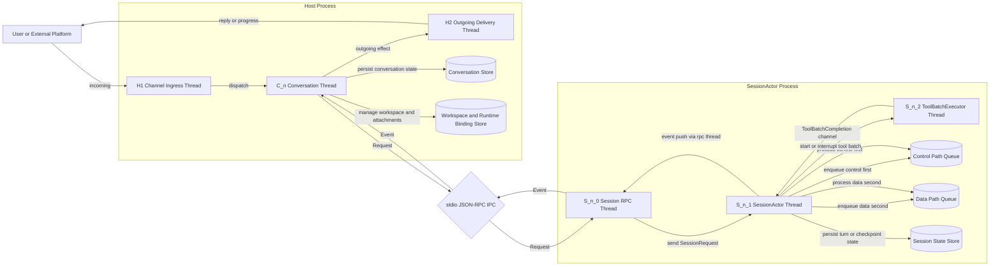
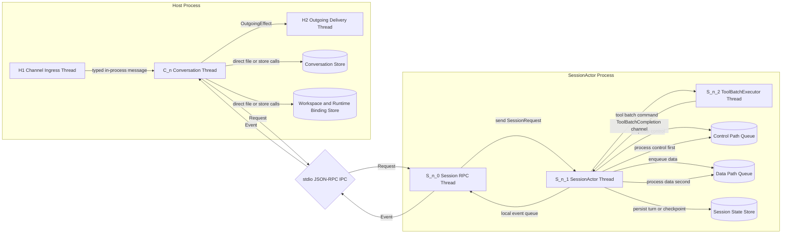
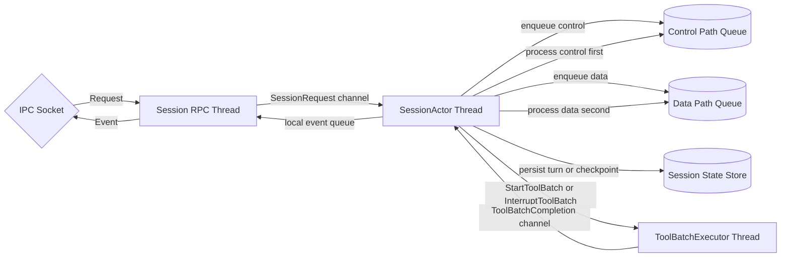
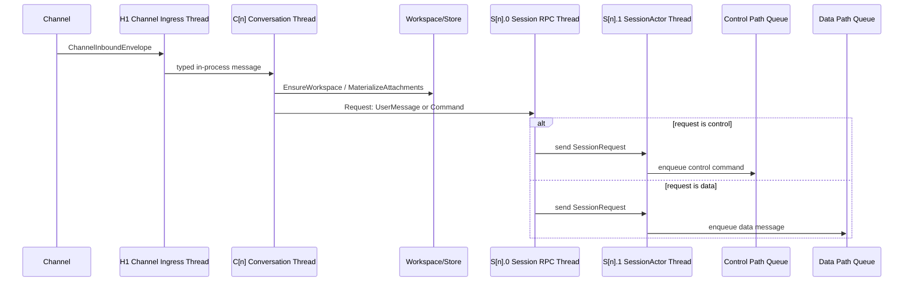
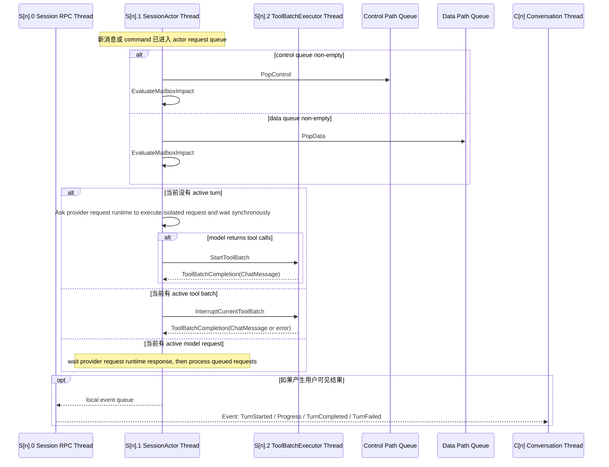

# Ideal Structure

## 1. 目标

这次重构的核心目标是把当前链路明确拆成两层：

- `Conversation` 层负责 conversation 级 durable state。
- `SessionActor` 层负责 session 级执行循环。

其中：

- 一个消息从 `Channel` 进来后，先进入 `Conversation`。
- `Conversation` 负责 workspace 是否存在、conversation/session 绑定、远程 workspace 绑定、附件落盘、消息 canonicalization 和路由。
- incoming message 会先在这里被 canonicalize 成可投递给 session 的 `ChatMessage`。
- 然后由 `Conversation` 作为 router，把消息或命令投递到跨进程运行的 `Session RPC Thread`。
- `Session RPC Thread` 把请求写入 `SessionActorInbox`；`SessionActor` 内部维护两条优先级队列：
  - `Control Path Queue`
  - `Data Path Queue`
- `Control Path` 的优先级高于 `Data Path`。
- `SessionActor` 只关心 session request queue、turn loop、interrupt、provider/tool error、turn result。

一句话概括：

`Conversation = durable boundary + router`

`SessionActor = execution boundary + state machine`

## 1.1 Host Surface Direction

- Host 侧的 `Channel` 应该是统一抽象，允许同时存在多个 channel 实例，各自维护自己的平台安全策略和管理员逻辑。
- 当前 `Telegram` 已经是主要可用 channel：支持入站消息/附件、模型切换、remote workspace 切换、conversation 级 sandbox 切换、状态查询、typing indicator 和进度面板。
- 后续会增加 `Web` 作为新的 channel 类型。
- 在 channel 抽象之上，后续会补一层统一的 `RESTful API`，作为外部系统接入和管理面的稳定边界。
- 更后续阶段，前端界面应优先基于这层 `RESTful API` 构建，而不是直接耦合内部运行时。

## 1.2 当前实现快照

这一节记录已经落地的事实，用来避免 roadmap 和代码状态继续漂移。

- Host 进程目前由 `stellaclaw` binary 承载，session 执行边界由独立 `agent_server` binary 承载。
- `Conversation` 是每个 active conversation 的串行线程；session 侧通过 stdin/stdout line-delimited JSON-RPC 与 `agent_server` 通信。
- `SessionActor` 已经有 control/data mailbox、turn loop、tool batch executor、session state store、runtime metadata snapshot、idle compaction 和 crash/unfinished-turn 继续机制。
- `SessionActor` 会在 active tool batch 期间接收新的用户消息并触发 cooperative interrupt；工具尽快返回稳定结果后，旧 turn 在安全边界 yield，新用户消息进入下一轮处理。
- `ToolRemoteMode` 当前支持 selectable SSH alias 和 fixed SSH workspace；fixed mode 下 schema 会隐藏各工具上的 `remote` 字段。
- conversation 级配置已经包括 `model_selection_pending`、`tool_remote_mode`、`sandbox` override、`reasoning_effort` 和 foreground/background/subagent session binding。
- Telegram 控制面当前支持 `/model`、`/remote`、`/sandbox`、`/status`、`/continue`、`/cancel`。
- Telegram 输出面当前支持普通 delivery、typing indicator、可编辑 progress feedback 面板和最终完成/失败状态。
- Codex subscription provider 当前按官方订阅 websocket 形态调用，支持 access token 自动刷新；`reasoning.service_tier = fast/priority` 会映射到请求级 `service_tier = priority`，不会塞进 `reasoning` payload。
- 多模态输入在 `SessionActor` 发 provider 前统一 normalization：模型支持对应模态时按 `ModelConfig.multimodal_input` 发送；不支持或文件损坏时降级为包含文件路径/原因的文本上下文。
- Provider 请求前的消息规整采用双层 normalization：先做通用模型能力降级，再做 provider 特化 normalization。Codex subscription provider 会保留并回传 `codex_summary` / `codex_encrypted_content`，普通 reasoning text 仍不会作为 model-visible 内容回传。
- `ChatMessage::Reasoning` 当前支持 Codex 专用 encrypted reasoning continuation；token 估算按 Codex 风格把 `codex_encrypted_content` 作为上下文成本估入，但展示层和普通文本路径不暴露密文。
- `reasoning_effort` 是 conversation 级 override；已有 conversation 的 `session_profile.main_model` 是持久化快照，不会自动跟随全局 config 更新。
- 每轮 model/tool loop 默认上限是 200 步，主要作为防无限循环兜底，而不是正常工作流限制。
- skill 工具当前包括 `skill_load`、`skill_create`、`skill_update`、`skill_delete`；持久化类工具走 ConversationBridge，由 Host/Conversation 写回 runtime skill store 并同步已有 conversation workspace。

## 2. 线程优先视图

这一节改成“线程优先”表述，不再把“模块”和“线程”画成同一种框。

### 2.1 图例

- 绿色圆角框：一个真实线程。
- 黄色圆柱：durable store / 文件目录，不是线程。
- 蓝色菱形：协议或 IPC 边界，不是线程。

### 2.1.1 系统总览结构图

这张图是整个程序的总览图。

- 它先回答“系统有哪些大块，以及它们怎么连接”。
- 绿色框仍然代表真实线程。
- 黄色圆柱代表持久化存储。
- 蓝色菱形代表协议/IPC 边界。



这张总览图表达的是：

- 外部消息先进入 `H1`
- 然后被路由到某个 `C[n]`
- `C[n]` 持有 conversation 级 durable truth
- `C[n]` 自己持有这一条 session connection 的 non-blocking transport
- `S[n].0` 是专门和 `ConversationThread` 沟通的 Session RPC 线程
- `S[n].0` 只负责 non-blocking JSON-RPC 收发，以及把请求写进 `SessionActorInbox`
- `S[n].1` 才是真正的 SessionActor 状态机线程
- `Session IPC` / stdio JSON-RPC 只是跨进程 transport，不代表 Host 持有消息存储
- `S[n].1` 收到请求后会按优先级放入两条内部队列：
  - `Control Path`
  - `Data Path`
- `S[n].1` 按 `Control > Data` 的顺序推进状态机
- `S[n].1` 同步执行模型请求；模型请求期间不处理中途 request
- `S[n].2` 负责执行所有 tool batch，并通过 completion channel 把最终结果聚合成一条 `ChatMessage` 返回
- 跨进程只保留两种方向的消息：
  - `Request`
  - `Event`
- 结果再回到 `C[n]`
- 最后通过 `H2` 发回外部

### 2.1.2 当前最小 agent_server 入口

当前新增一个最小可执行入口 `agent_server`：

- 它是独立 binary crate，依赖 `stellaclaw_core`。
- transport 先固定为 stdin/stdout 的 line-delimited JSON-RPC。
- `initialize` 请求只携带 `model_config` 和 `initial`；工具工作目录就是 `agent_server` 进程启动时的 cwd，不再单独传 `workspace_root`。
- 收到 `initialize` 后，server 创建 `SessionRpcThread`、`SessionActor` 和本地 `ToolBatchExecutor`，并把 `Initial` 通过 RPC 线程投递给 actor。
- 后续 `session_request` 请求携带任意 `SessionRequest` JSON，并统一通过 `SessionRpcThread` 投递，保证 `ResolveHostCoordination` 能回到等待中的 bridge call。
- `SessionEvent` 以 JSON-RPC notification `session_event` 写回 stdout。
- 这个 binary 不读取 config 文件，不拥有 Conversation durable state，只是 core execution boundary 的最小进程包装。

### 2.1.3 Conversation <-> Session RPC 消息边界

跨 `Conversation` 和 `SessionActor` 的协议只有两个主方向：

- `SessionRequest`：`Conversation` 发给 `Session RPC Thread`，再由 RPC 线程写入 `SessionActorInbox`，或者用于回复 pending bridge call。
- `SessionEvent`：`SessionActor` 通过 `Session RPC Thread` 推回 `Conversation`，由 `Conversation` 决定是否更新 conversation state、触发 channel 输出、或继续回复一个 bridge call。

`Conversation -> Session` 当前请求如下：

| 请求 | Mailbox | 用途 |
|---|---|---|
| `Initial { initial }` | Control | 创建 session 后第一条控制消息；设置 `session_id`、`session_type`、`tool_remote_mode`、多模态工具模型配置、`search_tool_model`。 |
| `EnqueueUserMessage { message }` | Data | 投递用户输入形成一个 turn。 |
| `EnqueueActorMessage { message }` | Data | 投递内部 actor 生成的消息形成一个 turn。 |
| `CancelTurn { reason }` | Control | 请求取消当前 turn；当前有 active tool batch 时触发 `ToolBatchExecutor::interrupt`，否则返回 `ControlRejected`。 |
| `ContinueTurn { reason? }` | Control | 用户确认继续处理一次可恢复失败或 crash 恢复后未完成的 turn；不追加新消息，基于当前 session history 继续跑 provider/tool loop。 |
| `ResolveHostCoordination { response }` | Control-like RPC response | 回复一次 `HostCoordinationRequested`；如果命中 pending bridge call，不进入 actor request queue。 |
| `QuerySessionView { query_id, payload }` | Control | 查询 session 视图；当前返回 `SessionViewResult`。 |
| `Shutdown` | Control | 请求关闭 SessionActor。 |

`Session -> Conversation` 当前事件如下：

| 事件 | 用途 |
|---|---|
| `TurnStarted { turn_id }` | 通知 conversation 一个 turn 已开始。 |
| `Progress { message }` | 通知中间进度，例如正在执行 tool batch。 |
| `TurnCompleted { message }` | 返回最终 assistant `ChatMessage`。 |
| `TurnFailed { error, can_continue }` | 返回 turn 失败原因；`can_continue=true` 时 Conversation 应询问用户是否发送 `ContinueTurn`。 |
| `HostCoordinationRequested { request }` | ToolBatchExecutor 中的 conversation bridge 工具需要 conversation 协作。 |
| `InteractiveOutputRequested { payload }` | 预留：请求 conversation/channel 输出交互内容。 |
| `SessionViewResult { query_id, payload }` | 回复 `QuerySessionView`。 |
| `ControlRejected { reason, payload }` | 某个 control request 被拒绝或暂未实现。 |
| `RuntimeCrashed { error }` | 预留：Session runtime 崩溃通知。 |

请求和反馈的对应关系：

| Conversation 请求 | Session 反馈 |
|---|---|
| `Initial` | 成功时当前不单独返回 ack；重复初始化会返回 `ControlRejected`。 |
| `EnqueueUserMessage` / `EnqueueActorMessage` | `TurnStarted`，随后若执行工具可能有 `Progress`，最终是 `TurnCompleted` 或 `TurnFailed`。 |
| `CancelTurn` | 当前有 active tool batch 时请求工具批次尽快收敛；当前无可取消 turn 时返回 `ControlRejected`。 |
| `ContinueTurn` | 如果存在可恢复失败或恢复出的未完成 history，则 `TurnStarted` 后继续 provider/tool loop，最终 `TurnCompleted` 或再次 `TurnFailed`；否则返回 `ControlRejected`。 |
| `QuerySessionView` | `SessionViewResult { query_id, payload }`。 |
| `Shutdown` | 当前不单独返回 ack；RPC/进程生命周期负责关闭确认。 |
| bridge 工具触发的 `HostCoordinationRequested` | Conversation 必须用 `ResolveHostCoordination { response }` 带同一个 `request_id` 回复；RPC 线程用 `request_id` 唤醒等待中的 tool batch。 |

Bridge 工具的完整链路是：

`ToolBatchExecutor -> ConversationBridgeRequest -> Session RPC Thread -> HostCoordinationRequested -> Conversation -> ResolveHostCoordination -> Session RPC Thread -> ToolBatchExecutor`

这里 `ResolveHostCoordination` 是回复，不是新的 actor control 命令；如果 `request_id` 没有命中 pending bridge call，才会按普通 control request 写入 actor request queue。

### 2.1.3 Session History 不变量

- system prompt 内容只能由 `SessionKind` / `SessionInitial` 统一生成，Provider 不能各自定义不同 system prompt 内容。
- Provider 只负责把同一份 system prompt 映射到自己的协议字段：
  - Chat Completions: `role = "system"`
  - Responses / Codex Subscription: `instructions`
  - Claude: top-level `system`
- `history` 中不持久化 `role = "system"`；canonical system prompt snapshot 由 session state 持有，并且只能由 `SessionKind` 决定。
- 禁止在 `history` 中间插入新的 `system` message；运行期提示变化应作为本轮用户消息前的 `user` 侧运行期通知进入上下文。
- 压缩完成后，才允许更新当前 session 的 canonical system prompt snapshot。
- `STELLACLAW.md` 是 workspace 根目录下唯一的长期项目记录文件；它只作为 snapshot 进入 system prompt，不生成运行期 notice。压缩完成后直接把最新文件内容提升到 canonical system prompt snapshot。
- `skill metadata`、已加载 skill 内容、`user meta`、identity、SSH remote alias 列表发生变化时，必须在真实 user message 前插入 synthetic `role = "user"` 通知；这些通知进入 durable history。
- SSH remote alias 列表来源是 `~/.ssh/config` 的 `Host` alias（支持 `Include`），不是 Conversation 自己维护的 remote workspace 列表。
- `session.json` 必须持久化当前 runtime prompt component snapshot、已通知 snapshot、skill content/load state、`current_messages` 和 `all_messages`，保证 crash 后恢复不会重复通知或丢失旧 system prompt 组装依据。

### 2.2 建议创建的线程

如果按这份理想结构落地，建议创建的线程是下面这些。

#### Host process 固定线程

| 线程名 | 数量 | 职责 |
|---|---|---|
| `H0 Host Main Thread` | 1 | 启动、关闭、监督其他线程；不承载正常消息处理。 |
| `H1 Channel Ingress Thread` | 1 | 接收各个 channel 的入站消息，做平台归一化，送入 conversation。 |
| `H2 Outgoing Delivery Thread` | 1 | 专门负责给 channel 发 reply / progress / error，避免发送阻塞 conversation。 |

#### Host process 按 conversation 增长的线程

| 线程名 | 数量 | 职责 |
|---|---|---|
| `C[n] Conversation Thread` | 每个 active conversation 1 个 | 这是 conversation 的唯一串行执行点；负责 workspace、runtime binding、附件落盘、消息 canonicalization 和路由到 session。 |

#### SessionActor process 按 session 增长的线程

| 线程名 | 数量 | 职责 |
|---|---|---|
| `S[n].0 Session RPC Thread` | 每个 session process 1 个 | 专门和 `ConversationThread` 沟通，处理 non-blocking JSON-RPC 收发；把 `UserMessage` 和其他 `Command` 写入 `SessionActorInbox`。 |
| `S[n].1 SessionActor Thread` | 每个 session process 1 个 | 维护 request queue、turn state、内部 interrupt/cancel 决策；用 `select` 接收 RPC request 和 tool completion；模型请求在这里同步执行。 |
| `S[n].2 ToolBatchExecutor Thread` | 每个 session process 1 个 | 执行所有工具调用组成的当前 tool batch；支持 interrupt；最终通过 completion channel 向 SessionActor 返回一条聚合后的 `ChatMessage` 或稳定错误。 |

#### 总线程数公式

如果当前有：

- `C` 个 active conversations
- `S` 个 active session processes

那么总线程数大致是：

`3 + C + 3S`

其中：

- 固定线程是 `3`：`H0`、`H1`、`H2`
- 每个 active conversation 增加 `1`
- 每个 active session process 增加 `3`

如果后面某些工具再下沉成 child process，那么增加的是“进程”，不是这份图里的 host/session 主线程模型本身；这份图仍然保持：

- `Session RPC Thread` 负责 transport I/O
- `SessionActor Thread` 负责状态机和同步模型请求
- `ToolBatchExecutor Thread` 负责驱动所有工具批次
- JSON-RPC transport 不阻塞 `ConversationThread` 和 `SessionActorThread`

### 2.3 单个消息路径的线程图

下面这张图只回答一件事：一条消息经过哪些线程。



### 2.4 单个 session process 内部图

这一张只看 session process 自己内部，不混入 host 侧模块。



## 3. 线程 / 进程边界

### 3.1 线程和模块怎么对应

为了避免“一个框既像线程又像模块”，这里约定：

- 图里只把真实线程画成主要执行框。
- `Store`、`IPC`、`Protocol` 一律不画成线程框。
- 如果一个东西只是模块，不是线程，就不单独占一个绿色线程框。

也就是说：

- `Conversation` 在图上代表的是 `Conversation Thread`
- `Session RPC` 在图上代表的是专门和 `ConversationThread` 沟通的线程
- `SessionActor` 在图上代表的是状态机线程
- `Workspace Manager`、`Conversation Store`、`Session Store` 都不是线程，只是被某个线程独占访问的资源或模块

### 3.2 并发域划分

| 并发域 | 实际线程 | 说明 |
|---|---|---|
| Channel ingress 域 | `H1` | 所有 channel 入站先到这里。 |
| Conversation 串行域 | `C[n]` | 同一个 conversation 的状态修改只能发生在它自己的 conversation 线程里。 |
| Outgoing I/O 域 | `H2` | 所有向外发消息的慢 I/O 统一放这里。 |
| Conversation transport 域 | `C[n]` | conversation 线程发起 non-blocking JSON-RPC，但不等待 SessionActor 模型请求或工具批次中断完成。 |
| Session RPC 域 | `S[n].0` | 专门承接来自 conversation 的 `UserMessage` 和其他 `Command`，并把它们写入 `SessionActorInbox`，避免它们被 SessionActor 内部执行过程阻塞。 |
| Session 状态机域 | `S[n].1` | session request queue、turn state、内部 interrupt/cancel 决策都在这里；它按 `Control > Data` 的顺序推进请求，不直接承担对话侧 JSON-RPC 往返。 |
| Tool batch 执行域 | `S[n].2` | 执行所有工具调用组成的当前 tool batch；不直接拥有 session durable truth；最终只返回一条 `ChatMessage`。 |

### 3.3 跨进程位置

- `H0`、`H1`、`H2`、`C[n]` 在 host process。
- `S[n].0`、`S[n].1`、`S[n].2` 在对应的 session process。
- `C[n] <-> S[n].0` 是明确的跨进程边界。

### 3.4 关键原则

- `Conversation` 只管理 conversation scope 的 durable truth。
- `SessionActor` 不直接拥有 conversation/workspace 的主数据定义权。
- `SessionActor` 消费的是由 conversation canonicalize 之后投递过来的 `ChatMessage`。
- `Conversation Thread` 和 `SessionActor Thread` 之间增加一个 `Session RPC Thread`，专门负责沟通和 non-blocking transport I/O。
- Session 侧恢复边界当前由 `session.json`、`all_messages.jsonl`、`current_messages.jsonl` 承担；工具批次只在 call/result 闭包完成后持久化。
- Session 侧 request queue 分成两条：
  - `Control Path`
  - `Data Path`
- `Control Path` 的优先级必须高于 `Data Path`。
- `Session RPC Thread` 必须保证 `EnqueueUserMessage` 和同类 `Command` 不会因为 SessionActor 正在模型请求或 tool batch 正在中断而被阻塞。
- JSON-RPC transport 的背压不能直接卡死 actor request queue 处理。

## 4. 每条线的协议

为了让下面的协议表继续和线程图对齐，这里先固定一次映射关系：

- `Channel Adapter + Incoming Dispatcher` 运行在 `H1`
- `Conversation Actor` 运行在 `C[n]`
- `Outgoing Sink` 运行在 `H2`
- `Session RPC` 运行在 `S[n].0`
- `SessionActor Loop` 运行在 `S[n].1`
- `ToolBatchExecutor` 运行在 `S[n].2`

| 线路 | 边界类型 | 建议协议 | 原因 |
|---|---|---|---|
| `Channel Adapter -> Incoming Dispatcher` | 同进程跨线程 | typed Rust message + `crossbeam_channel` | 当前实现轻量、无需序列化。 |
| `Incoming Dispatcher -> Conversation Actor` | 同进程跨线程 | typed Rust actor mailbox + `crossbeam_channel` | 保证同 conversation 串行。 |
| `Conversation Actor <-> Conversation Store / Workspace Manager` | 同线程 | 直接 trait / function call | 这是本地持久化边界，不需要 IPC。 |
| `Conversation Actor -> Session RPC` | 跨进程 | 当前是 agent_server stdin/stdout line-delimited JSON-RPC；后续可替换为 Unix Domain Socket / length-prefixed JSON | `Request` 方向，只承接 `UserMessage` 和其他 `Command`。 |
| `Session RPC -> Conversation Actor` | 跨进程 | 当前是同一条 stdio JSON-RPC 连接上的 event notification | `Event` 方向，只承接 turn 生命周期和进度事件。 |
| `Session RPC -> SessionActorInbox` | 同进程跨线程 | typed in-process channel | RPC 线程把请求非阻塞写入 actor request channel。 |
| `SessionActor Loop 内部队列` | 同线程 | prioritized queue drain | SessionActor 收到 request 后按 `Control > Data` 的优先级消费。 |
| `SessionActor Loop <-> Session State Store` | 同线程 | 直接 trait / function call | session history/checkpoint 必须由 loop 串行持有。 |
| `SessionActor Loop <-> Provider Request Runtime` | 平台相关隔离 | typed `ProviderRequest` | Unix/macOS 使用 agent_server 启动早期 fork 出的单线程 forkserver；每次模型请求由 forkserver 再 fork request child 执行。Windows 不支持 fork，使用同 API 的线程 fallback：等待方可被 `abort` 立即释放，但底层 in-flight HTTP 不能被强杀。actor 同步等待结果，active model request 不抢占。 |
| `SessionActor Loop <-> ToolBatchExecutor` | 同进程跨线程 | typed in-process channel | 所有工具调用统一进入工具线程；工具完成后通过 `ToolBatchCompletion` channel 回到 actor loop。 |
| `Conversation Actor -> Outgoing Sink / Channel` | 同进程跨线程 | typed Rust message + `crossbeam_channel` | 统一把用户可见输出从 Conversation 发回 channel。 |

### 4.1 为什么 `Conversation <-> SessionActor` 不建议直接用函数调用

因为它已经是跨进程边界，而且是这次架构里最重要的 fault boundary：

- `SessionActor` 可以 crash，但 `Conversation` 不应丢 durable state。
- `SessionActor` 可以重启，但 `Conversation` 仍然知道哪些 `ChatMessage` 已持久化、哪些还未被消费。
- `SessionActor` 内部可以在收到新消息后自行决定是否 interrupt 当前 tool batch 或继续等待，而 `Conversation` 只需要根据 IPC event 做持久化和路由。
- `InterruptCurrentToolBatch` 不会立即返回，因为 `ToolBatchExecutor` 需要时间来中断当前工具批次并收敛成结果。
- 因此必须把“和 ConversationThread 沟通”的职责放在独立的 `Session RPC Thread` 上，不能让它被模型请求或工具中断耗时拖住。
- 这份协议里不再单独定义 `Accepted` 这类回包；跨边界只保留 `Request` 和 `Event` 两种方向。

## 5. 消息类型总表

这里区分两类概念：

- `transport message`：组件之间在线路上传的消息。
- `durable record`：落盘后的稳定对象。

### 5.1 Channel -> Conversation

| 消息类型 | 发出方 -> 接收方 | 何时发出 | 用途 |
|---|---|---|---|
| `ChannelInboundEnvelope` | `Channel Adapter -> Incoming Dispatcher` | 平台收到一条新消息 | 把 Telegram/Web/CLI 的原始输入统一成 host 可处理的标准入站结构。 |
| `ConversationCommand::AcceptInbound` | `Incoming Dispatcher -> Conversation Actor` | 这条消息属于某个 conversation，且不是 immediate fast-path | 把入站消息交给 conversation 串行处理。 |
| `ConversationCommand::Control` | `Incoming Dispatcher -> Conversation Actor` | conversation close、channel control、system side signal | 处理非普通聊天类事件。 |

建议 `ChannelInboundEnvelope` 至少包含：

- `channel_id`
- `conversation_key`
- `remote_message_id`
- `sender`
- `text`
- `attachments`
- `received_at`
- `control`

### 5.2 Conversation 内部 durable 边界

| 消息/记录类型 | 发出方 -> 接收方 | 何时发出 | 用途 |
|---|---|---|---|
| `WorkspaceCommand::EnsureWorkspace` | `Conversation Actor -> Workspace Manager` | conversation 首次收消息，或 workspace 缺失 | 保证 workspace 存在。 |
| `WorkspaceCommand::EnsureSessionWorkspace` | `Conversation Actor -> Workspace Manager` | 需要为 foreground/background/subagent 确认 workspace 或运行根时 | 保证每个 session 的文件根明确可恢复。 |
| `WorkspaceCommand::MaterializeAttachments` | `Conversation Actor -> Workspace Manager` | 入站消息含附件 | 把附件落到 workspace/conversation 管理的路径下。 |
| `ConversationRecord::IngressEnvelope` | `Conversation Actor -> Conversation Store` | 入站消息被 conversation 接收并完成路由前置处理时 | 记录 conversation 侧的 ingress / routing 元信息，而不是 session transcript 本体。 |
| `ConversationRecord::RoutingDecision` | `Conversation Actor -> Conversation Store` | 准备把消息转发到某个 session 时 | 记录这条 message 被路由到哪个 session，便于恢复与去重。 |

这里的关键要求是：

- 入站消息在 `Conversation` 层就转成 `ChatMessage`。
- 附件路径在这里就 canonicalize 成 workspace-relative path。
- 从这一层往下，不再传 platform-specific message shape。
- session transcript 的 durable 持久化不放在 `Conversation` 侧完成，而是在 `SessionActor` 侧的 `session.json` / jsonl 内完成。
- `Conversation` 不应该再持久化一份 session transcript 或 assistant/tool 完整历史。
- `Conversation` 持有的是 ingress/routing/delivery metadata，而不是 session full transcript 的第二份副本。

### 5.3 Conversation -> SessionActor IPC

| 消息类型 | 发出方 -> 接收方 | 何时发出 | 用途 |
|---|---|---|---|
| `SessionRequest::EnqueueUserMessage` | `Conversation Actor -> Session RPC` | 一条用户消息已经完成 canonicalization 并准备投递给 session | 把 canonical `ChatMessage` 非阻塞地写入 `SessionActorInbox`，由 actor 放入 `Data Path`。 |
| `SessionRequest::EnqueueActorMessage` | `Conversation Actor -> Session RPC` | 另一个 session/background/subagent 的结果需要投递到当前 session | 把 actor-to-actor delivery 非阻塞地写入 `SessionActorInbox`，由 actor 放入 `Data Path`。 |
| `SessionRequest::CancelTurn` | `Conversation Actor -> Session RPC` | 用户明确取消，或 conversation 被关闭 | 把 cancel command 非阻塞地写入 `SessionActorInbox`，由 actor 放入 `Control Path`。 |
| `SessionRequest::ContinueTurn` | `Conversation Actor -> Session RPC` | 用户确认要继续一次 `TurnFailed { can_continue: true }` 或 crash 恢复后未完成的 turn | 不追加新 user message，基于当前 session history 继续 provider/tool loop。 |
| `SessionRequest::ResolveHostCoordination` | `Conversation Actor -> Session RPC` | `Conversation` 已经完成某个 host-owned 协作动作 | 如果命中 pending bridge call 就唤醒工具线程；否则作为 control request 进入 actor。 |
| `SessionRequest::QuerySessionView` | `Conversation Actor -> Session RPC` | `Conversation` 需要读取 session-owned durable read model | 请求 session 返回 transcript/history/live view，而不是让 `Conversation` 自己再持久化一份。 |
| `SessionRequest::Shutdown` | `Conversation Actor -> Session RPC` | 会话删除、服务退出、session 被替换 | 把 shutdown command 非阻塞地写入 `SessionActorInbox`，由 actor 放入 `Control Path`。 |

建议 `EnqueueUserMessage` 至少携带：

- `conversation_id`
- `session_id`
- `conversation_message_id`
- `chat_message`
- `workspace_binding_version`

关键语义：

- `Conversation` 只负责把新 user message canonicalize 后投递到 `SessionActorInbox`。
- `Conversation` 不负责告诉 session “现在就去 interrupt 当前 turn”。
- 消息和 command 先由 `Session RPC Thread` 写入 SessionActor 侧的 request channel。
- `Data Path` 承载 user message。
- `Data Path` 也可以承载 actor-to-actor delivery，例如 background result 或 subagent result。
- `Control Path` 承载 cancel、continue、shutdown，以及 host coordination result 这类高优先级 command。
- 查询类请求仍然属于 `Request` 方向，但语义上是 read/query，而不是写 history。
- `Conversation` 不再等待单独的 `Accepted` 回包；Unix Domain Socket 写入完成后，session 侧会立即把请求投递给 actor inbox。
- `SessionActor` 在收到新消息后，自己决定下一步策略：
  - 立即启动新 turn
  - 请求当前 tool batch interrupt
  - 合并多个 follow-up 再处理

### 5.4 SessionActor -> Conversation IPC event

| 消息类型 | 发出方 -> 接收方 | 何时发出 | 用途 |
|---|---|---|---|
| `SessionEvent::TurnStarted` | `SessionActor -> Session RPC -> Conversation Actor` | session 开始处理一轮 turn | 让 conversation 更新 routing/runtime 状态。 |
| `SessionEvent::Progress` | `SessionActor -> Session RPC -> Conversation Actor` | 模型调用、工具执行、压缩中等阶段变化 | conversation 决定是否向 channel 发 progress feedback。 |
| `SessionEvent::TurnCompleted` | `SessionActor -> Session RPC -> Conversation Actor` | 一轮 turn 正常结束 | 返回 assistant `ChatMessage`、usage、runtime summary，供 conversation 更新 delivery/routing metadata 并下发给用户。 |
| `SessionEvent::TurnFailed` | `SessionActor -> Session RPC -> Conversation Actor` | 一轮 turn 失败但 session 仍存活 | 返回错误和 `can_continue`；如果可继续，Conversation 应给用户可见错误并询问是否发送 `ContinueTurn`。 |
| `SessionEvent::HostCoordinationRequested` | `SessionActor -> Session RPC -> Conversation Actor` | Session 内某个 tool 或内部动作需要 host/conversation 配合 | 请求 `Conversation` 代为执行 subagent/background/cron/snapshot 之类的 host-owned 操作。 |
| `SessionEvent::InteractiveOutputRequested` | `SessionActor -> Session RPC -> Conversation Actor` | Session 生成了需要 channel 特殊渲染的交互输出 | 请求 `Conversation` 把 `ShowOptions`、进度快照、可展开 detail 等交给对应 channel。 |
| `SessionEvent::SessionViewResult` | `SessionActor -> Session RPC -> Conversation Actor` | 响应 `QuerySessionView` | 返回 transcript page/detail 或当前 live state snapshot。 |
| `SessionEvent::ControlRejected` | `SessionActor -> Session RPC -> Conversation Actor` | 某个 control command 当前状态下不可执行 | 立即回复“该 control 现在不能执行”，并允许把这个 control 从内部队列中丢弃。 |
| `SessionEvent::RuntimeCrashed` | `SessionActor -> Session RPC -> Conversation Actor` | provider/tool 子层崩溃或 session 内部不可恢复错误 | 让 conversation 做故障转移、重启或保留待恢复消息。 |

这里再收紧一条约束：

- 跨边界不再单独定义 `Accepted` 这类回包。
- actor inbox enqueue、impact evaluation、tool batch interrupt plan 这些都属于 `SessionActor` 内部实现细节。

`TurnCompleted` 建议至少包含：

- `session_id`
- `turn_id`
- `consumed_message_ids`
- `assistant_messages: Vec<ChatMessage>`
- `usage`
- `compaction`
- `artifacts`
- `final_status`

`TurnFailed` 建议至少包含：

- `session_id`
- `turn_id`
- `failed_phase`
- `failed_operation_kind`
- `can_continue`
- `retryable`
- `continue_strategy`
- `blocking_reason`

### 5.4.1 Host 协作型消息要单独对齐

随着功能变多，`Conversation <-> SessionActor` 之间不能只剩“用户消息 + turn 生命周期”两类消息，还要覆盖那些必须由 Host/Conversation 代办的动作。

推荐固定成这套模式：

1. `SessionActor` 通过 `SessionEvent::HostCoordinationRequested` 发起 host-owned 请求
2. `Conversation` 或 Host 侧 manager 执行真正的外部动作
3. 完成后再通过 `SessionRequest::ResolveHostCoordination` 把结果投回 session

也就是说：

- `SessionActor` 不应该直接操纵 host 全局 registry / cron manager / subagent registry
- `Conversation` 也不应该直接决定 session 内部如何继续执行
- 两边只通过 typed `HostCoordinationRequested -> ResolveHostCoordination` 往返协作

当前实现上可以进一步收敛成：

- 所有 tool 执行都统一由 `ToolBatchExecutor` 负责。
- batch 里的普通项走本地 tool 执行。
- batch 里的特殊项可以表示成 `ConversationBridgeRequest`。
- `ToolBatchExecutor` 通过 `Session RPC Thread` 把这类 request 发给 `Conversation`，再等待 `ConversationBridgeResponse`。
- 对 `SessionActor` 来说，tool batch 仍然只返回一条最终的聚合 `ChatMessage`。

### 5.4.2 HostCoordinationRequested 的推荐子类型

| 子类型 | 谁真正执行 | 何时需要 | 返回给 Session 的结果 |
|---|---|---|---|
| `SpawnSubagent` | `Conversation + Session/Host registry` | foreground session 里的 subagent tool 请求创建子 agent | `subagent_id`、目标 session/workspace binding、失败原因。 |
| `StartBackgroundAgent` | `Conversation + Session/Host registry` | foreground session 请求启动 background agent | `background_agent_id`、目标 session/workspace binding、失败原因。 |
| `DeliverBackgroundResult` | `Conversation` | background agent 完成后，需要把结果投递回 foreground conversation | delivery 是否成功、目标 session 是否存在。 |
| `CronCreate` | `Conversation + CronManager` | session tool 请求创建 cron task | `cron_task_id`、规范化后的 schedule、失败原因。 |
| `CronUpdate` | `Conversation + CronManager` | session tool 请求更新 cron task | 更新后的任务视图或失败原因。 |
| `CronDelete` | `Conversation + CronManager` | session tool 请求删除 cron task | 删除结果或失败原因。 |
| `CronList` | `Conversation + CronManager` | session tool 请求列出当前 conversation 可见的 cron task | task 列表快照。 |
| `SnapshotSave` | `Conversation + SnapshotManager` | session/tool 请求保存 snapshot | `snapshot_id` 或失败原因。 |
| `SnapshotLoad` | `Conversation + SnapshotManager` | session/tool 请求加载 snapshot | 是否已恢复、恢复到哪个 binding。 |
| `SnapshotList` | `Conversation + SnapshotManager` | session/tool 请求列出 snapshot | snapshot 列表快照。 |

### 5.4.3 Web 功能里哪些要进协议，哪些不要进

这里最好也明确边界，避免把所有 Web 功能都塞进 `SessionActor` 协议里。

应该进入 `Conversation <-> SessionActor` 协议的：

- Web 用户通过 `/api/send` 发来的普通消息
  - 这仍然只是 `SessionRequest::EnqueueUserMessage`
- `ShowOptions`、progress、assistant 输出、typing/progress feedback、tool/detail skeleton 这类由 session 产生、由 channel 特殊渲染的内容
  - 这属于 `SessionEvent::InteractiveOutputRequested` 或普通 `TurnCompleted/Progress`
- 实时 transcript append 通知
  - 这可以作为 `SessionEvent::InteractiveOutputRequested` 的一种特例，或者作为独立的 transcript-append channel event
  - 它的目的只是告诉 Web 前端“有新内容到了”，不是回传整段历史
- conversation 代表 Web/其他消费者查询 session-owned 历史或 live view
  - 这属于 `SessionRequest::QuerySessionView -> SessionEvent::SessionViewResult`

不应该进入这条协议的：

- Web conversation create/delete
- Web remote execution / sandbox 绑定创建或修改
- WebSocket 客户端订阅和认证

这些都属于 `Channel / Conversation / Host service` 自己的职责，不应该伪装成 session control message。

换句话说，Web 至少有两条不同的数据路径：

1. 实时路径
   - `/api/send`
   - `Conversation -> SessionActor`
   - `SessionActor -> Conversation`
   - `/ws` 推送新的 progress / output / transcript append
2. 历史读取路径
   - Web 客户端向 Host 发 transcript list/detail 请求
   - Host 先经过 `Conversation` 做鉴权、conversation/session 解析和可见性判断
   - `Conversation` 再通过 `SessionRequest::QuerySessionView` 向 session 读取 session-owned durable read model
   - session 返回 `SessionEvent::SessionViewResult`

建议这里明确一个硬约束：

- Web history 是必须有的
- 但 session full transcript 的主数据仍然只在 session 侧
- `Conversation` 不应该因为 Web history 再复制持久化一份 session transcript
- 如果需要通过 `Conversation` 访问历史，推荐增加窄协议 `QuerySessionView`

原因不是“Web history 不属于 session”，而是：

- `SessionActor` 的主职责是推进状态机
- 但 session transcript / live view 的主数据仍然属于 session
- 所以更合理的是让 `Conversation` 通过一个只读 IPC query 去拿 session-owned 视图
- 而不是让 `Conversation` 再持久化第二份 transcript

更准确地说，实现上推荐是：

1. `Web Client -> Host Web Service`
2. `Host Web Service -> Conversation`
3. `Conversation` 校验 conversation ownership、解析当前 foreground/background session root、决定可见范围
4. `Conversation -> SessionActor IPC: QuerySessionView`
5. `Session RPC / SessionActor` 从 session-owned transcript store 或 live state 读数据
6. `SessionActor -> Conversation IPC: SessionViewResult`
7. 把读取结果回给 Web Client

这样做的好处是：

- session transcript 仍然只持久化一份
- `Conversation` 不越权直接读写 session 主数据
- 历史读取、detail 展开、live snapshot 都能通过同一条 IPC 协议扩展

### 5.4.3.1 Web 历史读取的推荐消息类型

这部分需要拆成两层：

| 消息类型 | 发出方 -> 接收方 | 用途 |
|---|---|---|
| `WebHistoryRequest::ListConversations` | `Web Client -> Host Web Service` | 获取左侧 conversation 列表。 |
| `WebHistoryRequest::ListTranscriptSkeleton` | `Web Client -> Host Web Service` | 分页拉取 transcript skeleton。 |
| `WebHistoryRequest::GetTranscriptDetail` | `Web Client -> Host Web Service` | 拉取某一段 transcript detail。 |
| `WebHistoryRequest::ListAttachments` | `Web Client -> Host Web Service` | 查询当前 conversation 可见附件。 |
| `WebHistoryEvent::TranscriptAppended` | `Host Web Service -> Web Client` | 告诉前端有新的 transcript item 已落盘。 |
| `SessionRequest::QuerySessionView` | `Conversation Actor -> Session RPC` | 向 session 查询 transcript page、detail 或 live snapshot。 |
| `SessionEvent::SessionViewResult` | `SessionActor -> Session RPC -> Conversation Actor` | 返回上面查询的结果。 |

推荐语义：

- `ListTranscriptSkeleton`
  - 先由 `Conversation` 解析读取范围，再通过 `QuerySessionView` 取 page 数据
  - 返回 newest-first 分页结果
- `GetTranscriptDetail`
  - 先由 `Conversation` 解析读取范围，再通过 `QuerySessionView` 取 detail 数据
  - 用于展开 tool result / api call detail
- `TranscriptAppended`
  - 只是增量通知
  - 前端收到后再按 id 或 cursor 去拉具体内容
- `QuerySessionView`
  - 只读
  - 不能推进 session 状态机
  - 支持 `transcript_page`、`message_detail`、`live_state` 这几种 query kind

`QuerySessionView.payload` 当前格式：

| `payload.type` | 参数 | 返回 |
|---|---|---|
| `transcript_page` | `source?`: `current` 或 `all`，默认 `current`；`offset?`: 默认 `0`；`limit?`: 默认 `50`，最大 `200`。 | `{ type, source, offset, limit, total, messages }`。 |
| `message_detail` | `source?`: `current` 或 `all`，默认 `current`；`index`: 消息下标。 | `{ type, source, index, message }`；失败时返回 `{ type, source, error, total }`。 |
| `live_state` | 无。 | 当前 actor 快照：初始化状态、session id/type、history/all messages 长度、pending 队列长度、active tool batch、是否可 `ContinueTurn`。 |

### 5.4.4 对 `Subagent`、`Background Agent`、`Cron` 的一条硬约束

这些能力虽然是从 session 内部的 tool 发起的，但它们本质上不是纯 session 内部行为。

因此建议文档里明确：

- `Subagent`
  - 由 `SessionActor` 发起请求
  - 由 `Conversation/Host` 分配目标 session、workspace binding、registry entry
- `Background Agent`
  - 由 `SessionActor` 发起请求
  - 由 `Conversation/Host` 创建后台 session，并在完成后再投递结果
- `Cron`
  - 由 `SessionActor` 发起请求
  - 由 `CronManager` 作为 host-owned manager 执行持久化与调度

这样后面协议实现时不会混淆：

- session 可以“请求”
- host/conversation 可以“执行并回填结果”
- 但双方都不应该越权直接改对方的主状态

## 6. SessionActor 内部消息

这部分虽然对外不可见，但需要在图上明确，因为它决定“新消息来了之后要不要 interrupt”到底是谁拍板。

注意：

- 这一节描述的是 `SessionActor` 内部动作，不是对外 IPC event。
- 对外只保留 `Event` 方向的生命周期消息，不再保留单独的 `Accepted`。

| 消息类型 | 发出方 -> 接收方 | 何时发出 | 用途 |
|---|---|---|---|
| `SessionRequest` | Session RPC Thread -> actor request channel | Conversation 投递 request 时 | actor 收到后按 `mailbox_kind()` 放入 `Control Path` 或 `Data Path`。 |
| `ActorLoopCommand::StartUserTurn` | actor loop -> actor loop | actor 发现可开始新 turn | 写入 history，并在 actor 线程同步执行模型请求。 |
| `ActorLoopCommand::StartToolBatch` | actor loop -> ToolBatchExecutor | 模型返回一批 tool calls | 启动一批工具；所有工具都进入工具线程。 |
| `ActorLoopCommand::InterruptCurrentToolBatch` | actor loop -> ToolBatchExecutor | 收到 cancel 或 actor 判断当前 tool batch 应尽快收敛 | 请求工具线程中断当前 batch，并返回最终 `ChatMessage` 或稳定错误。 |
| `ToolBatchCompletion` | ToolBatchExecutor -> actor completion channel | batch 正常完成、失败或被 interrupt 后完成收敛 | 回传 `batch_id` 和聚合后的 `ChatMessage` / 错误。 |

### 6.1 SessionActor 主循环伪代码

这里用伪代码说明整条路径，会比状态图更直接。

当前实现采用 `SessionActorInbox` 加 `ToolBatchCompletion` 两个 channel。

固定三条语义：

- actor 空闲时用 `select(request_rx, tool_completion_rx)` 等待新事件。
- `Control Path` 优先于 `Data Path`；收到 request 后先进入 actor 内部队列，再按优先级处理。
- 模型请求在 actor 线程同步执行；工具执行在工具线程，完成后通过 completion channel 回来。

```text
loop {
  drain_ready(request_rx, tool_completion_rx)

  if no_ready_work() {
    event = select(request_rx, tool_completion_rx)
    enqueue(event)
  }

  control = pop_next_control()
  if control exists {
    handle_control(control)
    continue
  }

  if has_active_tool_batch() {
    completion = pop_next_tool_completion()
    if completion exists {
      finish_tool_batch(completion.batch_id)
      append_tool_result_message(completion.chat_message)
      continue_model_tool_loop()
    }
    continue
  }

  data = pop_next_data()
  if data exists {
    append_user_or_actor_message(data)
    model_message = run_model_request_synchronously()

    if model_message contains tool_calls {
      start_tool_batch(model_message.tool_calls, completion_tx)
    } else {
      append_model_message(model_message)
      emit TurnCompleted
    }
    continue
  }
}
```

这段伪代码想强调的是：

- actor 主循环不是调用工具执行器的 `poll/wait`，而是从 request channel 和 tool completion channel 取事件。
- `Control Path` 和 `Data Path` 的处理语义不一样。
- `Control Path` 如果当前不能执行，可以 reject，然后立刻发一个 event 告诉 conversation。
- 模型请求在 `SessionActor Thread` 同步执行；这段时间 actor 不处理中途 request。
- 所有工具调用都通过 `ToolBatchExecutor Thread` 执行；actor 可以在等待工具结果时响应 control request 并请求 interrupt。

### 6.1.1 request enqueue 之后的处理规则

为了避免后面实现时重新引入 requeue 抽象，这里把规则写死：

| entry 类型 | 什么时候从内部队列移除 | 当前不能处理时怎么办 |
|---|---|---|
| `Control Path` command | 被执行或被 `rejected` 时 | 直接 reject 并回复原因。 |
| `Data Path` user message | actor 开始处理这一轮 turn 时 | 当前有 active tool batch 时不处理 data，先等待 completion 或 control。 |

所以：

- 对 control 来说，`drain -> reject -> event` 是合法路径。
- 对 user message 来说，不应该出现 `pop -> cannot process -> requeue` 这种额外折返。
- 正确语义是：没有 active tool batch 时才取 data；取出后立即进入 turn 处理。

### 6.2 四类触发的阻塞语义

| 触发类型 | 内部归类 | 失败后是否阻塞新消息 | 说明 |
|---|---|---|---|
| `IDLE` 压缩 | `maintenance / non-gating` | 否 | 只是闲时优化，失败后延期重试即可。 |
| `Time Out` 压缩 | `maintenance / non-gating` | 否 | 也是维护类动作，不该卡住用户消息。 |
| `上下文阈值超限` 压缩 | `maintenance / gating` | 通常会 | 不压缩就无法安全继续构造下一次 prompt 时，它就是 gate。 |
| `切换模式` | `maintenance / gating` | 会 | 后续 turn 的执行语义依赖目标模式，不能在半切换状态继续。 |

约束：

- 这四类触发如果需要跨 crash 恢复，必须落到 `session.json` 的安全状态，而不是只放临时内存标记。
- `SessionActor` 任意时刻只有一个 `active_operation`。
- 失败后不能简单“忘掉失败”，而要落成 `failure_latch`。

### 6.3 新消息或继续命令到来时的算法

建议固定成下面这套内部规则：

1. `Session RPC Thread` 先把 request 写入 `SessionActorInbox`。
2. 如果 `SessionActor Thread` 正在同步模型请求，它不会中途处理 request；新请求只会先排队。
3. `SessionActor Thread` 可继续推进时，总是先处理 `Control Path`。
4. 如果某个 control 当前状态下不能执行，可以直接标记 `rejected`，并发 `ControlRejected` event。
5. 如果当前有 active tool batch，就根据 request impact 决定是否发 `InterruptCurrentToolBatch`。
6. `ToolBatchExecutor` 必须在正常完成、失败、超时或 interrupt 后收敛成一条最终 `ChatMessage`，或者返回稳定错误。
7. 上一批 tool batch 没有最终结果前，actor 不会启动下一批 tool batch。
8. `Data Path` 上只看队首；只有没有 active tool batch 时才弹出并立即开始 turn。
9. 如果当前是 `BlockedByGatingFailure`，只允许处理能解除 gate 的 control command：
   - `RetryMaintenance`
   - `RollbackModeSwitch`
   - `ContinueTurn`
   - `Shutdown`
10. 如果只是 `RecoverableFailureLatched`，新的用户消息可以继续推进；失败的 maintenance 会记成 deferred retry，而不是卡死 data path。

### 6.4 Tool Batch 语义

当前先固定一条更简单的约定：

- `SessionActor` 不消费单个 tool 的细粒度完成事件。
- 一次 tool 执行是“一批 tools”同时启动。
- 所有工具调用都进入 `ToolBatchExecutor Thread`；`SessionActor Thread` 不直接执行工具。
- `SessionActor` 在上一批 tools 还没有最终结果前，不会开启下一批。
- `InterruptCurrentToolBatch` 的语义是：要求当前 batch 尽快收敛，并返回一个最终结果。
- tool batch 最终只返回一条 `ChatMessage`。
- 这条 `ChatMessage` 的 `data` 里可以包含多个 `tool_result` item。
- 如果 tool 产生多模态文件，tool 自己先把文件持久化，再把落盘后的 `file://...` 放进返回的 `ChatMessage`。
- `tool_executor` 只负责统一调度、统一中断语义和统一结果包装，不承载各工具族自己的业务状态机。
- 每个工具文件负责自己的核心执行语义；新增工具族时，允许在 `tool_executor` 中增加一个显式分发 case。
- 特殊状态默认留在工具模块内部，不回流到 `tool_executor`；避免把工具内部 job 管理、权限细节和业务分叉重新集中到 executor。
- 当前已落地的工具执行族包括：file/search/patch、`shell`、`file_download_*`、`web_fetch`、`web_search`、`skill_load`、`skill_create`、`skill_update`、`skill_delete`、native `*_load`、Provider-backed `*_analysis` / `*_stop` / `image_generation`。
- 工具内部 job 状态默认是内存临时状态；只有工具产出闭合的 tool result 后，结果才进入 session history 并参与持久化。

## 7. 统一消息接入流



这条统一接入流只描述“消息如何到达 SessionActor”：

- 不区分正常消息还是 follow-up 消息
- 在到达 `SessionActor` 之前，workflow 完全一样
- `Conversation -> Session RPC` 这条 `Request` 箭头是 non-blocking 的
- `Session RPC -> SessionActor` 这条写入箭头是 typed request channel，不是 JSON-RPC transport
- 消息和其他 command 真正先进入的是 SessionActor 进程侧的 request queue
- `Control Path` 和 `Data Path` 是分开的
- 这里不再单独画 `Accepted`

## 8. SessionActor 内部处理分支



这两张图合起来表达的是：

- “消息进入 SessionActor 之前”的 workflow 只有一条，不应该因为是否 interrupt 而分叉。
- 差异只出现在 `SessionActor` 内部。
- `Conversation` 不参与 interrupt 判定。
- 第二张图里，只有 `Session RPC -> Conversation` 的 `Event` 回传箭头是跨边界消息。
- `SessionActor -> ToolBatchExecutor` 和 `ToolBatchExecutor -> SessionActor` 是进程内线程协作，不是 JSON-RPC transport。
- `SessionActor` 处理内部队列时必须先看 `Control Path`，再看 `Data Path`。
- 模型请求期间 `SessionActor` 可以同步阻塞；这不会阻塞 `Conversation -> Session RPC` 这条 enqueue path。
- tool batch interrupt 不会立即返回，但最终必须收敛成一条 `ChatMessage` 或稳定错误。
- request channel 只保证进程内非阻塞投递；crash 恢复依赖 `session.json` / jsonl 中已经闭合的 history 和安全状态。

### 8.1 对 `drain` 和 `non-blocking` 的补充说明

这里再把两个最容易误实现错的点说清楚：

- `Conversation -> Session RPC` 的 `Request` 仍然是 non-blocking 的。
- session process 内部的模型请求等待和 tool batch interrupt 等待，都不会反向卡住 IPC enqueue。
- 已进入 `Control Path` 的 command 可以被立即 reject。
- `Data Path` user message 不需要额外 requeue；actor 只有在没有 active tool batch 时才取出并开始 turn。

## 9. 错误与恢复

### 9.1 SessionActor 可恢复错误

例如模型调用失败、工具失败、一次 turn 内部异常：

- `SessionActor` 发 `SessionEvent::TurnFailed`
- `Conversation` 持久化错误结果并把错误转成用户可见消息
- 如果 `can_continue=true`，Conversation 应询问用户是否继续
- 用户确认后，Conversation 发送 `ContinueTurn`

这里建议再拆成两类：

- `user turn failure`
  - 失败对象就是当前用户 turn
  - 可以直接对外表现成这次请求失败
- `maintenance failure`
  - 失败对象是 compaction 或 mode switch
  - 不一定对应某个用户 turn
  - 对外仍可复用 `TurnFailed`，但内部必须落明 `failed_operation_kind`

### 9.2 四类 maintenance 失败后的继续规则

| 当前失败的 operation | 新到达的是 user message | 新到达的是 continue/retry command | 处理规则 |
|---|---|---|---|
| `IDLE` 压缩失败 | 直接继续处理新消息 | 允许重试，但不抢过用户消息；不合法 control 可直接 reject | 记录 deferred retry，不阻塞 data path。 |
| `Time Out` 压缩失败 | 直接继续处理新消息 | 允许重试，但不抢过用户消息；不合法 control 可直接 reject | 仍然属于 maintenance 优化失败。 |
| `上下文阈值超限` 压缩失败 | 如果上下文仍超限，则先阻塞 | 优先允许重试压缩或切模式 | 这是 gating failure，不解除 gate 就不能安全继续。 |
| `模式切换` 失败 | 如果新消息依赖目标模式，则先阻塞 | 允许 retry switch 或 rollback switch | 直到切换被提交或回滚。 |

也就是说：

- 不是所有失败都会阻塞后续消息。
- 只有影响“下一轮还能不能安全执行”的失败，才会进入 `BlockedByGatingFailure`。
- `ContinueTurn` 不是特权捷径，它本质上也是 `Control Path` 上的一个 command；它不会追加新消息，只会重试当前可恢复上下文。

### 9.3 SessionActor 进程崩溃

`Conversation` 必须仍然知道：

- 哪些 canonical `ChatMessage` 已经写入 conversation history
- 哪些消息已经投递给某个 session
- 哪些请求尚未被 `TurnCompleted` 消费确认

因此建议在 `Conversation` 层维护 message delivery state：

- `persisted`
- `forwarded`
- `forwarded_to_session_rpc`
- `consumed`
- `failed`

如果 `SessionActor` 重启后发现 session history 已经持久化了一个未完成 turn，它应立即发 `TurnFailed { can_continue: true }`，由 Conversation 询问用户是否继续；用户确认后再发送 `ContinueTurn`。

### 9.4 SessionActor 侧必须 durable 的内容

如果要让上面的状态机可恢复，session 侧不能依赖内存 request queue，还必须 durable actor 自己的安全状态。

建议至少有下面三类 durable record：

| durable record | 归属 | 最少字段 | 用途 |
|---|---|---|---|
| `session_json` | `Session State Store` | `initial`、`current_messages`、`all_messages`、`next_turn_id`、`next_batch_id`、`runtime_metadata_state` | 恢复当前 session 的闭合 history 和 runtime prompt snapshot。 |
| `all_messages.jsonl` | `Session State Store` | 所有已经进入 session 的 `ChatMessage` | 保留完整历史，不作为 Conversation 的第二份 transcript。 |
| `current_messages.jsonl` | `Session State Store` | 当前压缩后 history | 恢复模型上下文；只在 tool call/result 闭包安全时持久化。 |

当前约束：

- 未完成的 tool batch 不持久化；crash 后丢弃正在执行的工具批次。
- 只有 history 中 tool call 和对应 tool result 闭包完整时，才写入 `session.json` 和 jsonl。
- 如果后续引入 gating maintenance，再单独定义 `active_operation` / `failure_latch` 的 durable schema。

### 9.5 为什么压缩和模式切换也必须 durable

因为这些边缘情况都发生在“做到一半”的时候：

- 正在 `IDLE` 压缩时进程退出
- 正在 `Threshold` 压缩时 tool result 请求失败
- 正在模式切换时用户又发来继续命令
- 正在 interrupt 一个 Torch 工具时 tool batch 迟迟没有返回最终 `ChatMessage`

如果这些都只是内存标记，重启后无法判断：

- 上一次正在做什么
- 那个操作是不是 gating
- 是应该 retry、rollback，还是允许直接继续服务新消息

所以当前正确的 durable 边界应该是：

- 闭合的 session history durable
- runtime prompt snapshot durable
- 压缩后的 current history durable
- 未闭合 tool batch 不 durable，恢复时从上一个安全点继续

## 10. 推荐的数据主权划分

### 10.1 Conversation 持有

- conversation settings
- workspace existence
- workspace / remote / sandbox binding
- ingress canonical `ChatMessage`
- attachment durable path
- message delivery state
- session routing metadata

### 10.2 SessionActor 持有

- in-memory control/data request queue
- actor inbox runtime view
- current turn state
- active operation
- interrupt / cancel decision and flag
- failure latch
- mode switch in-flight state
- compaction checkpoint
- runtime checkpoint
- progress state
- tool/model execution lifecycle

### 10.3 不要混放

下面这些不应该再散落在两个边界里同时拥有写权限：

- workspace / runtime binding 主绑定
- 入站消息的 canonicalization
- ingress canonical message history
- “消息是否已经被 session 消费” 的最终判断

## 13. Tools 与动态 Schema

这一节要回答三个问题：

- 当前系统大致有哪些 tool family。
- 每类 tool 的 schema 长什么样。
- 哪些 option 会因为 execution mode、模型模态或 session 状态不同而出现或消失。

这里的核心约束是：

- durable 的是 `conversation/session state`，不是某一轮请求时临时展开出来的 tool schema。
- tool schema 应该在真正发模型请求前，根据当前状态动态生成。
- 当某个 option 在当前状态下根本不该让模型选择时，应该直接从 schema 里移除，而不是塞一个“无效默认值”让模型猜。

### 13.1 Tool surface 的归类

当前可以按下面几组来理解：

| tool family | 代表 tool | 执行类型 | 主要用途 |
|---|---|---|---|
| 文件与补丁 | `file_read`、`file_write`、`glob`、`grep`、`ls`、`edit`、`apply_patch` | `Immediate` | 读写 workspace、搜索文件、应用 patch。 |
| Shell / Exec | `shell`、`shell_close` | `shell = Interruptible`，`shell_close = Immediate` | 运行或继续一个持久 shell session。 |
| Web | `web_fetch`、`web_search` | `Interruptible` | 获取网页或调用搜索 provider。 |
| 多模态加载与分析 | `image_load`、`pdf_load`、`audio_load`、`image_analysis`、`image_stop`、`pdf_analysis`、`pdf_stop`、`audio_analysis`、`audio_stop`、`image_generation`、`image_generation_stop` | 混合型，见下面明细 | 把本地媒体放进上下文，或调用 helper 做分析/生成。 |
| 下载 | `file_download_start`、`file_download_progress`、`file_download_wait`、`file_download_cancel` | 混合型，见下面明细 | 后台下载远端资源到本地。 |
| Skill | `skill_load`、`skill_create`、`skill_update`、`skill_delete` | `Immediate` | 读取或管理 skill。 |

### 13.1.1 执行类型定义

这里把 tool 类型固定成两大类：

- `Immediate`
  - 调用后立刻完成
  - 仍然通过 `ToolBatchExecutor Thread` 执行
  - 正常不会进入“等待中断完成”的状态
- `Interruptible`
  - 调用后可能等待较久
  - 可以被新的用户消息、timeout observation 或 actor 内部 interrupt 打断
  - 被中断时必须有稳定的返回语义，而不是静默消失

对于 `start / wait / cancel` 这类长生命周期工具，再补一条约定：

- `start`
  - 通常是 `Interruptible`
  - 因为它可能选择“立即等待一会儿”而不是纯粹 fire-and-forget
- `wait`
  - 一定是 `Interruptible`
- `cancel / kill / close`
  - 通常是 `Immediate`

### 13.2 统一的 schema 生成原则

建议把所有 tool schema 都看成：

- `静态部分`
  - tool 名字
  - 固定字段
  - 字段类型
  - 基本 required 规则
- `动态部分`
  - 某些 option 是否出现
  - 某些 tool 是否整个出现
  - 某些 enum 值是否被裁剪

推荐的输入上下文至少包含：

- `execution_mode`
- `workspace_binding`
- `session_mode`
- `upstream_capabilities`
- `helper_model_capabilities`
- `search_provider_capabilities`
- `skill_catalog`

可以把它抽象成：

```text
ToolSchemaContext {
  execution_mode,
  enable_remote_tools,
  upstream_caps,
  helper_caps,
  search_caps,
  session_mode,
  available_skills,
}
```

### 13.3 文件与补丁类 tools

| tool | 类型 | schema 关键字段 | option 含义 |
|---|---|---|---|
| `file_read` | `Immediate` | `file_path`、`offset?`、`limit?`、`remote?` | 读文本文件；`offset/limit` 控制窗口；`remote` 只在允许 remote tools 时出现。 |
| `file_write` | `Immediate` | `file_path`、`content`、`mode?`、`encoding?`、`remote?` | 写文本；`mode` 通常是 `overwrite` 或 `append`。 |
| `glob` | `Immediate` | `pattern`、`path?`、`remote?` | 做文件名模式匹配。 |
| `grep` | `Immediate` | `pattern`、`path?`、`include?`、`remote?` | 做内容搜索；`include` 是路径过滤。 |
| `ls` | `Immediate` | `path?`、`remote?` | 列目录树；`path` 缺省或空串等价当前工作目录。 |
| `edit` | `Immediate` | `path`、`old_text`、`new_text`、`replace_all?`、`create_if_missing?`、`encoding?`、`remote?` | 精确替换文本。 |
| `apply_patch` | `Immediate` | `patch`、`strip?`、`reverse?`、`check?`、`remote?` | 应用 unified diff patch。 |

目录型参数规则：

- `glob.path`、`grep.path`、`ls.path` 缺省或空串都等价于当前工作目录。
- `agent_server` 进程启动时的 cwd 就是本地工具工作目录；初始化协议不再传 workspace/workdir 参数。
- `ToolRemoteMode::FixedSsh.cwd` 缺省或空串表示不显式 `cd`，使用 SSH 登录后的当前目录。

这组里最重要的动态 option 是 `remote`：

- selectable remote 模式下：
  - `remote` 是可选 string
  - 模型可以选择本地或某个 SSH alias
- fixed `/remote` execution mode 下：
  - `remote` 不应该出现在 schema 里
  - 当前绑定 execution root 直接成为隐式默认目标
  - 这不是 “remote=某个默认值”，而是“根本不给模型这个选择”

当前实现状态：

- 文件与补丁类工具已经在 core 内按独立模块执行。
- `remote` 目标统一来自 `~/.ssh/config` 中的 SSH alias；完全 remote mode 下由 `SessionInitial.tool_remote_mode` 指定隐式目标，schema 不再暴露 `remote` 选择。

### 13.4 Shell / Exec 类 tools

| tool | 类型 | schema 关键字段 | option 含义 |
|---|---|---|---|
| `shell` | `Interruptible` | `session_id?`、`command?`、`input?`、`interactive?`、`wait_ms?`、`remote?` | 既能新建 session，也能继续已有 session。 |
| `shell_close` | `Immediate` | `session_id` | 关闭 shell session。 |

`shell` 的几个关键 option：

- `session_id`
  - 有值：复用已有 session
  - 无值：新建 session
- `command`
  - 有值：启动下一条命令
  - 无值：只观察当前状态
  - 新建 shell command 时必须使用 `command` 字段；当前 schema 不再支持 `cmd` alias
  - 没有 `session_id` 时必须提供非空 `command`，否则会返回 missing command
- `input`
  - 给交互式进程写 stdin
  - 和 `command` 互斥
- `interactive`
  - 只允许在新建 session 时出现
- `remote`
  - 和文件类 tools 一样，受 execution mode 裁剪

当前实现状态：

- `shell` / `shell_close` 已经在 core 内执行。
- `shell` 的 interrupt 只打断本次等待，不默认杀死底层进程；需要停止时由 `shell_close` 显式关闭。
- shell 输出由工具侧落盘到 `.output` 下，再通过 tool result 返回摘要和路径。
- `session_id` 只用于轮询或继续已有 shell session；新启动命令时应省略 `session_id` 让工具生成新 session。

### 13.5 Web 与搜索类 tools

| tool | 类型 | schema 关键字段 | option 含义 |
|---|---|---|---|
| `web_fetch` | `Interruptible` | `url`、`timeout_seconds`、`max_chars?`、`headers?` | 直接取网页或 HTTP 资源。 |
| `web_search` | `Interruptible` | `query`、`timeout_seconds`、`max_results?`、`images?` | 调搜索 provider；`images` 只在支持 vision search 时出现。 |

这里的动态点在于 `images`：

- 如果当前 search provider / helper model 支持 vision input：
  - schema 里出现 `images: string[]`
- 如果不支持：
  - `images` 直接从 schema 里移除

当前实现状态：

- `web_fetch` / `web_search` 已经在 core 内执行。
- `web_search` 优先使用 `SessionInitial.search_tool_model: Option<ModelConfig>` 指定的搜索模型；Brave Search 已作为独立 `ProviderType::BraveSearch` 接入，`url` 指向 `/res/v1/web/search`，`api_key_env` 指向 Brave API key。
- 如果没有 `search_tool_model`，`web_search` 保留 `STELLACLAW_WEB_SEARCH_URL` 配置式 endpoint 和本地 DuckDuckGo HTML fallback，主要用于本地测试/降级。

### 13.6 多模态加载与分析类 tools

当前约束：

- `SessionInitial` 中对应工具模型为 self 时暴露 `*_load`；模型为外部 helper 时暴露 `*_analysis` / `*_stop`。
- `image_generation` 表示生成图片；如果配置了 `image_generation_tool_model` 就使用该模型，否则使用主模型的 `image_out` 能力。
- Provider-backed media tool 复用 Provider 层，不在工具层重新实现模型协议。
- Provider-backed media job 的真实请求统一通过 provider request runtime 执行。
- Unix/macOS 下由 forkserver fork 出 request child，`*_stop` 会标记 job cancelled，并 kill 对应 request child。
- Windows 下没有 fork；`*_stop` 会让等待方立刻得到 cancelled，但底层已经发出的 provider HTTP 请求不会被强杀，只是结果会被丢弃。
- `ModelConfig.multimodal_input` 描述模型输入侧约束，包括每类 media 的 `transport`、`supported_media_types`、图片 `max_width` / `max_height`。
- 如果模型要求 `inline_base64`，`SessionActor` 在发 Provider 前统一读取、校验并转成 data URL；图片可按模型格式和尺寸限制在内存中转码/缩放。
- 如果模型只需要 `file_reference`，发送前不强制读取文件内容。
- 如果文件不可读、不可解码或签名不匹配，history 仍可保留 crashed `FileItem`；真正发 Provider 前会降级成带文件路径和原因的文本提示，而不是把坏文件作为多模态输入发送。
- 如果模型不支持对应输入模态，`FileItem` 在 provider request 前会降级为 plain context，保留文件路径、名称和 media type，而不是强行作为多模态内容发送。
- `token_estimator_type=local` 使用 OpenAI/tiktoken 本地估算，按 `ModelConfig.model_name` 自动选择 tokenizer；`token_estimator_type=hugging_face` 才需要 `token_estimator_url` 指向 tokenizer_config/template。
- `TokenEstimator` 当前只支持图片 token 估计；遇到 PDF/audio 文件时必须返回错误，不能静默忽略或套用图片估计算法。

| tool | 类型 | schema 关键字段 | option 含义 |
|---|---|---|---|
| `image_load` | `Immediate` | `path` | 把图片直接加载进下一次模型请求。 |
| `pdf_load` | `Immediate` | `path` | 把 PDF 直接加载进下一次模型请求。 |
| `audio_load` | `Immediate` | `path` | 把音频直接加载进下一次模型请求。 |
| `image_analysis` | `Interruptible` | `image_id?`、`path?`、`question?`、`images?`、`return_immediate?`、`wait_timeout_seconds?`、`on_timeout?` | 首次调用启动图片分析并返回 `image_id`；带 `image_id` 再调用表示等待或观察。 |
| `image_stop` | `Immediate` | `image_id` | 停止图片分析任务。 |
| `pdf_analysis` | `Interruptible` | `pdf_id?`、`path?`、`question?`、`images?`、`return_immediate?`、`wait_timeout_seconds?`、`on_timeout?` | 首次调用启动 PDF 分析并返回 `pdf_id`；带 `pdf_id` 再调用表示等待或观察。 |
| `pdf_stop` | `Immediate` | `pdf_id` | 停止 PDF 分析任务。 |
| `audio_analysis` | `Interruptible` | `audio_id?`、`path?`、`question?`、`images?`、`return_immediate?`、`wait_timeout_seconds?`、`on_timeout?` | 首次调用启动音频分析并返回 `audio_id`；带 `audio_id` 再调用表示等待或观察。 |
| `audio_stop` | `Immediate` | `audio_id` | 停止音频分析任务。 |
| `image_generation` | `Interruptible` | `generation_id?`、`prompt?`、`images?`、`return_immediate?`、`wait_timeout_seconds?`、`on_timeout?` | 首次调用启动图片生成并返回 `generation_id`；带 `generation_id` 再调用表示等待或观察。 |
| `image_generation_stop` | `Immediate` | `generation_id` | 停止图片生成任务。 |

这组有两类动态裁剪：

1. `load` 类 tool 是否能用，取决于当前主模型是否原生支持对应模态。
   - 例如 `image_load` 依赖 `native_image_input`
   - `pdf_load` 依赖 `native_pdf_input`
   - `audio_load` 依赖 `native_audio_input`
2. helper 分析/生成类 tool 上的 `images` option 是否出现，取决于 helper/upstream 是否支持 vision input。

也就是说：

- 有些情况下是“tool 还在，但某个 option 消失”
- 有些情况下是“整个 tool 不该暴露，或调用会被明确拒绝”

### 13.7 下载、图片任务、DSL 这类长生命周期 tools

这几类其实共享同一套 lifecycle schema 模式：

| 阶段 | 代表 tool | 类型 | 常见字段 | 语义 |
|---|---|---|---|
| `start` | `file_download_start`、`image_analysis`、`pdf_analysis`、`audio_analysis`、`image_generation` | `Interruptible` | `return_immediate?`、`wait_timeout_seconds?`、`on_timeout?` | 启动任务，并决定是立即返回还是先等一会儿。 |
| `progress/read` | `file_download_progress` | `Immediate` | `download_id` | 只读快照，不阻塞。 |
| `wait` | `file_download_wait`、`*_analysis`、`image_generation` | `Interruptible` | `<task_id>`、`wait_timeout_seconds?`、`on_timeout?` | 等待任务，但 timeout 不等于自动取消。 |
| `cancel/kill` | `file_download_cancel`、`*_stop`、`image_generation_stop` | `Immediate` | `<task_id>`、`kill_children?` | 终止任务。 |

这组通用 option 的语义建议固定：

- `return_immediate`
  - `true`：只返回 handle/snapshot，不长等
  - `false`：先等一小段时间
- `wait_timeout_seconds`
  - 只控制这一次 wait 的外层等待时长
  - 不等于任务本身的生命周期上限
- `on_timeout`
  - 常见值是 `continue` 或 `kill`
  - 表示 wait 超时后，后台任务是继续跑还是被终止

当前实现状态：

- `file_download_*` 已经在 core 内按后台任务生命周期执行。
- `dsl_*` 相关实现代码当前保留在仓库中，但 tool surface 已临时关闭；后续需要先补 DSL bridge、权限边界和模型/工具绑定，再重新开放。
- 长生命周期任务的 interrupt 只要求当前 tool batch 尽快收敛；后台任务是否继续由 `on_timeout` 或对应的 cancel/kill tool 决定。

### 13.8 Skill 类 tools

| tool | 类型 | schema 关键字段 | option 含义 |
|---|---|---|---|
| `skill_load` | `Immediate` | `skill_name` | `skill_name` 应来自当前可用 skill 列表，通常是 enum。 |
| `skill_create` | `Immediate` | `skill_name` | 从工作区内 staged skill 持久化为新 skill。 |
| `skill_update` | `Immediate` | `skill_name` | 更新已存在 skill。 |
| `skill_delete` | `Immediate` | `skill_name` | 删除 runtime skill store 和已有 conversation workspace 中的 skill。 |

这组的动态点在于：

- `skill_load.skill_name` 不应该是自由文本
- 它应该根据当前 runtime 可见 skill catalog 动态生成 enum
- `skill_load` 在 core 内执行；SessionActor 构造 `ToolBatch` 时把 `SessionInitial.runtime_metadata.skills` 中对应 skill 内容嵌入 operation，避免 ToolBatchExecutor 反向依赖 actor 状态。
- `skill_create` / `skill_update` / `skill_delete` 是 ConversationBridge 工具，由 Host/Conversation 侧负责持久化。
- 持久化目标是 `rundir/.skill/<skill_name>`；成功后同步到已有 conversation workspace 的 `.skill/<skill_name>`。
- `skill_create` / `skill_update` 会校验 staged skill 目录中 `SKILL.md` 存在、frontmatter `name` 匹配目录名、`description` 非空。

### 13.9 哪些状态会改变 schema

建议文档里明确把下面几类状态视为 schema 裁剪输入：

| 状态来源 | 影响 |
|---|---|
| `execution_mode = remote` | 移除各类 tool 上的 `remote` 参数。 |
| 主模型原生模态能力变化 | 控制 `image_load` / `pdf_load` / `audio_load` 是否暴露。 |
| helper/search provider 的 vision 能力变化 | 控制 `images` option 是否暴露。 |
| 当前 session mode 切换 | 可能改变整个 tool surface，而不是只改一个字段。 |
| 当前可用 skill 集变化 | 改变 `skill_load` 的 enum 值。 |

这里要再加一条硬约束：

- schema 切换必须发生在某个稳定边界上，通常是“下一次模型请求构造前”。
- 如果当前正处于 `mode switch in-flight`，那就只能使用“切换前 schema”或“切换后 schema”其中之一，不能混出一个半旧半新的 schema。
- 这也是为什么 mode switch 失败会被归类为 gating failure。

### 13.10 持久化什么，不持久化什么

这里建议明确：

- 持久化：
  - conversation mode / execution mode
  - workspace binding
  - session mode
  - upstream capability snapshot
  - active mode switch state
- 不持久化：
  - 某一轮请求时展开后的完整 tool schema JSON

理由是：

- 完整 schema 是派生视图
- 真正 durable 的应该是生成 schema 所依赖的状态
- 这样 session 重启后，能够重新生成与当前状态一致的 schema，而不是恢复一份过期 schema
