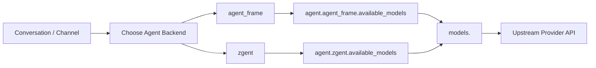

# 部署说明

本文档推荐只用两个命令完成部署：

- `partyclaw config <config>`
- `partyclaw setup <config> <workdir> [systemd-name]`

建议把仓库里的 [`deploy_telegram.json`](/home/jeremyguo/services/ClawParty2.0/deploy_telegram.json) 当作模板复制一份，再编辑你自己的部署配置。不要直接覆盖模板文件。

## 1. 前置条件

- Linux
- Rust stable toolchain
- `systemd --user`
- Git
- 如果要启用 `bubblewrap` 沙盒：系统里需要有 `bwrap`

`partyclaw setup` 目前只支持 Linux。非 Linux 环境下它会直接提示不兼容。

## 2. 部署整体流程

推荐流程：

1. 拉代码
2. 编译 `partyclaw`
3. 复制一个新的 `deploy_xxxx.json`
4. 在执行 `setup` 之前先准备好 `.env`
5. 用 `partyclaw config` 编辑配置
6. 用 `partyclaw setup` 生成 user systemd
7. 启动、设置开机自启、按需启用 linger

一个典型例子：

```bash
git clone <your-repo-url>
cd ClawParty2.0

cargo build --release --manifest-path agent_host/Cargo.toml --bin partyclaw

cp deploy_telegram.json deploy_mybot.json
mkdir -p deploy_workdir

cp .env.example .env
# 编辑 .env，填入真实密钥

./target/release/partyclaw config ./deploy_mybot.json
./target/release/partyclaw setup ./deploy_mybot.json ./deploy_workdir mybot
```

## 3. 文件建议

建议保留这几个文件的职责：

- `deploy_telegram.json`
  仓库自带模板，不要直接覆盖
- `deploy_xxxx.json`
  你自己的部署配置，例如 `deploy_prod.json`、`deploy_team_a.json`
- `.env`
  本机环境变量，存放 token 和 API key，不要提交
- `deploy_workdir/`
  运行时工作目录，保存 session、workspace、snapshot 等持久化数据

推荐命名方式：

```bash
cp deploy_telegram.json deploy_prod.json
```

以后都编辑你自己的 `deploy_prod.json`，不要改模板。

## 4. `backend`、`agent`、`model` 的关系

这几个概念很容易混在一起，推荐按下面理解：

- `models`
  定义“模型别名 -> 上游模型配置”。这里描述的是模型本身能做什么，比如：
  - 上游地址 `api_endpoint`
  - 上游模型名 `model`
  - 能力 `capabilities`
  - 是否支持视觉输入
- `agent`
  定义“哪个 agent backend 可以把哪些模型当成对话 agent 来跑”
- `backend`
  指 agent 运行时后端，目前主要是：
  - `agent_frame`
  - `zgent`

可以这样记：

- `models` 决定“仓库里有哪些模型别名”
- `agent.agent_frame.available_models` 决定“`agent_frame` 能选哪些模型”
- `agent.zgent.available_models` 决定“`zgent` 能选哪些模型”
- 会话里真正运行时，是“先选 backend，再从这个 backend 可用的模型里选 model”

关系图：



再补一句最实用的：

- `tooling.image`、`tooling.web_search`、`tooling.image_gen` 这些配置，填的是模型别名
- 它们不是填 backend 名字
- 它们最终会指向 `models` 里定义好的某个 alias

### 一个最小理解例子

如果你有：

- `models.gpt54`
- `models.opus-4.6`
- `agent.agent_frame.available_models = ["gpt54"]`
- `agent.zgent.available_models = ["opus-4.6"]`

那含义就是：

- `gpt54` 这个模型存在，并且能被 `agent_frame` 当成 agent 模型使用
- `opus-4.6` 这个模型存在，并且能被 `zgent` 当成 agent 模型使用
- 但并不是所有存在于 `models` 里的模型都一定能被拿来当 agent 模型
- 比如专用搜索模型、专用图像模型，通常只放在 `tooling` 里使用，不放进 `agent.*.available_models`

## 5. 先准备 `.env`

建议在执行 `setup` 之前就把 `.env` 准备好。

例如：

```dotenv
OPENROUTER_API_KEY=...
OPENAI_API_KEY=...
TELEGRAM_BOT_TOKEN=...
```

注意：

- 不要把真实密钥写进 JSON 配置
- 不要把填过值的 `.env` 提交到仓库
- 后面 `setup` 会自动把发现到的 `.env` 写进 user systemd 的 `EnvironmentFile`

`setup` 目前会自动查找：

- `WorkingDirectory/.env`
- `config` 所在目录的 `.env`

所以最简单的做法就是把 `.env` 放在仓库根目录，然后从仓库根目录执行 `setup`。

## 6. 用 `partyclaw config` 编辑部署配置

先复制模板，再打开配置界面：

```bash
cp deploy_telegram.json deploy_prod.json
./target/release/partyclaw config ./deploy_prod.json
```

这个界面是分页面的：

- `Models`
- `Tooling`
- `Main Agent`
- `Runtime`
- `Sandbox`
- `Channels`

建议编辑顺序：

1. `Models`
2. `Tooling`
3. `Main Agent`
4. `Channels`
5. 保存

### Model 页面

`Models` 页面里可以：

- 查看当前模型列表
- `a` 新增模型
- `Enter` 或 `e` 编辑模型
- `d` 删除模型

新增模型时会先选类型，再进入表单。

模型里最重要的是这些字段：

- `alias`
  本地别名，给别的地方引用
- `type`
  上游适配类型，例如 `openrouter`、`openrouter-resp`、`codex-subscription`
- `model`
  真实上游模型名
- `capabilities`
  模型能力，多选

常见能力：

- `chat`
- `web_search`
- `image_in`
- `image_out`
- `pdf`
- `audio_in`

模型表单里还有两个很关键的开关：

- `agent.agent_frame.available_models`
- `agent.zgent.available_models`

它们决定这个模型 alias 会不会被加入对应 backend 的可选模型列表。

如果某个模型只是工具用途，例如只做搜索或图像生成，通常不要把它放进这里。

### Main Agent 页面

这里配置的是宿主级默认行为，例如：

- 语言
- context compaction
- idle compaction
- timeout observation compaction

这一页不是拿来选模型的。

### Tooling 页面

这里配置工具路由，例如：

- `tooling.web_search`
- `tooling.image`
- `tooling.image_gen`

它们填写的是模型 alias，例如：

- `sonar_pro`
- `gpt54:self`
- `gemini3.1-flash-image`

## 7. Telegram Channel 怎么配

如果你要部署 Telegram，直接在 `Channels` 页面新增一个 `telegram` channel。

现在 Telegram channel 只需要关心两个输入：

- `id`
  频道唯一标识，例如 `telegram-main`
- `bot_token_env`
  Telegram Bot Token 对应的环境变量名，例如 `TELEGRAM_BOT_TOKEN`

一个典型配置长这样：

```json
{
  "kind": "telegram",
  "id": "telegram-main",
  "bot_token_env": "TELEGRAM_BOT_TOKEN"
}
```

需要特别说明的是，下面这些东西现在是内建的，不需要你手动配置：

- Telegram commands 列表
- 默认 polling 行为
- 默认 `https://api.telegram.org`

所以 Telegram 部署时，真正要准备的关键是：

1. 配置里有一个 `telegram` channel
2. `.env` 里有 `TELEGRAM_BOT_TOKEN=...`

## 8. 用 `partyclaw setup` 生成 systemd

配置文件和 `.env` 都准备好以后，再执行：

```bash
./target/release/partyclaw setup ./deploy_prod.json ./deploy_workdir mybot
```

说明：

- 第一个参数是配置文件
- 第二个参数是 workdir
- 第三个参数可选，是 systemd 服务名
- 如果不写服务名，默认是 `partyclaw.service`

这个命令会自动：

- 创建 user systemd unit
- 尽量解析当前实际执行的 `partyclaw` 绝对路径
- 写入 `ExecStart`
- 写入 `WorkingDirectory`
- 如果发现 `.env`，自动写入 `EnvironmentFile`
- 自动执行一次 `systemctl --user daemon-reload`

也就是说，推荐顺序是：

1. 先写好 `.env`
2. 再执行 `setup`

### `.env` 会怎么进入 systemd

`setup` 不是把密钥内容写死到 `.service` 里，而是写入类似：

```ini
EnvironmentFile=-"/path/to/.env"
```

这意味着：

- systemd 会在启动服务时读取这个 `.env`
- 以后你修改 `.env` 内容，不需要重新 `setup`
- 只需要重启服务，新的环境变量就会生效
- 但不要删除或改名这个 `.env`

如果你删除或移动这个文件：

- 旧的 `EnvironmentFile` 路径就失效了
- 下次重启服务时，环境变量可能就没了
- 如果路径变了，应该重新执行一次 `setup`

## 9. 启动、开机自启、linger

`setup` 执行完后，按它打印的提示继续做。

典型命令：

```bash
systemctl --user restart mybot.service
systemctl --user enable mybot.service
systemctl --user status mybot.service --no-pager
```

如果你希望“机器重启后，即使用户没有登录，也自动拉起这个 user service”，还要执行：

```bash
sudo loginctl enable-linger "$USER"
loginctl show-user "$USER" -p Linger
```

这是 user systemd 常见的坑：只 `enable` 还不一定能覆盖“未登录自动拉起”的场景。`setup` 会专门把这条提示打印出来，就是为了避免这个问题。

## 10. 修改配置或 `.env` 之后怎么生效

这点一定要说清楚：

- 改了 `deploy_xxxx.json`
  需要重启服务才能生效
- 改了 `.env`
  也需要重启服务才能生效

常用操作：

```bash
./target/release/partyclaw config ./deploy_prod.json
systemctl --user restart mybot.service
```

如果只是修改 `.env`：

```bash
$EDITOR .env
systemctl --user restart mybot.service
```

总结一下：

- 改内容：重启服务
- 改路径或文件名：重新 `setup`

## 11. 后续更新流程

后续升级通常不需要重新走整套部署。

如果只是正常更新代码，推荐流程就是：

```bash
git pull --ff-only
cargo build --release --manifest-path agent_host/Cargo.toml --bin partyclaw
systemctl --user restart mybot.service
systemctl --user status mybot.service --no-pager
```

也就是说，常规更新通常只需要：

1. `git pull`
2. 重新编译
3. 重启服务

只要这些路径没变，一般不需要重新 `setup`：

- `partyclaw` 二进制路径
- 配置文件路径
- workdir 路径
- `.env` 路径

如果这些路径变了，再重新执行一次 `setup`。

## 12. 一套推荐的初次部署命令

如果你想从零开始走一遍，下面这组命令最接近推荐路径：

```bash
git clone <your-repo-url>
cd ClawParty2.0

cargo build --release --manifest-path agent_host/Cargo.toml --bin partyclaw

cp deploy_telegram.json deploy_prod.json
mkdir -p deploy_workdir
cp .env.example .env

$EDITOR .env

./target/release/partyclaw config ./deploy_prod.json
./target/release/partyclaw setup ./deploy_prod.json ./deploy_workdir mybot

systemctl --user restart mybot.service
systemctl --user enable mybot.service
sudo loginctl enable-linger "$USER"
```

## 13. 故障排查

如果服务没起来，优先检查：

```bash
systemctl --user status mybot.service --no-pager
journalctl --user -u mybot.service -n 100 --no-pager
```

如果是 Telegram 没响应，优先检查：

- `channels` 里是否存在 `telegram` channel
- `bot_token_env` 填的变量名是否和 `.env` 一致
- `.env` 是否还在原路径
- 修改 `.env` 之后是否已经重启服务
