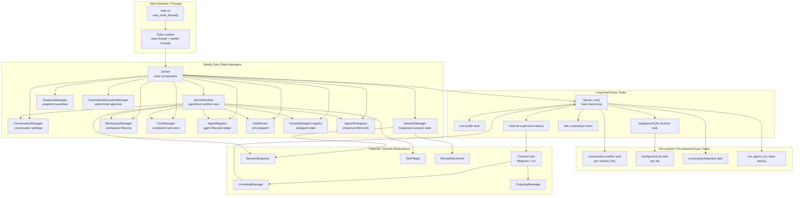
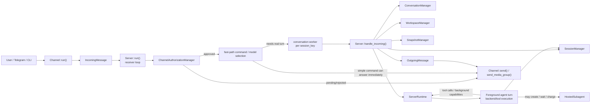
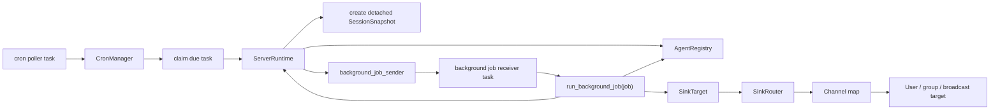
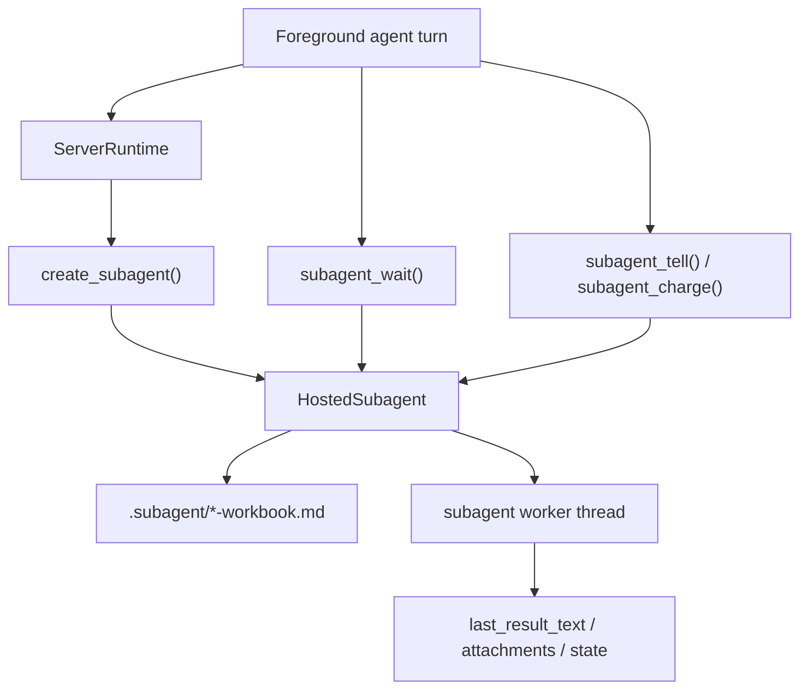

# Workflow

本文按 Tokio 的使用方式，把 `agent_host` 拆成几个层次来看：

- Runtime / threads：谁提供执行底座
- Long-lived async tasks：启动后常驻的异步任务
- Per-request async tasks：按消息、按后台任务临时创建的异步任务
- Sync state managers：主要负责持久化和内存状态，不自己跑 Tokio task
- Domain abstractions：在这些任务之间传递的数据和目标

---

## 1. Tokio 视角下的系统切分



### 这张图怎么读

- `Server` 是最外层编排器，负责把 Tokio task、channel、session、workspace 等抽象串起来。
- `ServerRuntime` 不是启动入口，而是给 agent/tool/background/subagent 执行时用的能力集合。
- `ConversationManager` 和 `SessionManager` 是两层状态：
  - `ConversationManager` 管长期设置，例如 model / sandbox / reasoning effort。
  - `SessionManager` 管当前活跃会话、消息、恢复点、token usage。
- `WorkspaceManager` 管工作区本身；`SnapshotManager` 管工作区快照；`AgentWorkspace` 管共享模板和全局 profile。
- `Channel` 是外部世界入口；`IncomingMessage` / `OutgoingMessage` / `SinkTarget` 是在系统内部穿梭的标准载体。

---

## 2. 前台消息流：用户发来一条消息时，抽象之间怎么互相使用



### 什么时候会用到这些抽象

- 收到消息后，先经过 `Channel`，统一变成 `IncomingMessage`。
- `Server::run()` 先做轻量判断：
  - 要不要 fast-path 直接回复
  - 要不要打断正在运行的前台 turn
  - 这条消息属于哪个 `session_key`
- 真正处理时进入该会话自己的 `conversation worker`，避免同一个会话并发踩状态。
- `handle_incoming()` 里会同时碰几类状态：
  - `ConversationManager`：取当前 conversation 的 model / sandbox / think 配置
  - `SessionManager`：取当前 session、消息历史、pending continue、usage
  - `WorkspaceManager`：确认或切换 workspace
  - `SnapshotManager`：处理 `snapsave` / `snapload`
- 当需要真正跑 agent 时，`Server` 会构造 `ServerRuntime`，再由它进入主 agent turn。
- agent 执行过程中，如果需要子代理，就会用 `HostedSubagent` 抽象。
- 最终 assistant 输出会被包装成 `OutgoingMessage`，再交回 `Channel` 发送。

---

## 3. 后台 / Cron / Sink：不是用户当前前台 turn 的工作怎么跑



### 这条链路里每个抽象的职责

- `CronManager` 只负责定时任务定义、校验、claim、触发结果持久化。
- 真正的执行不在 `CronManager` 里，而是转成 `BackgroundJobRequest` 后交给 `ServerRuntime`。
- 后台任务通常会创建一个 detached `SessionSnapshot`，避免污染当前前台会话。
- `AgentRegistry` 用来记录后台 agent 的状态变化：enqueued / running / completed / failed / timed out。
- 后台任务完成后不一定直接回复原对话，而是经由 `SinkTarget` + `SinkRouter` 决定往哪里发：
  - direct
  - multi
  - broadcast

---

## 4. 子代理：什么时候从前台主代理分叉出去



### 什么时候会用 `HostedSubagent`

- 当前前台主代理想把一块任务拆出去独立执行时。
- 子代理不是普通 Tokio task，它是 host 托管的持久化对象：
  - 有自己的状态文件
  - 有 workbook
  - 可以 wait / tell / charge / destroy
- `ServerRuntime` 负责管理这些子代理的创建、恢复、计费时间、等待和销毁。

---

## 5. 一句话总结

如果只记一条主线，可以记成：

```text
Channel -> Server -> Conversation/Session/Workspace state -> ServerRuntime -> Agent execution
       -> (optional) Subagent / Background / Cron / Sink
       -> OutgoingMessage -> Channel
```

按 Tokio 视角看：

- Tokio runtime 负责“跑”
- `Server` 负责“编排”
- 各种 `*Manager` 负责“存和查状态”
- `ServerRuntime` 负责“把执行时需要的能力打包给 agent”
- `Channel` / `Message` / `SinkTarget` 负责“和外界交换信息”

---

## 6. 对应伪代码

### 6.1 启动阶段

```text
main():
    args = parse_cli_args()
    if args.command == run-child:
        run_child_stdio()
        return
    if args.command == run-tool-worker:
        run_tool_worker()
        return

    runtime = tokio.new_multi_thread()
    runtime.block_on(run_server(args))

run_server(args):
    config = load_config(args.config)
    init_logging(args.workdir)

    server = Server::from_config(config, workdir)
    server.run().await
```

### 6.2 Server 启动后常驻任务

```text
Server::run():
    retry_pending_workspace_summaries().await

    incoming_tx, incoming_rx = tokio_mpsc_channel()
    background_rx = take(background_job_receiver)

    spawn cron_poller_task:
        loop:
            tick()
            runtime.poll_cron_once().await

    spawn background_receiver_task:
        loop:
            job = recv(background_rx)
            spawn background_job_task(job):
                runtime.run_background_job(job).await

    for each channel in channels:
        spawn channel_supervisor_task(channel, incoming_tx)

    loop main_receiver:
        select:
            msg = recv(incoming_rx) => dispatch_to_conversation_worker(msg)
            idle_tick => run_idle_context_compaction_once().await
```

### 6.3 前台消息处理

```text
dispatch_to_conversation_worker(msg):
    if fast_path_can_answer(msg):
        send_immediately()
        return

    if active_foreground_turn_exists_for_same_session(msg):
        request_yield_for_incoming()

    worker = get_or_create_worker(session_key)
    worker.send(msg)

conversation_worker_loop():
    while recv(msg):
        merged = coalesce_buffered_conversation_messages(msg, queue)
        server.handle_incoming(merged).await

Server::handle_incoming(msg):
    enforce_channel_authorization_if_needed().await

    conversation = ConversationManager.ensure_conversation(address)
    session = SessionManager.ensure_foreground(address)

    if command_message(msg):
        handle_command_using(
            ConversationManager,
            SessionManager,
            WorkspaceManager,
            SnapshotManager,
            ChannelAuthorizationManager
        )
        return

    attachments = materialize_attachments().await
    runtime = tool_runtime_for_address(address)

    outcome = run_main_agent_turn(runtime, session, msg, attachments).await

    persist_session_updates(outcome)
    send_outgoing_message()
```

### 6.4 主代理执行

```text
run_main_agent_turn(runtime, session, msg, attachments):
    previous_messages = build_previous_messages_for_turn(
        session.agent_messages,
        session.pending_continue,
        synthetic_system_messages,
        current_user_message
    )

    frame_config = runtime.build_agent_frame_config(...)
    extra_tools = runtime.build_extra_tools(...)

    report = backend.run_session_with_report_controlled(
        previous_messages,
        frame_config,
        extra_tools
    )

    if report.completed:
        return Replied(...)
    if report.yielded:
        return Yielded(...)
    if report.failed:
        return Failed(...)
```

### 6.5 后台任务 / Cron

```text
poll_cron_once():
    claimed_tasks = CronManager.claim_due_tasks(...)
    for each claimed in claimed_tasks:
        handle_claimed_cron_task(claimed).await

handle_claimed_cron_task(claimed):
    detached_session = create_detached_session_snapshot(...)

    AgentRegistry.register(background_agent, state=enqueued)

    background_job_sender.send(
        BackgroundJobRequest {
            detached_session,
            model_key,
            prompt,
            sink
        }
    )

run_background_job(job):
    AgentRegistry.mark_running(job.agent_id)

    runtime = tool_runtime()
    result = run_main_background_turn(runtime, job.session, job.prompt).await

    if success:
        sink_router.dispatch(channels, job.sink, outgoing_message).await
        AgentRegistry.mark_completed(...)
    else:
        AgentRegistry.mark_failed_or_timed_out(...)
```

### 6.6 子代理

```text
create_subagent(parent, session, description):
    subagent = HostedSubagent::create(...)
    AgentRegistry.register(subagent, state=running)
    remember_subagent_handle(subagent)

    spawn OS thread:
        run_subagent_worker(subagent)

run_subagent_worker(subagent):
    loop:
        wait_until_has_charge_and_prompt()
        run_one_subagent_turn()
        persist_subagent_state()
        notify_waiters()

foreground_agent_side():
    create_subagent(...)
    subagent_wait(...)
    subagent_tell(...)
    subagent_charge(...)
    subagent_destroy(...)
```

### 6.7 抽象职责的最短记忆版

```text
Channel                 = 和外界收发消息
Server                  = 总调度器
ServerRuntime           = 执行时能力打包
ConversationManager     = 对话级设置
SessionManager          = 会话级运行状态
WorkspaceManager        = 工作区生命周期
SnapshotManager         = 快照存取
CronManager             = 定时任务定义与触发
AgentRegistry           = agent 生命周期账本
SinkRouter              = 后台结果投递
HostedSubagent          = 可等待/可持久化的子代理
ChannelAuthorizationMgr = 渠道管理员和会话审批
```
